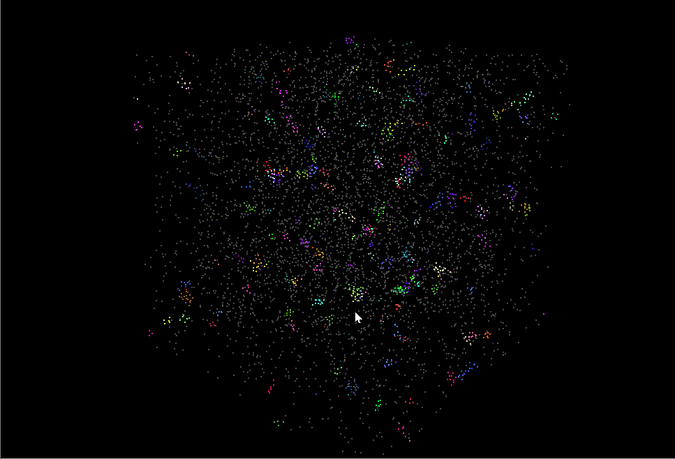
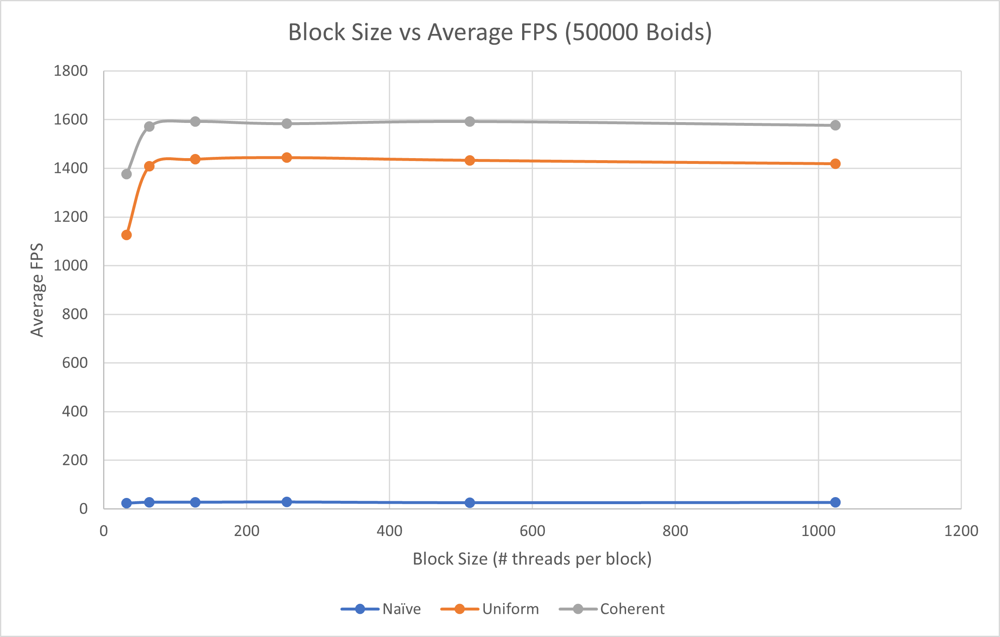
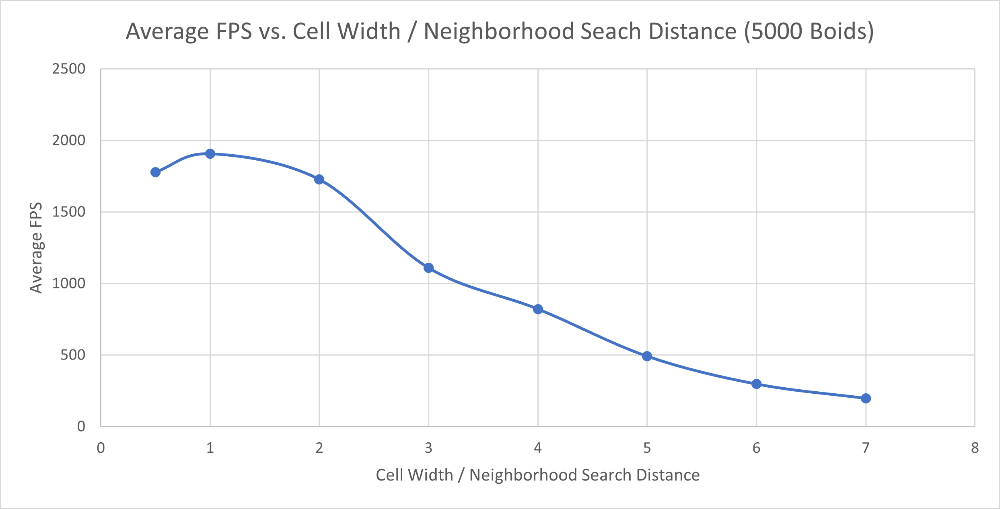

**University of Pennsylvania, CIS 565: GPU Programming and Architecture,
Project 1 - Flocking**

* Nick Moon
  * [LinkedIn](https://www.linkedin.com/in/nick-moon1/), [personal website](https://nicholasmoon.github.io/)
* Tested on: Windows 10, AMD Ryzen 9 5900HS @ 3.0GHz 32GB, NVIDIA RTX 3060 Laptop 6GB (Personal Laptop)

**This is a Reynolds Boids implementation in C++ using CUDA for GPU acceleration of the simulation. This allows for
simulating even 5,000,000 boids at real-time rates (>30 fps)**


### Results


*Figure 1: 5000000 boids, 1.75 dt, 400.0 scene scale, 1.5 max speed*



*Figure 2: 5000 boids, 0.2 dt timestep*


*Figure 3: 5000 boids, 1.0 dt timestep*

**For more gifs of the simulator with different settings, see images/results**

## Implementaion

#### Boid Flocking

In the Boids flocking simulation, particles representing birds or fish
(boids) move around the simulation space according to three rules:

1. Cohesion - boids move towards the perceived center of mass of their neighbors
2. Separation - boids avoid getting to close to their neighbors
3. Alignment - boids generally try to move with the same direction and speed as
their neighbors

These three rules specify a boid's velocity change in a timestep.
At every timestep, a boid thus has to look at each of its neighboring boids
and compute the velocity change contribution from each of the three rules.

In pseudocode, these 3 rules are as follows:

**Rule 1: Boids try to fly towards the centre of mass of neighbouring boids**

```
function rule1(Boid boid)

    Vector perceived_center

    foreach Boid b:
        if b != boid and distance(b, boid) < rule1Distance then
            perceived_center += b.position
        endif
    end

    perceived_center /= number_of_neighbors

    return (perceived_center - boid.position) * rule1Scale
end
```

**Rule 2: Boids try to keep a small distance away from other objects (including other boids)**

```
function rule2(Boid boid)

    Vector c = 0

    foreach Boid b
        if b != boid and distance(b, boid) < rule2Distance then
            c -= (b.position - boid.position)
        endif
    end

    return c * rule2Scale
end
```

**Rule 3: Boids try to match velocity with near boids**

```
function rule3(Boid boid)

    Vector perceived_velocity

    foreach Boid b
        if b != boid and distance(b, boid) < rule3Distance then
            perceived_velocity += b.velocity
        endif
    end

    perceived_velocity /= number_of_neighbors

    return perceived_velocity * rule3Scale
end
```

#### Naive Implementation

The naive implemententation simply checks every boids against every other boid to determine which boids are
within its neighborhood (i.e. within some max distance from itself). Ping-pong buffers are needed for the velocity
values: writing a value to a boids velocity data required the velocity data of neighboring boids. This would cause
a race condition and conflict trying the read and write to the same buffer if only a single velocity array was allocated.
Instead, two are allocated and the program switches which is the "active" buffer at the end of each time step.

#### Uniform Grid-Based Implementation

A way to optimize this simulation, given the constraint that the boids are constrained by some axis aligned minimum cube volume,
is to cut this cube volume into uniform sub-cube chunks. Each boid then only needs to check the grid cells
that fall within the maximum neighborhood check distance and retrieve the boid data of all those cells. If the 
cell resolution is set such that it is 2x that of the maximum search distance, then only 8 neighboring cells
need to be checked. These are the cells in the 2x2x2 grid around the current boid. Likewise, if the cell resolution
is around equal to the maximum search distance, then the 3x3x3 grid (or 27 cells) needs to be searched.
This allows not only for only a certain subspace of the entire volume, and thus a subset of all the boids
to be searched, but it also allows for "skipping" empty cells, or cells which contain no boids.

#### Coherent Uniform Grid-Based Implementation

A way to optimize this approach even further is to get rid of the array that represents a mapping between
the boids sorted in grid-cell index number and their original order. Instead, the velocity and position buffers
are rearranged according to their boids sorted positions. This necessitated only one additional position buffer
to use as a ping-pong buffer before and after rearranging the values. This optimization should help speed up
memory accesses when iterating through a certain grid cell, as all of the position and velocity data of the boids
in that grid cell will be contiguous in memory.

#### Extra Credit

I also implemented the extra credit to optimize and parameterize the grid-based looping to handle arbitrary
subgrid lengths. This involved calculating the number of cells needed to be checked in the x,y,z directions of the cell
grid, and then using these values to offset the grid cell indices from the current boid grid cell index. This feature 
is how I generated Figure 7.


## Performance Analysis

As can be seen by the below two graphs (Figures 4 and 5), increasing the number of boids simulated results in a larger runtime.
This is because the more boids that are needed to be simulated, the more of the hardware is being used, and the
more threads are needed to handle these boids.

As expected, the grid-based approach **significantly** increased performance as well as the rate of loss in performance
caused a rise in the number of boids. This is because only a subset of the overall simulation space is checked per boid
which makes simulating boids with very few nearby boids very fast to compute, but also helps with boids with lots
of neighbors too.

Also as expected, the coherent grid-based simulation was faster than the original uniform grid-based simulation, 
achieving at points double the fps and always faster to at least some degree than the normal uniform version.
This effect can be seen in Figures 4 and 5 below.
This is what I had hoped to achieve with this optimization. This optimization helped improve memory locality efficiency,
particularly in iterating through all the boids in a certain grid cell and retrieving their position and velocity data.


*Figure 4: Effect of number of boids on average FPS (with visualization disabled)*


*Figure 5: Effect of number of boids on average FPS (with visualization enabled)*

Below is a graph measuring the impact of various block sizes, i.e. the number of threads allocated to each block. 
As shown, the runtime of the grid-based simulation stays relatively constant at levels greater than 256, where it peaks.
The reason it is mostly constant is because so many boids are being simulated with respect to the block size,
that most values for block size allocate these threads at roughly the same efficiency.
Block size values less than this result in penalties in performance.
Note that all block sizes measured are multiples of 32. GPU threads are grouped into collections of 32 threads
called a warp that can execute simultaneously. If a block size is not a factor of 32, this will result in some warps not being
filled up to their optimal containmen, and will cause slowdown.


*Figure 6: Effect of cuda kernel block size on average fps for uniform grid-based simulation*

As a final point of analysis, Figure 7 below displays the effect of changing the grid cell resolution with respect the
maximum neighbor search distance each boid uses to get nearby boids that influence its velocity. As can be shown,
balancing this ratio is important for improving and maintain efficiency, and the benefits of the grid-based system.
Too low a resolution, such as the first data point on the graph, and the performance is suboptimal as a lot of potentially
empty space is being encompassed by large cells. Too high a resolution, and the benefit of the grid-based system is lost.
There are now so many neighboring cells needed to be checked by a single boid, that even the increased potential
prevalence of empty cells is lost. The graph shows that having a resolution approximately equal to the maximum search distance
is optimal.


*Figure 7: Effect of the ratio of grid cell width to boid neighbor max search distance on average FPS*

### Bloopers


*Blooper caused by accessing wrong index values for boid position and velocity arrays*

**For more bloopers, see images/bloopers.**
