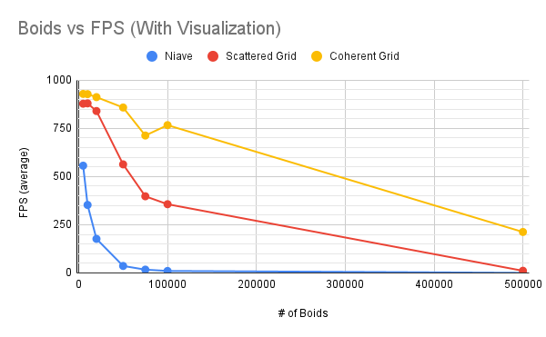
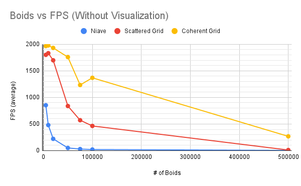
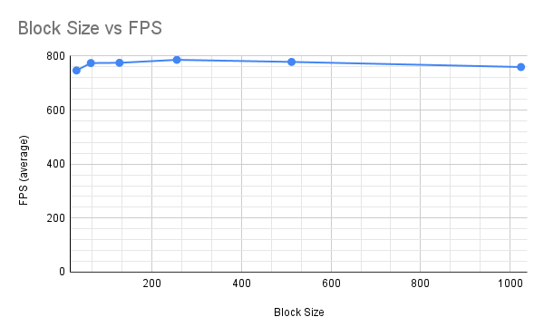

<!-- 

  <b>
    University of Pennsylvania, CIS 5650: GPU Programming and Architecture,
    Project 1 - Flocking
  </b>

<ul>
  <li>
    Michael Mason
    <ul>
      <li><a href="https://www.michaelmason.xyz/">Personal Website</a></li>
    </ul>
  </li>
  <li>Tested on: Windows 11, Ryzen 9 5900HS @ 3.00GHz 16GB, RTX 3080 (Laptop) 8192MB</li>
</ul>

 -->

> University of Pennsylvania, CIS 5650: GPU Programming and Architecture, Project 1 - Flocking
> * Michael Mason
>   + [Personal Website](https://www.michaelmason.xyz/)
> * Tested on: Windows 11, Ryzen 9 5900HS @ 3.00GHz 16GB, RTX 3080 (Laptop) 8192MB 

# CUDA Boids

**This project is a CUDA implementation of a flocking simulation based on the Reynolds Boids algorithm, previewing two levels of optimization: using a uniform grid, and using a uniform grid with semi-coherent memory access. This was done as part of UPenn CIS 5650 (GPU Programming & Architecture).**

| *5,000 boids* | *50,000 boids* | *100,000 boids*
| :--: | :--: | :--:
|  |   |  |

<!-- ## Table of Contents

- [TODO](#todo)
- [Analysis](#analysis) -->

## 📈 Performance Results

#### Method Explanation

For all comparisons graphed below, the FPS was recorded over 12 seconds from program start time, then averaged.

### Boids vs FPS *with visualization*

Note: Block Size was 128. 

### Boids vs FPS *without visualization*

Note: Block Size was 128. 

### Block Size vs FPS

Note: Used coherent grid with 100,000 boids, visualization on. 

## 📃 Performance Analysis

#### Q. For each implementation, how does changing the number of boids affect performance? Why do you think this is?

For each implementation, as the number of boids increases, the performance decreases. I think it makes sense that for each boid we must calculate a velocity for, there are even more neighbouring boids to take into account. Of course, for the Naive method this is the case. As for each boid, we must go through the data of all N boids. For the grid methods, it makes sense that for each boid, we are more likely to encounter more and more neighbouring boids as N increases, and thus a performance hit as there's more operations to be done. 

#### Q. For each implementation, how does changing the block count and block size affect performance? Why do you think this is?

For testing block size, I initially test at 32 (considering that the size of a warp is 32 threads) to 1024 (the maximum block size for my graphics card). In my testing, I saw a slight increase in performance from 32, but after 256 threads I actually saw a slight decrease. It's uncertain without making more tests whether there is actually a correlation between block size and performance here, since the change in fps is almost negligible. I perhaps see why there might be a "sweet spot" between 128 and 512, given the information that any thread in the same block is guaranteed to be on the same SM. It could be that 1024 may be too high of a thread count, and not balancing the utilization of the SM's accross the GPU. Having the block size too small may be because you aren't utilizing each individual SM effectively. 

#### Q. For the coherent uniform grid: did you experience any performance improvements with the more coherent uniform grid? Was this the outcome you expected? Why or why not?

The coherent uniform grid method was a significant improvement over the scattered grid method, and this was especially apparent over higher boid counts (i.e. at 100,000 boids, coherent was almost 3x faster than scattered). It seems reasonable to expect this would be the case, given that the coherent grid allows for the boid data to be sorted in accordance with the grid index. Due to the temporal and spatial locality of reading `pos` and `vel` data from each boid in a more sequential manner (as we update the velocity of each individual boid in parallel), the more efficient use of global memory caching means better performance. 

#### Q. Did changing cell width and checking 27 vs 8 neighboring cells affect performance? Why or why not? Be careful: it is insufficient (and possibly incorrect) to say that 27-cell is slower simply because there are more cells to check!

Note: I made my test using the coherent grid method which has likely impacted my answer to this question. 

I found that decreasing the cell width (that is, checking for a total of 27 cells rather than 8 total cells) showed a slight increase in performance. Specifically at 8 cells, I recorded an FPS of *796.5* whereas at 27 cells, I recorded an FPS of *844.49*. I think further testing would be required to actually understand if the performance impact is actually significant. I can imagine that 27 cells may be more efficient due to spatial locality. Given that the cells are smaller and that we are using a coherent grid structure to sort the boid data according to grid index, it may be possible that we are checking boids more sequentially, and therefore making more efficient usage of cache. 
