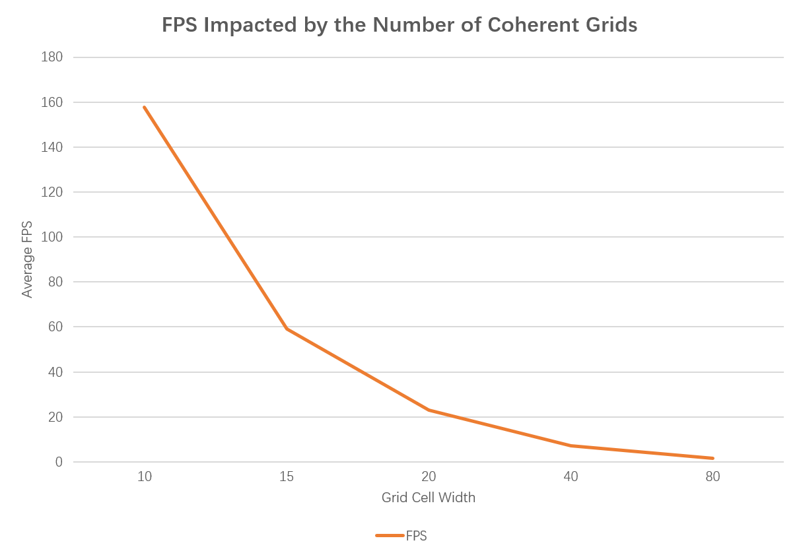
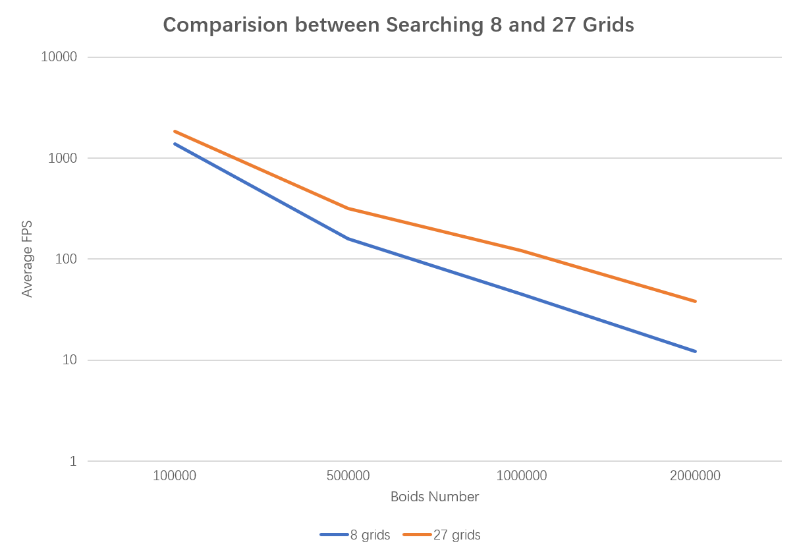

**University of Pennsylvania, CIS 565: GPU Programming and Architecture**

* Alex Fu
  * [LinkedIn](https://www.linkedin.com/in/alex-fu-b47b67238/)
  * [Twitter](https://twitter.com/AlexFu8304)
  * [Personal Website](https://thecger.com/)
* Tested on: Windows 10, i7-10750H @ 2.60GHz, 16GB, GTX 3060 6GB

# CIS 565 - Project 1: Flocking

## Results

### Brute force, 50,000 boids, 30+ fps

### Scattered grids, 50,000 boids, 144+ fps

### Scattered grids, 1,000,000 boids, 14+ fps

### Coherent grids, 1,000,000 boids, 35+ fps

## Analysis

I use the average FPS over 1-11 secs to represent the performance of the application. I have tested the impact on performance by the boids number, CUDA block size, and grid cell size.

### Average FPS Impacted by the Boids Number

CUDA block sizes are all 128.

#### Without Visulization

#### With Visualization

### Average FPS Impacted by the CUDA Block Size

The boids number is 500,000 for scattered and coherent grids, and 20,000 for brute force.

### Average FPS Impacted by the Number of Coherent Grids

The boids number is 500,000 and the CUDA block size is 128.

| Grid Cell Width | Grid Number | Average FPS |
|:---------------:|:-----------:|:-----------:|
| 10              | 10648       | 157.8       |
| 15              | 2744        | 59.0        |
| 20              | 1728        | 23.0        |
| 40              | 216         | 7.1         |
| 80              | 64          | 1.7         |

### Comparison Between  Searching 8 and 27 grids

## Answers to the Questions

* For each implementation, how does changing the number of boids affect performance? Why do you think this is?
  
  * Generally, the more boids there are, the slower the program runs. However when boids are less than 100,000 this isn't obvious when using uniform grids — the bottleneck maybe on the host side. Also, the FPS drops when uniform grids are less than 10,000 — I guess it's because the boids are too scattered so the program will go over nearly every grid. Under that circumstance the I/O to the memory is close to the brute force.

* For each implementation, how does changing the block count and block size affect performance? Why do you think this is?
  
  * To be honest, I haven't found the specific relation between block size and performance. But one thing for sure is that the size of 32 is the most disadvantageous to the performance on my machine.

* For the coherent uniform grid: did you experience any performance improvements with the more coherent uniform grid? Was this the outcome you expected? Why or why not?
  
  * Yes. If there are less uniform grids, the program will do much more checks and the performance will get closer to the brute force.

* Did changing cell width and checking 27 vs 8 neighboring cells affect performance? Why or why not? Be careful: it is insufficient (and possibly incorrect) to say that 27-cell is slower simply because there are more cells to check!
  
  * Increasing cell width (decreasing cell number) will significantly harm the performance. The larger the cell is, the more boids need to be checked.
  * checking 27 neighboringis actually faster than chekcing 8 neighboringcells. I think it's because: 1. when checking 27 neighboring cells, the cell width can be the half of those when checking 8, thus the search area increase by a factor of 3.375, not 27; 2. when checking 27 neighboring cells, there will be less `if... else` branches. recalling the knowledge of `warp`, branche statements will harm the performance.

## Feedback

* There is a bug in coherent grids when boids size is small. See the [my post in Ed Discussion](https://edstem.org/us/courses/28083/discussion/1757498).

* At first all my boids would disapear quickly. It took me a while before I realize it's because some values were divided by zero. 

* 
