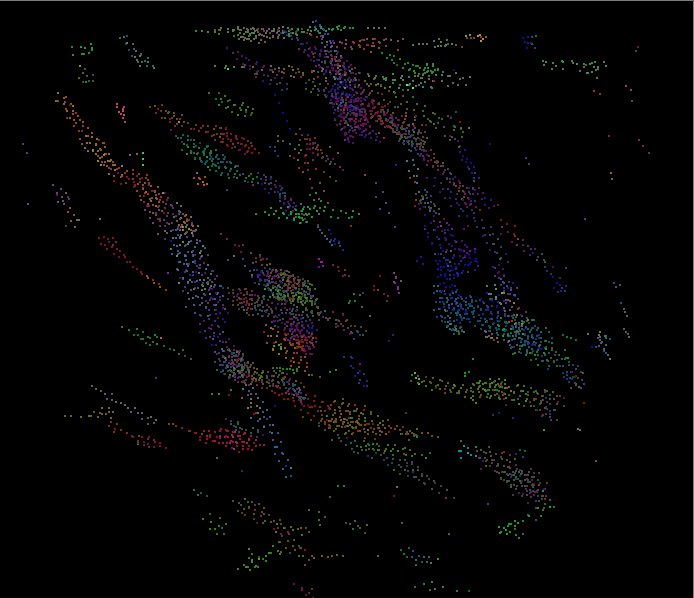
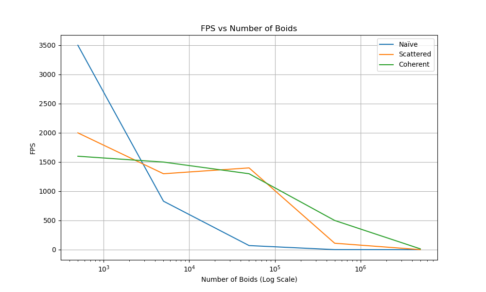
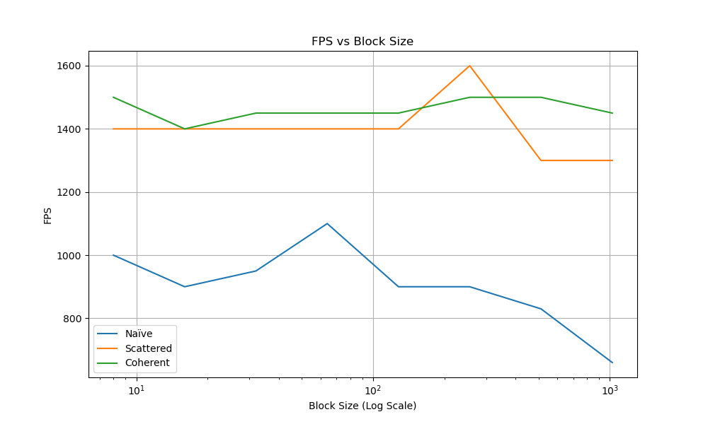
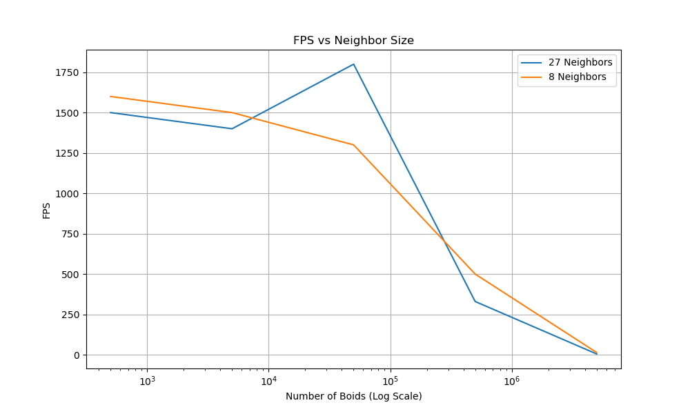

**University of Pennsylvania, CIS 5650: GPU Programming and Architecture,
Project 1 - Flocking**

* Zhaojin Sun
  * www.linkedin.com/in/zjsun
* Tested on: Windows 11, i9-13900HX @ 2.2GHz 64GB, RTX 4090 Laptop 16GB

##### 1. Flocking Results #####
The GIFs shown below are flocking effects with 5000, 50000 and 500000 boids!

 
Figure 1-1: Flocking with 5000 boids

 
Figure 1-2: Flocking with 50000 boids

 
Figure 1-3: Flocking with 500000 boids

##### 2. Performance Analysis #####
(1) Number of boids

Graph below shows when block size is fixed to 512, how fps changes with number of boids among the three flocking methods.

 
Figure 2-1: FPS vs number of boids

(2)  Block size

Graph below shows when number of boids is fixed to 5000, how fps changes with block size among the three flocking methods.

 
Figure 2-2: FPS vs block size

(3) Number of neighbors

Graph below shows when block size is fixed to 512, how fps changes with number of boids when coherent method searches different neighbors.

 
Figure 2-2: FPS vs neighbor size

##### 3. Questions and Reflect #####
(1) For each implementation, how does changing the number of boids affect performance? Why do you think this is?

Answer: See Figure 2-1. Generally, the larger the number of boids, the more particles need to be computed, leading to 
lower FPS. However, this is only a general observation, as in the case of the scattered method, the FPS at 50,000 boids 
is actually higher than at 5,000 boids, and even higher than the coherent method. I have tested this multiple times, 
and the result remains consistent, which is rather unusual. My hypothesis for this phenomenon is that the initial 
random distribution of boids may have inadvertently aligned with the GPU's memory access patterns, resulting in improved performance.

(2) For each implementation, how does changing the block count and block size affect performance? Why do you think this is?

Answer: See Figure 2-2. While there are small differences in FPS when increasing the block size from 8 to 1024, these differences 
are not significant. Even with a block size of 1, the FPS does not drop noticeably. This may be because, for the 4090 GPU, 
handling a 5000-boid flock is trivial, so underutilizing blocks by selecting a block size much smaller than a warp does 
not significantly impact performance. However, there is a trend where FPS decreases slightly as block size increases. 
This is likely due to shared memory within each block becoming saturated when too many threads access it simultaneously, 
leading to bottlenecks.

(3) For the coherent uniform grid: did you experience any performance improvements with the more coherent uniform grid? Was this the outcome you expected? Why or why not?
 
Answer: See Figure 2-1 again. When the number of boids is small, the coherent uniform grid is slower than the other two 
methods. However, as the number of boids increases exponentially, the coherent uniform grid shows a growing advantage 
because its performance degrades much more slowly than the other two methods. At 5,000,000 boids, the scattered method 
achieves only 1 FPS, while the coherent method reaches 14 FPS, which makes a crucial difference between "dead and alive." 
This phenomenon aligns well with my thoughts while writing the code for Section 2.3:

The ParticleArrayIndices gets shuffled after thrust::sort, but the pos and vel arrays remain unchanged. As a result, 
to access these pos and vel values, we must reference the original indices using int globalIndex = (scattered)particleArrayIndices, 
which is unavoidable. So why do we do this? Although reshuffling pos and vel takes time initially, it accelerates future 
searches by aligning contiguous indices, making them faster to process. This cumulative performance boost becomes more 
evident as the number of boids increases.

(4) Did changing cell width and checking 27 vs 8 neighboring cells affect performance? Why or why not? Be careful: it is
insufficient (and possibly incorrect) to say that 27-cell is slower simply because there are more cells to check!

See Figure 2-3. Another general observation is that checking 27 blocks is generally slower than checking 8 blocks, and 
the difference becomes more pronounced as the number of boids increases. At 5,000,000 boids, the FPS for 8 and 27 blocks 
are 14 and 5, respectively. While this isn't immediately clear from the figure, the ratio of 5/14 is very close to 8/27, 
which suggests that the GPU spends most of its time searching particles when their number is extremely large.

So why is there an abnormal peak at 50,000 boids, even more perplexing than in Figure 2-1? I can only assume there might
be an issue with my measurement method, since using the original method provided looks much more normal...

Changing the cell width affects the system dynamics, which in turn impacts performance. If the cell width is increased 
infinitely, the method essentially reverts back to the naive approach.