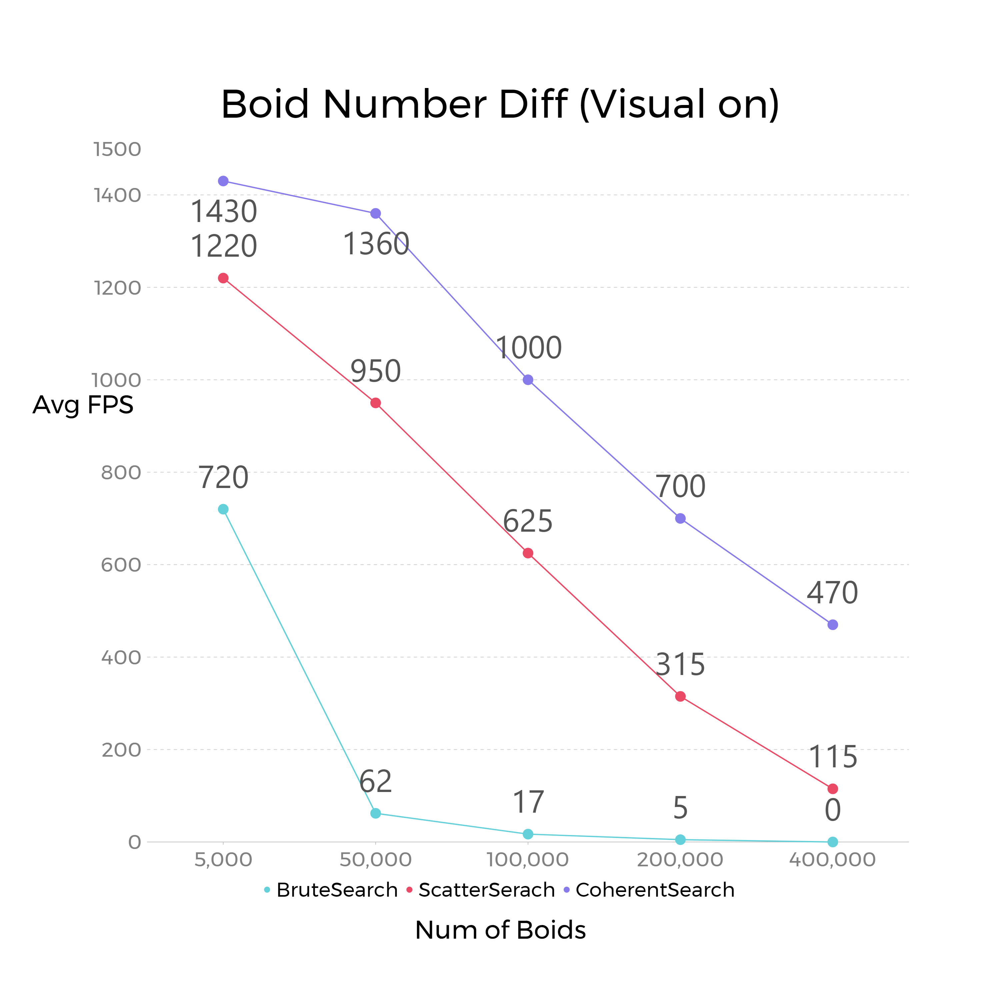
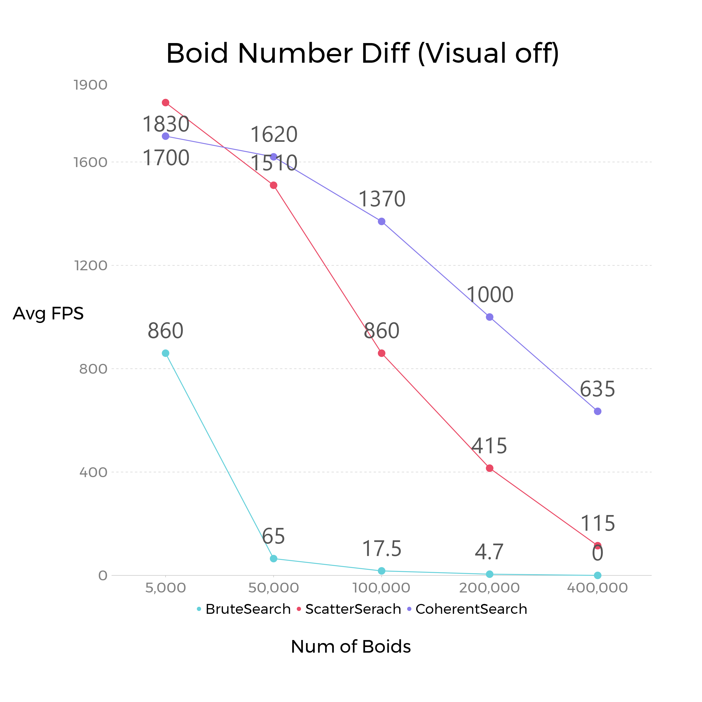
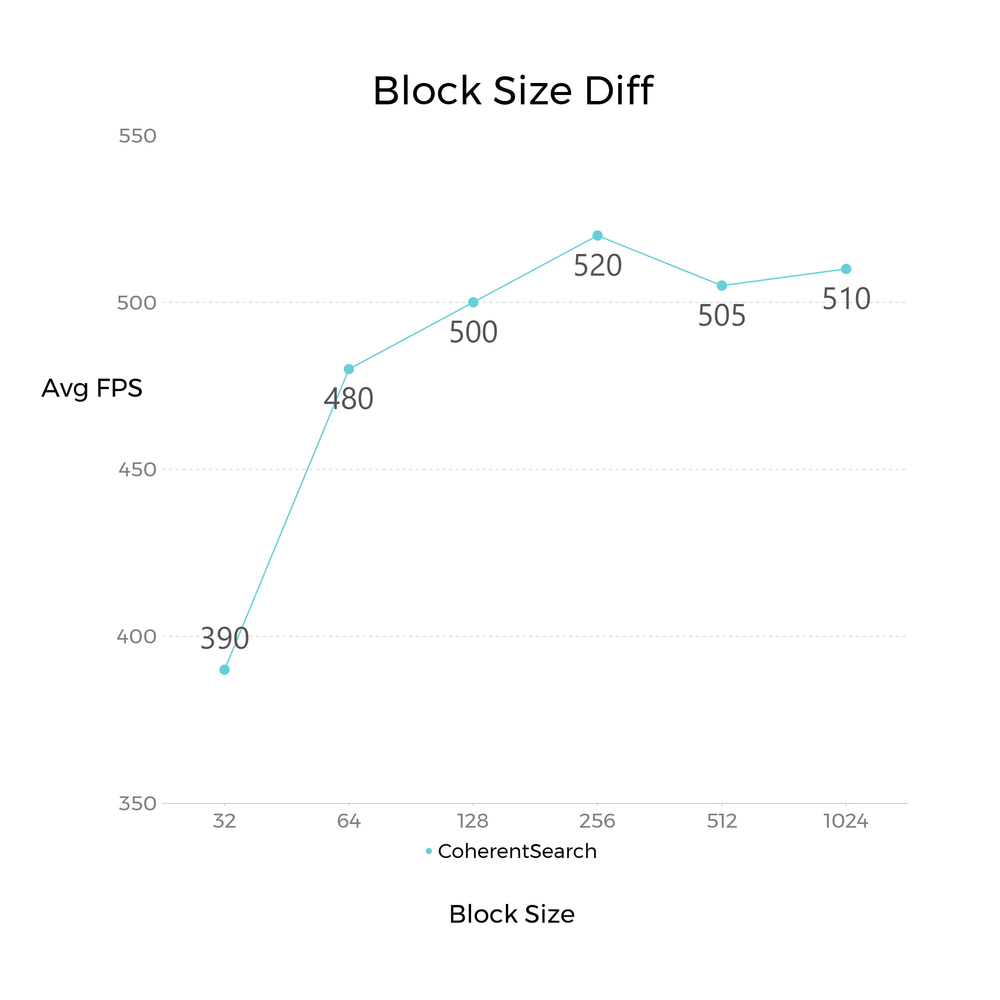

**University of Pennsylvania, CIS 565: GPU Programming and Architecture,
Project 1 - Flocking**

Jiajun Li

Linkedin: https://www.linkedin.com/in/jiajun-li-5063a4217/

Tested on: Windows 10, i7-12700 @ 2.10GHz, 32GB, RTX3080 12GB

CUDA Compute Capability: 8.6

---

## **Overview**

In this project, three flocking simulation methods are implemented based on the Reynolds Boids algorithm:
  1. Brute Search method that iterates every boid in the space.
  2. Scatter Search method that devides space into uniform grids and performs iteration on neighbor girds.
  3. Coherent Serach method that has an improvement for the Scatter Search method in coherent memory access.

The goal is to gain hand-on experience on CUDA programming and performance analysis.

---

## **Screenshots**

Brute Search method (N = 50,000):

Scatter Search method (N = 50,000):

Coherent Search Method (N = 50,000):

---

## **Performance Analysis**

Figure 1: Different boid numbers (Visual On)

Figure 2: Different boid numbers (Visual Off)

Figure 3: Different Block sizes (Visual On,  Coherent Search, N = 400,000)

Figure 4: 2X neighbors VS 3X neighbors (Visual On, Coherent Search)

---

## **Questions**

**For each implementation, how does changing the number of boids affect performance? Why do you think this is?**

In the figure 1 and 2 we can see that the for the three methods with visual on or off, the average FPS drops when the number of boids increases. This result matches my expectation since more boids introduce more works on calculating neighbor boids information in each thread. 

**For each implementation, how does changing the block count and block size affect performance? Why do you think this is?**

In the figure 3 we can see that the performance when block size equals to 32 is much lower than that of any other block sizes and other block sizes appear to have similar performances. In my opinion, this shows that a threshold may lay between size 32 and size 64. Excessive threads are spawned when size is below the threshold and those threads can not be handled in time, causing a drop on performance. 

**For the coherent uniform grid: did you experience any performance improvements with the more coherent uniform grid? Was this the outcome you expected? Why or why not?**

The figure 1 and 2 shows that the coherent method yields a better performance than that of the scatter method. This is out of my expectation because the coherent method requires setting up additional device memory and should cause a drop on performance. It turns out that assessing global memory ramdonly in threads has a higher cost.

**Did changing cell width and checking 27 vs 8 neighboring cells affect performance? Why or why not? Be careful: it is insufficient (and possibly incorrect) to say that 27-cell is slower simply because there are more cells to check!**

The figure 4 shows 3X neighboring cells has slightly higher performance than 2X neighboring cells in many but not all cases. When biod number is 200,000, the average FPS of 3X neighboring has a dramatic drop and becomes much lower than that of 2X neighboring. In my opinion, since 3X has a smaller range than 2X and boids are less likley to fall inside 3X range than 2X range, 3X is overall faster. But there are also execptions like the 200,000 boid number case where more boids happens to fall inside 3X range.