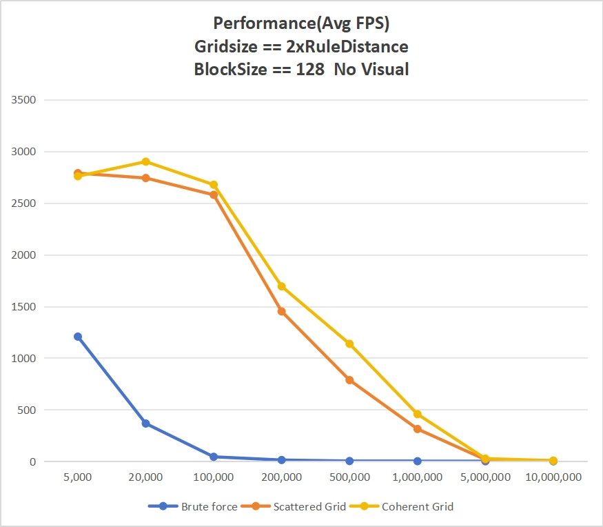
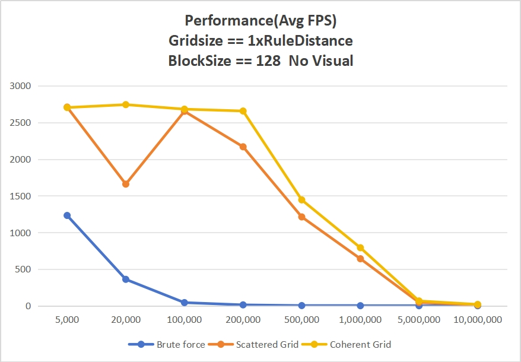
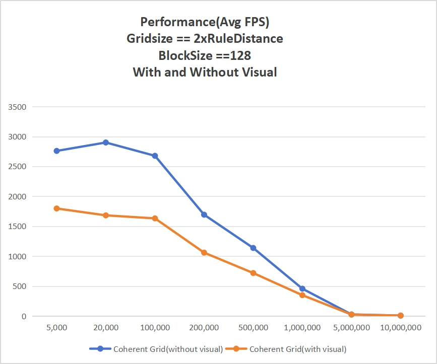
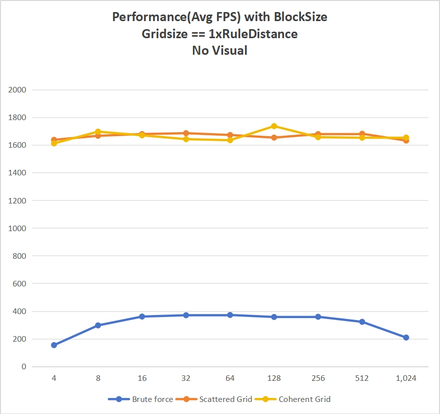

**University of Pennsylvania, CIS 5650: GPU Programming and Architecture,
Project 1 - Flocking**

* Jichu Mao
  * [LinkedIn](https://www.linkedin.com/in/jichu-mao-a3a980226/)
  *  [Personal Website](https://jichu.art/)
* Tested on: Windows 11,  i7-13700K @ 3.40 GHz, 32GB, RTX 4090 24GB

## Introduction

This project is based on Craig Reynolds' model for flocking of boids. Boids is a term Reynolds used to refer to simulated flocking creatures such as fish schools or bird flocks.

## Principles

1. <b>Cohesion</b>: boids try to fly towards the perceived center of mass of local neighbours

2. <b>Separation</b>: boids try to steer clear from each other if they get too close

3. <b>Alignment</b>: boids try to match velocity with their neighbours

  See instruction.md for more.

## Showcase

 

 

 

 

## Performance Analysis

### 1. Performance with different # of boids (Gridsize==1xMaxRuleDistance, No visual)

| Num of boids | Avg FPS(Brute force) | Avg FPS(Scattered Grid) | Avg FPS(Coherent Grid) |
| ------------ | -------------------- | ----------------------- | ---------------------- |
| 5,000         | 1206.4               | 2788.5                  | 2758.6                 |
| 20,000        | 365.2                | 2741.2                  | 2899.5                 |
| 100,000       | 43.0                 | 2578.5                   | 2676.8                   |
| 200,000       | 12.0                 | 1450.1                   | 1692.5                  |
| 500,000       | 2.2                  | 785.5                   | 1136.5                  |
| 1,000,000      | 0.6                  | 312.1                    | 455.7                  |
| 5,000,000      | 0.0                  | 16.1                    | 25.6                  |
| 10,000,000      | 0.0                  | 4.0                    | 6.5                  |

 

### 2. Performance with different # of boids (Gridsize == 1xMaxRuleDistance, No visual)

| Num of boids | Brute force | Scattered Grid | Coherent Grid |
|--------------|-------------|----------------|---------------|
| 5,000        | 1231.1      | 2708.5         | 2702.5        |
| 20,000       | 359.9       | 1658.2         | 2742.2        |
| 100,000      | 42.7        | 2651.2         | 2680.5        |
| 200,000      | 11.8        | 2167.4         | 2655.2        |
| 500,000      | 2.2         | 1211.2         | 1443.3        |
| 1,000,000    | 0.5         | 640.8          | 791.0         |
| 5,000,000    | 0           | 45.2           | 65.3          |
| 10,000,000   | 0           | 11.2           | 18.0          |

 

### 3. Performance with and without visualization (Gridsize == 2xMaxRuleDistance & Coherent Grid)

| Num of boids | Coherent Grid(without visual) | Coherent Grid(with visual) |
|--------------|-------------------------------|----------------------------|
| 5,000        | 2758.6                        | 1796.5                     |
| 20,000       | 2899.5                        | 1681.6                     |
| 100,000      | 2676.8                        | 1631.2                     |
| 200,000      | 1692.5                        | 1058.6                     |
| 500,000      | 1136.5                        | 717.5                      |
| 1,000,000    | 455.7                         | 347.7                      |
| 5,000,000    | 25.6                          | 23.3                       |
| 10,000,000   | 6.5                           | 6.3                        |

 

### 4. Performance with different blocksize  (Gridsize == 2xMaxRuleDistance & Coherent Grid)

| Block Size | Brute force | Scattered Grid | Coherent Grid |
|------------|-------------|----------------|---------------|
| 4          | 154.1       | 1636.5         | 1610.5        |
| 8          | 296.5       | 1665.5         | 1695.5        |
| 16         | 360.3       | 1678.1         | 1668.8        |
| 32         | 369.9       | 1684.3         | 1641.1        |
| 64         | 371.7       | 1671.2         | 1633.5        |
| 128        | 357.3       | 1652.4         | 1735.2        |
| 256        | 358.8       | 1677.7         | 1655.2        |
| 512        | 322.3       | 1680.2         | 1651.5        |
| 1,024      | 208.8       | 1630.9         | 1652.6        |

 

## Questions

- **For each implementation, how does changing the number of boids affect
performance? Why do you think this is?**

As the number of boids increases, the total workload for all threads rises, leading to a decrease in FPS. This is expected and aligns with actual results.

- **For each implementation, how does changing the block count and block size
affect performance? Why do you think this is?**

For Scattered Grid and Coherent Grid methods, block size has no significant impact on FPS.
However, in the brute force method, FPS initially increases, stabilizes, and then decreases with larger block sizes. I believe larger blocks allow for more efficient memory access, benefiting brute force more due to increased cache utilization, while the memory-optimized methods remain stable due to internal resource redundancy.

- **For the coherent uniform grid: did you experience any performance improvements
with the more coherent uniform grid? Was this the outcome you expected?
Why or why not?**

The coherent grid improved performance as expected because more consistent memory layout accelerated memory access.

- **Did changing cell width and checking 27 vs 8 neighboring cells affect performance?
Why or why not?**

Yes, surprisingly! 
For boid counts above 100,000, 1x rule distance outperformed 2x. 
Although more cells were checked, the finer spatial division led to more continuous memory access, improving performance.
