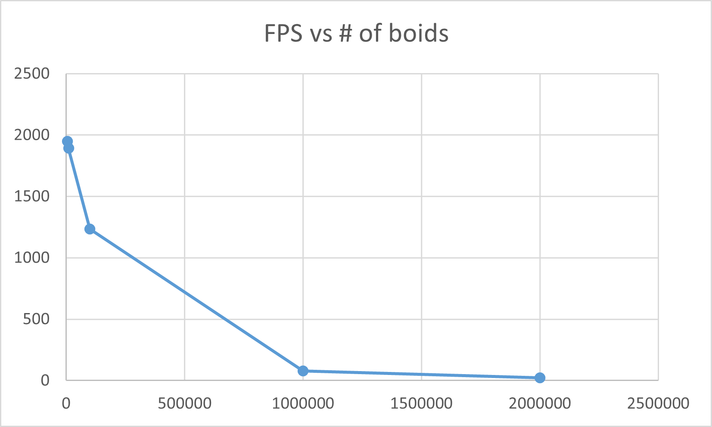
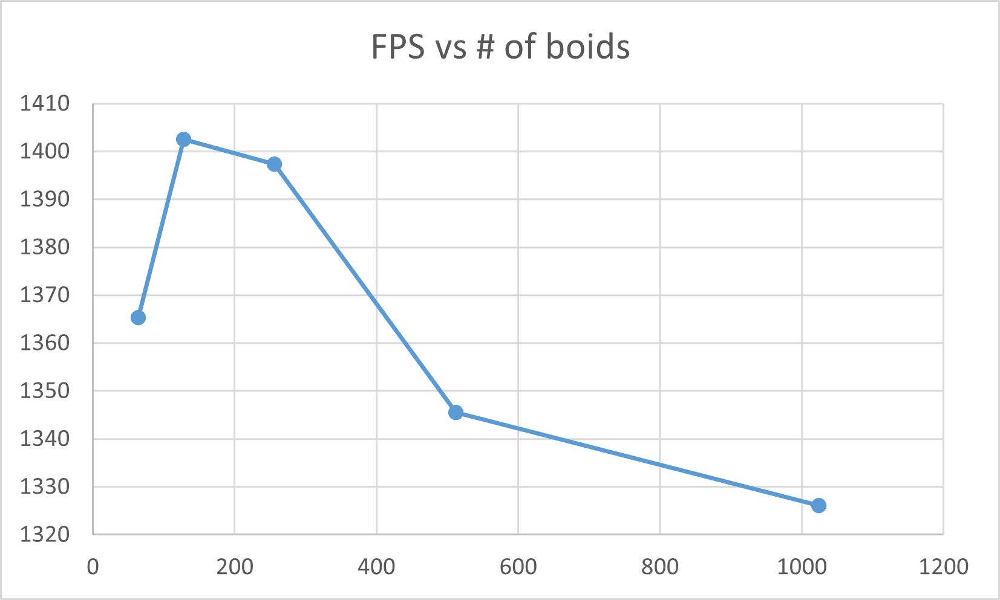
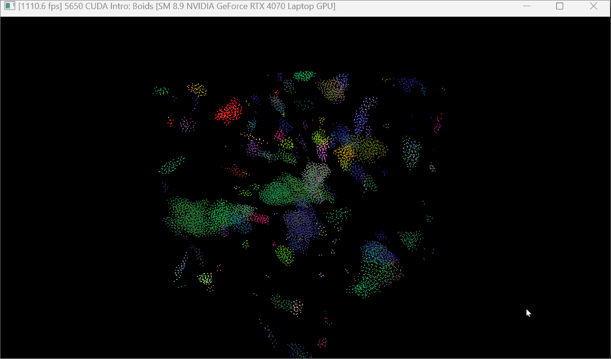
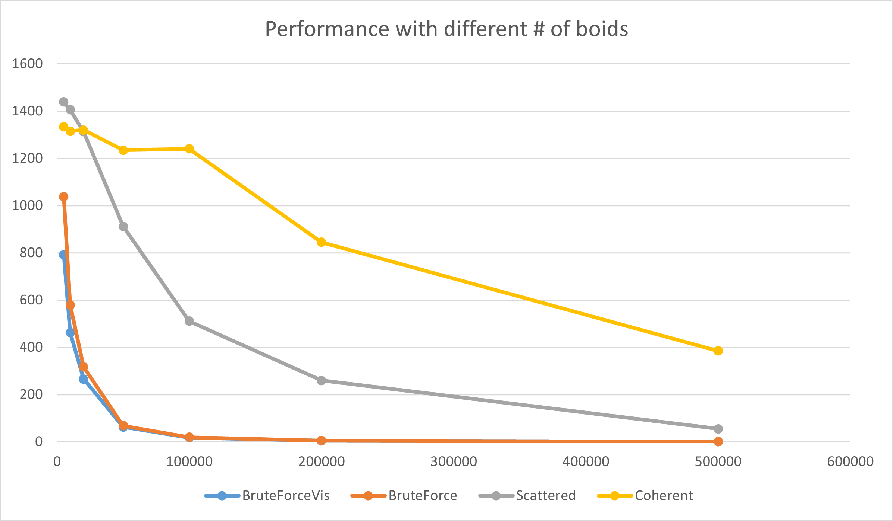
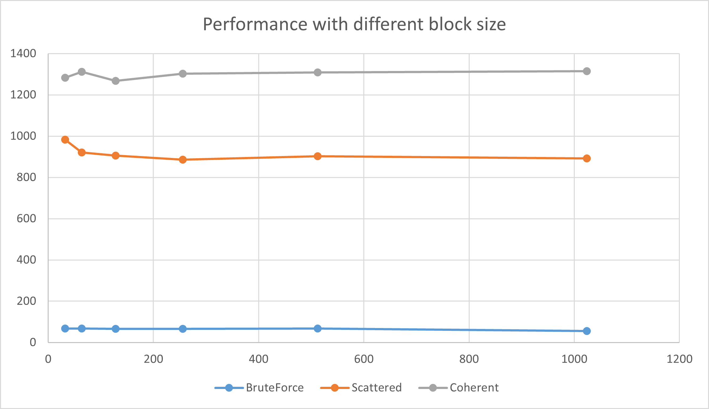
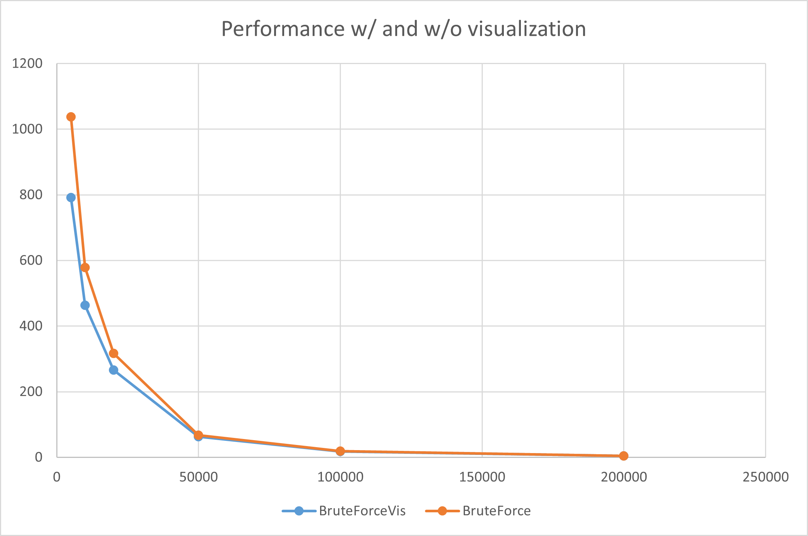
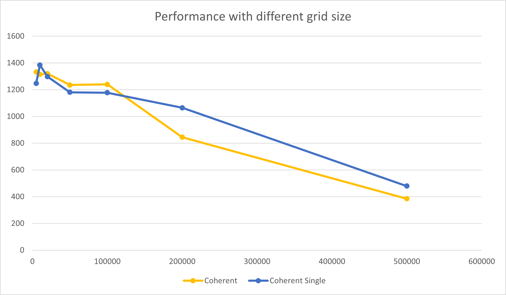

**University of Pennsylvania, CIS 5650: GPU Programming and Architecture,
Project 1 - Flocking**

* Zhen Ren
  * https://www.linkedin.com/in/zhen-ren-837089208/
* Tested on: Windows 11, i9-13900H @ 2.60 GHz 16GB, RTX 4070 Laptop 8GB (Self laptop)

### Screenshots
Two results are captures using coherent method with 10000 particles.

GIF:

### Performance Analysis
#### 1. Performance with increasing # of boids, no visualization

| Boids # | Brute force | Scattered Grid | Coherent Grid |
| ---------- | -------------------- | ----------------------- | ---------------------- |
| 5000       | 1038               | 1439                  | 1333                 |
| 10000      | 579                | 1406                  | 1315                 |
| 20000      | 317                | 1313                  | 1320                 |
| 50000      | 68                 | 912                   | 1235                 |
| 100000     | 19                 | 511                   | 1240                 |
| 200000     | 4.9                | 260                   | 845                  |
| 500000     | 0.8                | 55                    | 385                  |

#### 2. Performance with different block size, no visualization (50000 boids)

#### 3. Performance w/ and w/o visualization

### Questions:

**1.For each implementation, how does changing the number of boids affect**
**performance? Why do you think this is?**

Increasing the number of boids will generally lowering FPS. This is because more boids will need more threads to simulate them and involves more neighbors for each particle.

**2.For each implementation, how does changing the block count and block size**
**affect performance? Why do you think this is?**

As for this assignment, I didn't see much difference in FPS when increasing block size. I think it is because the memory pressure is relatively small and 50k boids 

**3.For the coherent uniform grid: did you experience any performance improvements**
**with the more coherent uniform grid? Was this the outcome you expected?**
**Why or why not?**

The performance imporvement with coherent grid is obvious when # of boids is large. This is expected since with larger # of boids, the cache miss rate will be higher in scattered grid and coherent grid can help resolves this issue with only an extra shuffle cost.

**4.Did changing cell width and checking 27 vs 8 neighboring cells affect performance?**
**Why or why not? Be careful: it is insufficient (and possibly incorrect) to say**
**that 27-cell is slower simply because there are more cells to check!**

It would affect performance and usually better when boids number is large. I think it is because smaller grid size provides more fine grained spatial division. Although more grid is searched with single grid width, less boids is calcuted and the neighbor hit rate is usually higher. Therefore, when more boids is simulated, single grid width will perform better.