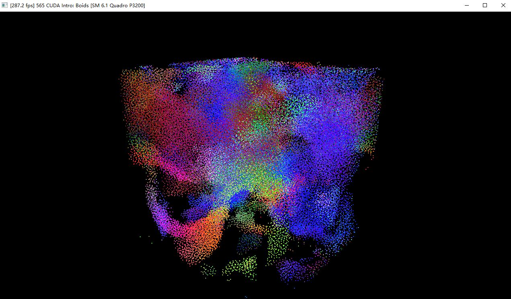
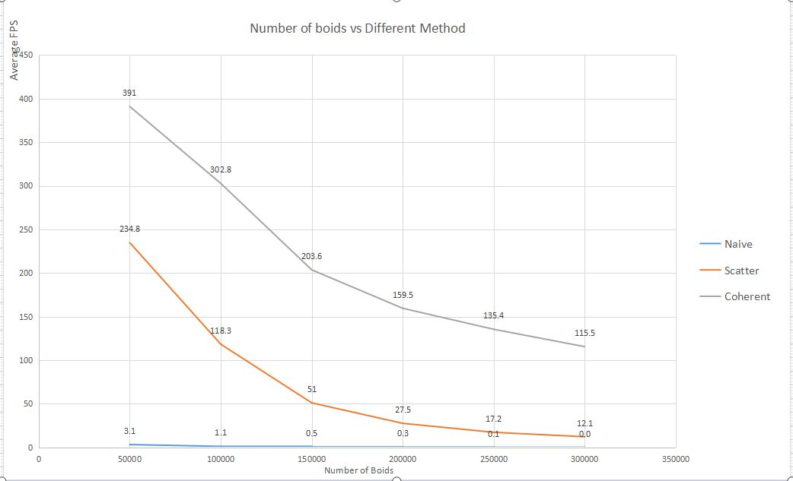
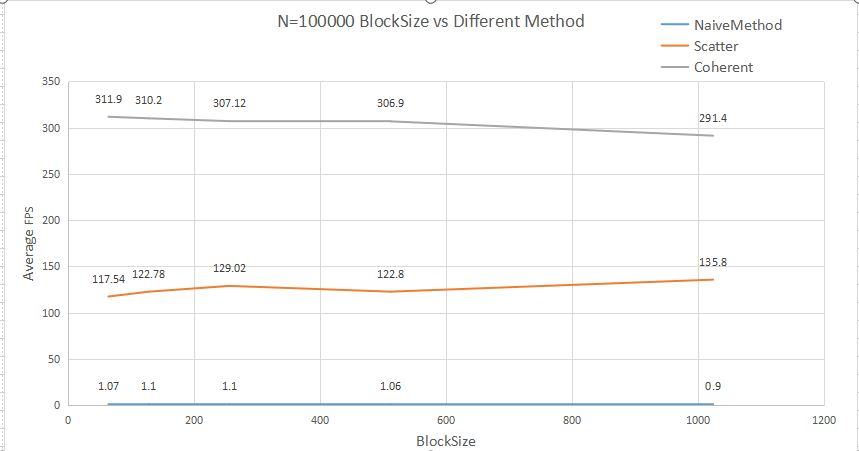

**University of Pennsylvania, CIS 565: GPU Programming and Architecture,
Project 1 - Flocking**

* Hanlin Sun
  *  [LinkedIn](https://www.linkedin.com/in/hanlin-sun-7162941a5/)
  *  [personal website](https://hanlinsun.github.io/)
* Tested on:  Windows 10, i7-8750H @ 2.21GHz 32GB, NVIDIA Quadro P3200

### ReadMe:

Demo:

### Performance Analysis:

### Questions : 
* Question 1: For each implementation, how does changing the number of boids affect performance? Why do you think this is?

  Increasing the number of boids will increase the affect performance and cause average FPS lower down. Because when we increase the boids number, that also means we will generate more threads and more threads will be running parallelly. Turning visualize down will not affect too much performance, because comparing to simulation cost, OpenGL drawing process cost is trivial. 

* Question 2: For each implementation, how does changing the block count and block size affect performance? Why do you think this is?

  When the blocksize is small, the block count will increase, at that time the performance tends to behave bad, when I increase blockSize, for each block they will have more threads and total block count will decrease, will increase performance.
  But when the blockSize is too huge, the performance will also decrease, I guess when the performance is up to the limit of parallel, when we increase blockSize it will not bring us performance increase anymore.

* Question 3: For the coherent uniform grid: did you experience any performance improvements with the more coherent uniform grid? Was this the outcome you expected? Why or why not?
  
  No I didn't. For coherent method, we need two extra memory and a new kernal to swap memory from dev_vel to sorted memory. I think it should become slow because we use two extra memory and need to generate a new kernal, but it turns out that it increase the performance greatly.
  I think in coherent method we didn't read the global buffer but use register buffer instead, and reading register buffer is super super fast.

* Question 4: Did changing cell width and checking 27 vs 8 neighboring cells affect performance? Why or why not? Be careful: it is insufficient (and possibly incorrect) to say that 27-cell is slower simply because there are more cells to check!
  
  It did not significantly affect the performance. While it is true that we're traverseing more cells,but now each cell is smaller.Now each cell is smaller as the cell width is the search radius instead of two times the search radius previously.in that case,the number of points inside each cell will now be smaller, and thus the overall iteration count can vary depending on the distribution of boids.
