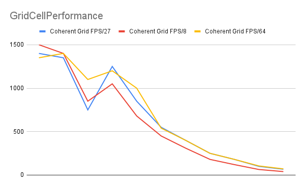

**University of Pennsylvania, CIS 565: GPU Programming and Architecture,
Project 1 - Flocking**

* Shutong Wu
  * [LinkedIn](https://www.linkedin.com/in/shutong-wu-214043172/)
  * [Email](shutong@seas.uepnn.edu)
* Tested on: Windows 10, i7-10700K CPU @ 3.80GHz, RTX3080, SM8.6, Personal Computer 

### Showcase
-20K Boids Naive 

-50K Boids Naive

-200K Boids Uniform

-500K Boids Coherent

## Q&A

###  For each implementation, how does changing the number of boids affect performance? Why do you think this is?
- In all, The performance goes down(FPS) as the number of boids become larger. 
- When boids number are relatively small(like under 10K boids), the change of the number does not affect the performance that much, but from 10K to 50K then to 100K, the frame rate will drop significantly, from 500 to 100 and then to 10FPS. The stats can be found in the performance analysis.
- The reason is that with more boids, more computations are needed especially in terms of computing boids velocity, since there are so much more boids around one single boid in a 100K scenario than in a 10K scenario. 

###  For each implementation, how does changing the block count and block size affect performance? Why do you think this is?
- So when we change block size from 1 to 128, the fps significantly increases from 20FPS to 300FPS; and from 128 to 1024, the performance does not show very significant improvement. And due to hardware limitation, threads per blocks cannot get over 1024.
- BlockSize is basically the number of threads that's running per block/boid, so when threads number are too low, the computation might be slowed down (for example if/else loop or multiple function call) and thus the frame per second will drop significantly.

###  For the coherent uniform grid: did you experience any performance improvements with the more coherent uniform grid? Was this the outcome you expected? Why or why not?
- It depends on the boids num; When boids num is comparatively small(like 50K), two methods did not show too much of a difference in terms of performance; but when the boids number get very high(500K), the performance of coherent uniform grid is way better than scatter uniform grid;
- I think that is the reason we are using coherent uniform grid: when facing a large number of boids, the searching and indexing can be quite consuming, and cutting off the step of searching by index can be more efficient.

###  Did changing cell width and checking 27 vs 8 neighboring cells affect performance? Why or why not? Be careful: it is insufficient (and possibly incorrect) to say that 27-cell is slower simply because there are more cells to check!
- I would say the answer is similar to the previous answer: when the number of the boids is not large enough(for example below 50K), using 27(width=1.5d) or 8(width=2d) does not make a large difference, in effect using 8 might be even a little faster; but when dealing a complex situation(like 2000K), using 27 run a lot faster than running 8. 
- My guess is that checking 27 cells and 8 cells all result in a O(n3) time complexity, so checking more grids might not result in a heavy performance lost; but using 27 help us cut the area of boid's detection much more precisely, thus helping us filter the boid easier and prevent more searching by index later(which should cause efficiency go down). 

### Performance Analysis
- Framerate is used to measure performance primarily, and each test is running for 15 seconds to ensure the stability of the result;
- I will check performance between different methods, performance with different cell width, and performance with different block size.
- From the observation, boids number seems to be a major factor in terms of performance, CellWidth and using Coherent or not can also affect performance in a later stage(More Boids), where BlockSize only affect performance in an early stage(Fewer BlockSize).
#### Naive/Scatter/Coherent Boids Performance

- You can see Coherent and Scatter's performance is significantly improved based on naive, and Coherent can run a scenario with more boids than Scatter;
- There will be a bottom FPS when reaching around 70K boids for Scatter/Coherent, I can't find my answers right now than thinking this was because boids dispersed in cells requires more computation at this number(80K) than smaller number(70K)
- Also there can be frame drop sometimes that make the flowing of the boids less consistent, for this I would think it to be the result of GPU Stalling/CPU throttling? 
#### Cell Width Performance

- (The Boids number on the X-Coord is the same as the previous chart, from 5K to 1000K)
- Larger CellWidth can make FPS relatively faster when running low weight task, but when running heavy weight task the larger cellwidth can perform better; but not larger cellwidth can bring better performance, for this scenario 27 and 64 grid performed a similar scenario as boids number getting huge.

#### Block Size Performance

- There is a climbing process for FPS/BlockSize, but after blockSize is large enough to handle functions in Kernel, more thread/larger blockSize will not improve performance that much. 

