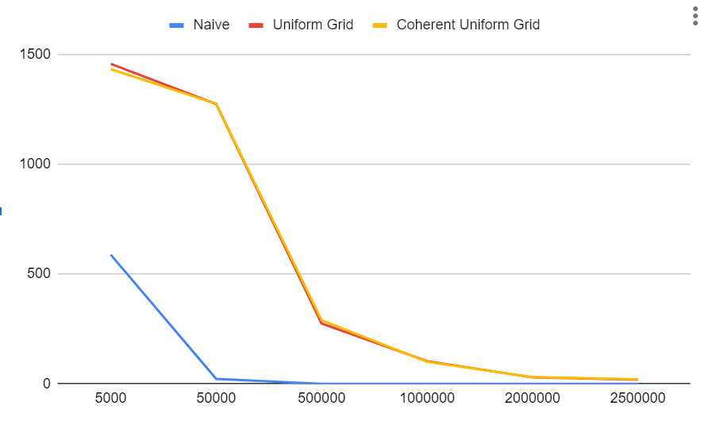
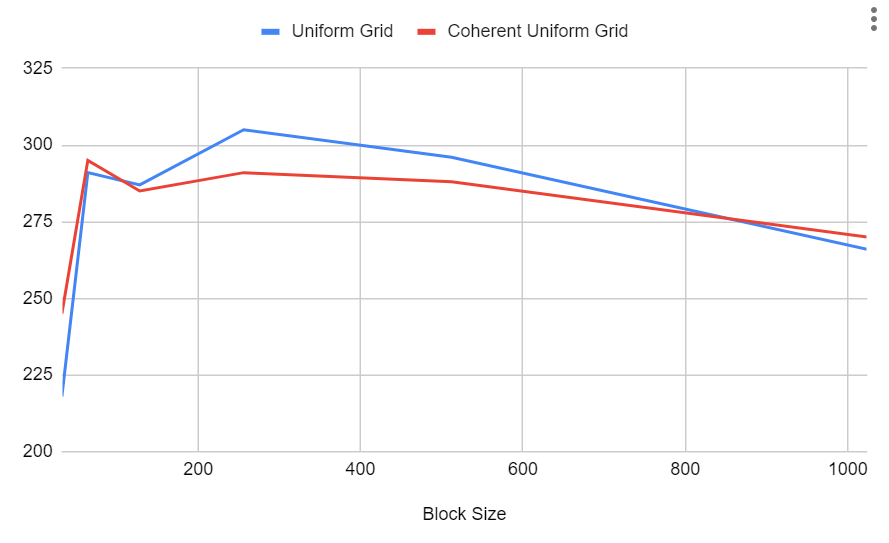
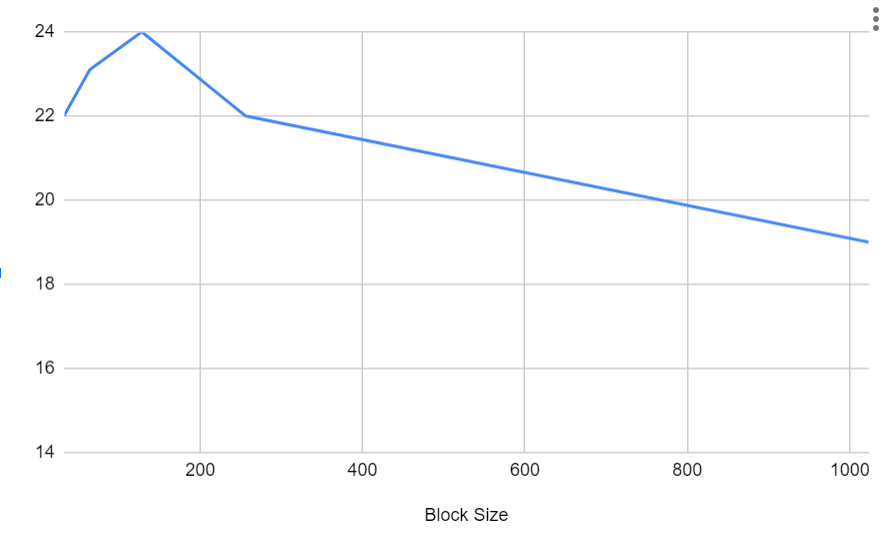
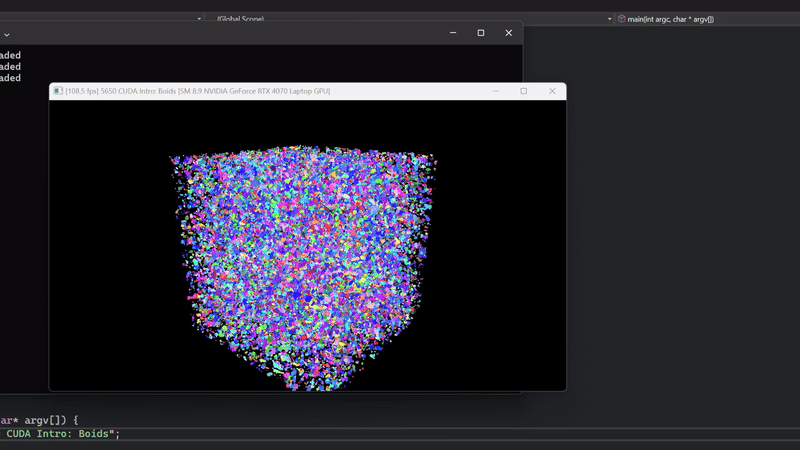
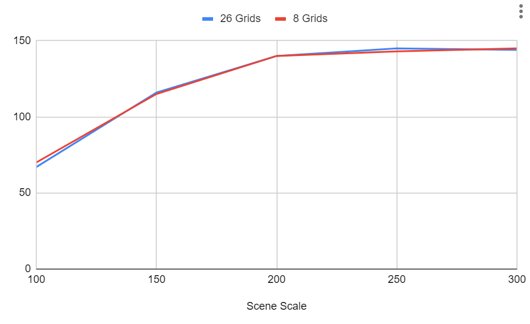

**University of Pennsylvania, CIS 5650: GPU Programming and Architecture,
Project 1 - Flocking**

* Jinxiang Wang
* Tested on: Windows 11, AMD Ryzen 9 8945HS w/ Radeon 780M Graphics 4.00 GHz 32GB, RTX 4070 Laptop 8 GB

-------------
### Performance Analysis:

**Questions:**

1. *For each implementation, how does changing the number of boids affect performance? Why do you think this is?* 
    
    
    
    **Observation:** The increase in the number of boids leads to a higher computational load. 
    
    **Explanation:** Each boid needs to interact with other boids within a certain neighborhood, so the more boids there are, the more neighbor checks and computation must be performed.
    
2. *For each implementation, how does changing the block count and block size affect performance? Why do you think this is?*
    
    
    
    
    
    **Uniform Grid method** and **Coherent Grid method** were tested under 500,000 boids, and **Naive method** was tested under 50,000 boids
    
    **Observatoin:** For **uniform Grid** and **Coherent Uniform Grid**, the performance has a gradua **increase from block size of 32** and **peak around 256**. The performance then gradually drops as block size is past 256. For **Naive method**, the performance curve **peaked at block size of 128**, then gradually drops.
    
    **Explanation:** When the block size is too small (at 32), since the parallel processing capability is poorly used, the performance is not as good as other block size. When the  block size is too large, it may lead to register spill or other exceeding of hardware limits.
    
3. *For the coherent uniform grid: did you experience any performance improvements with the more coherent uniform grid? Was this the outcome you expected?* 
    
    [Uniform Grid][2,000,000 boids][scenescale = 700]
    
    
    
    [Coherent Grid][2,000,000 boids][scenescale = 700]
    
    
    
    **Observation:** The performance of Coherent Grid method is slightly better than it of Uniform Grid method.
    
4. *Did changing cell width and checking 27 vs 8 neighboring cells affect performance? Why or why not? Be careful: it is insufficient (and possibly incorrect) to say that 27-cell is slower simply because there are more cells to check!*
    
    [Coherent Grid][2.000,000 Boids]
    
    
    
    **Observation**: The difference between 2 neighbor-grid searching methods is not obvious.
    
    **Explanation**: Although the result is not explicitly showcasing the differences between 2 neightbor-grid searching methods, the searching range of 27 grids can sometimes be smaller than 8 surrounding grids, when cell width of 27-grid method is half the size of 8-grid method.

