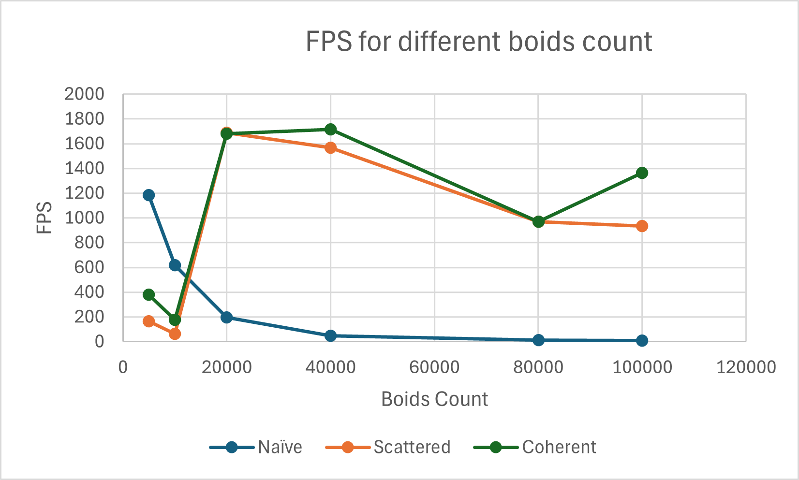

**University of Pennsylvania, CIS 5650: GPU Programming and Architecture,
Project 1 - Flocking**

* Manvi Agarwal
  * [LinkedIn](https://www.linkedin.com/in/manviagarwal27/)
   Tested on: Windows 11, AMD Ryzen 5 7640HS @ 4.30GHz 16GB, GeForce RTX 4060 8GB(personal)

# Performance Analysis

## 1. FPS vs Boids Count

The following gif shows boids flocking simulation showing each boid movement as per the three rules:
1. Cohesion
2. Seperation
3. Alignment

For this particular simulation, Uniform grid data structure is implemented to implement the three rules in order to calculate the velocity and position of boids for next time step.

## 2. Comparative Analysis for different methods of Boid flocking simulation

The three methods compared are:
1. Naive: Here for each boid, every other boid's position and velocity is checked for next step velocity and position compute for the boid.
2. Scattered Uniform Grid: Here Uniform grid is implemented and each boid is checked only against neighboring boids within defined grid cells.
3. Coherent Uniform Grid: This is similar to Scattered Uniform Grid except that here the data is rearranged in order to speed up access by accessing consecutive memory.

