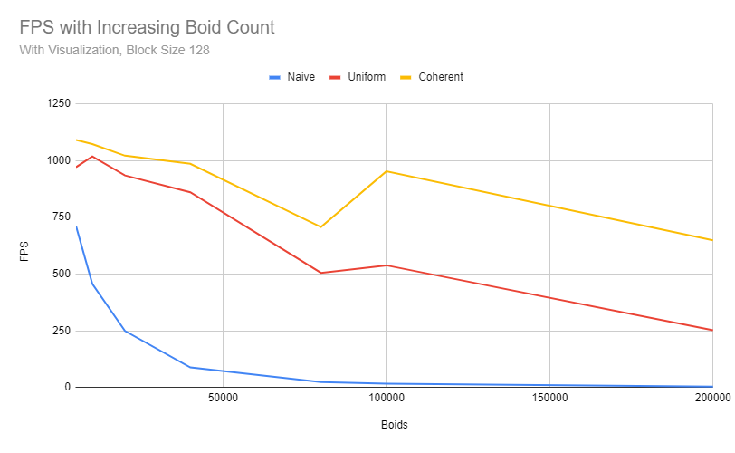
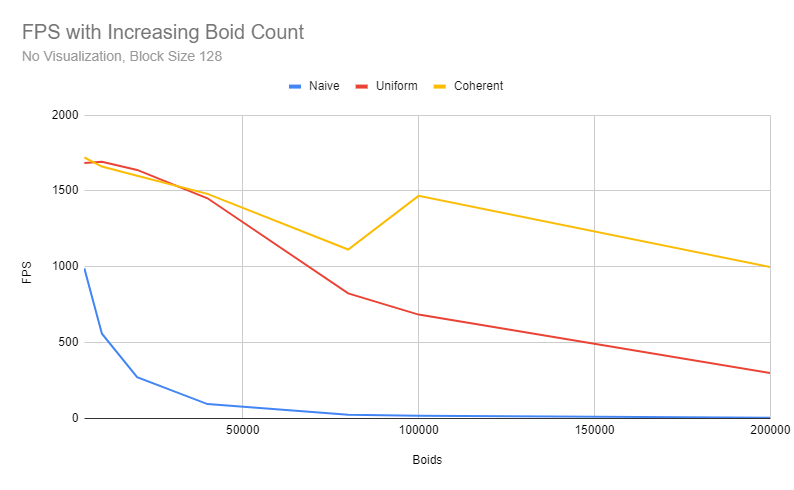

**University of Pennsylvania, CIS 5650: GPU Programming and Architecture,
Project 1 - Flocking**

- Dineth Meegoda
  - [LinkedIn](https://www.linkedin.com/in/dinethmeegoda/), [personal website](https://www.dinethmeegoda.com).
- Tested on: Windows 10 Pro, Ryzen 9 5900X 12 Core @ 3.7GHz 32GB, RTX 3070 8GB

## Summary

This project implements a flocking simulation based on Craig Reynold's Boids Rules and Algorithm. This project was optimized from the original naive method to include uniform grid based neighbor searching and coherent memory access.

This was done with the following approaches:

- **Naive**: Reynold's three rules are followed, and each boid checks every other boid to see how it influences itself (even if it is beyond its search distance).

- **Uniform**: Each boid is placed into a grid of uniform cell widths. As a result, boids only search the nearest cells that its search distance overlaps. This increases performance by a significant amount.

- **Coherent**: The memory for each position and velocity for boids is placed contigiously in memory as opposed to scattered. This allows for a considerable margin of performance to be gained.

## Performance Analysis

_Notes: The Performance based on FPS was calculated by averaging the reported Frame Count over 12 seconds, taking measurements every second. The first two counts of frames were removed to allow the simulation to stablize._

### For each implementation, how does changing the number of boids affect performance? Why do you think this is?

- **Naive**: Changing the number of boids heavily impacts performance since the algorithm has O(n^2) complexity. Each boid must check every other boid, which causes poor scaling.

- **Uniform**: This approach has a significant increase in performance over the naive approach since the number of checks is reduced with using the grid. As a result, the falloff of performance as the boids count increases is more linear, rather than exponential.

- **Coherent** This approach is a bit faster since it performs an additional optimization on top of the existing grid method. The increasing of boids still causes a linear decrease in FPS, however the performance is better and causes a less drastic drop off. The algorithm is still tracking a similar amount of neighbors, so algorithmic effiency has not changed much, but the memory management optimization causes some performance boost.

<table>
  <tr>
    <td>
      
      
Performance Graph with Visualization

    </td>
    <td>
      
      
Performance Graph with No Visualization

    </td>
  </tr>
</table>

### For each implementation, how does changing the block count and block size affect performance? Why do you think this is?

For all the approaches, the performance increases as the block size grows to about 64, and then plataeus and slightly falls off from there. The difference in performance between the implementation comes from the algorithmic discrepencies of computing the simulation. When the block size is under 64, the GPU seems to be underutilized. However, when the block size grows larger, some performance does drop off since there is a trade off between increasing the warps run on a block and resource availability (memory, scheduling with stalls, etc.). This hardware limit causes the limit on performance that is able to be gained by increasing the block size.

### For the coherent uniform grid: did you experience any performance improvements with the more coherent uniform grid? Was this the outcome you expected? Why or why not?

I did expect the coherent uniform grid to give a performance boost since the positions and velocities of each boid was contigiously in memory as opposed to being scattered in memory with the previous implementation. The largest performance inhibitor is reading and writing to memory, and improving memory latency by making them easier to access does give a significant performance boost.

### Did changing cell width and checking 27 vs 8 neighboring cells affect performance? Why or why not?

More cell checks generally resulted in more work, and less performance, but smaller cells means that there are less boids in each cell, which means less checks. However, there still must be a good amount of cells in order to be able to effectively use the cell/grid method as an optimization.

Generally, I experienced the greatest amount of performance when the cell width was a little less than twice the maximum search distance. This means that there were more than 8 cell checks, but the smaller amount of cells to check means less boids had to be checked than necessary. The real amount that we must limit is the number of boids that we check that are not within the search distance. In fact, as the amount of boids increased, and the simulation became more dense, performance was saved more by the greater amount of cell checks (of smaller cells).
