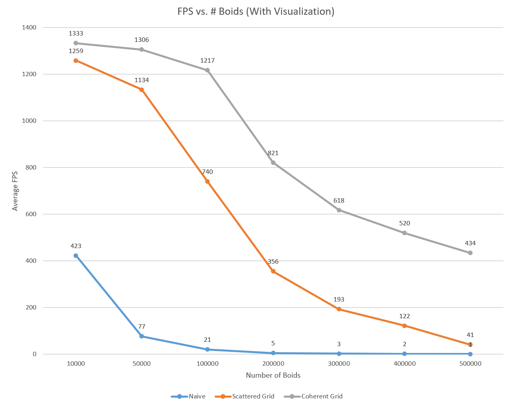
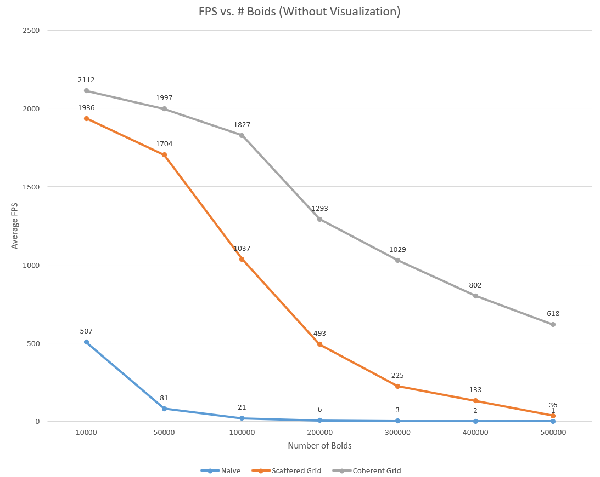
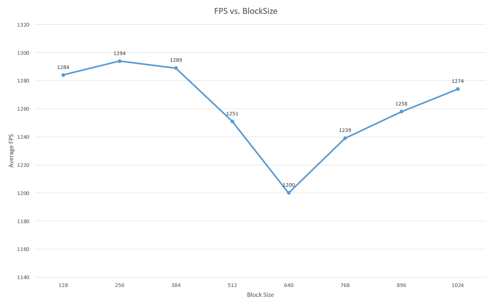

**University of Pennsylvania, CIS 565: GPU Programming and Architecture,
Project 1 - Flocking**
### Screenshots
* 5000 Boids

* 50000 Boids

* 500000 Boids

* 1000000 Boids

* Haoquan Liang
  * [LinkedIn](https://www.linkedin.com/in/leohaoquanliang/)
* Tested on: Windows 10, Ryzen 7 5800X 8 Core 3.80 GHz, NVIDIA GeForce RTX 3080 Ti 12 GB

### Extra Feature
* Grid-Looping Optimization: change searchRadius in kernUpdateVelNeighborSearchScattered() and kernUpdateVelNeighborSearchCoherent() to easily change the cell search radius. 2 for 8 and 3 for 27. 

### Performance Analysis
#### Average Frame Rate vs. Number of Boids (with visualization)

#### Average Frame Rate vs. Number of Boids (without visualization)

#### Average Frame Rate vs. Block Size (Coherent Grid, 50000 boids, visualization on)

### Questions and Answers
#### For each implementation, how does changing the number of boids affect performance? Why do you think this is?    
* The more boids to compute, the lowerer the performance. This is expected since if the number of boids are greater than the number of available GPU cores/threads, it will not be able to compute the result concurrently. If it needs more cycles to finish the computation, the performance will be worse.
#### For each implementation, how does changing the block count and block size affect performance? Why do you think this is?    
* From my result, the number of blocks/block size doesn't seem to affect the performance notably. It could simply be because all the block size I tested can fully utilize all the threads available on the GPU.
#### For the coherent uniform grid: did you experience any performance improvements with the more coherent uniform grid? Was this the outcome you expected? Why or why not?    
* Yes, I expect a performance, but not a significant one. However, according to my result, when the number of boids is less than  50000, coherent grid is only slightly better than the scattered grid. When there are more boids, the difference is significant! I did not expect this at all and I think it's because that when there are more boids, the cost of transferring the data (middle man) also increases, and so does the benefit of cutting down the middle man. 
#### Did changing cell width and checking 27 vs 8 neighboring cells affect performance? Why or why not? Be careful: it is insufficient (and possibly incorrect) to say that 27-cell is slower simply because there are more cells to check!    
* Yes, this will affect the performance. When the number of boids is not too large, the difference should be very small. However, if there are more boids, the cost of checking each cell and the cost of data transferring for each thread will increase significantly, which will noticeably affect the performance. 