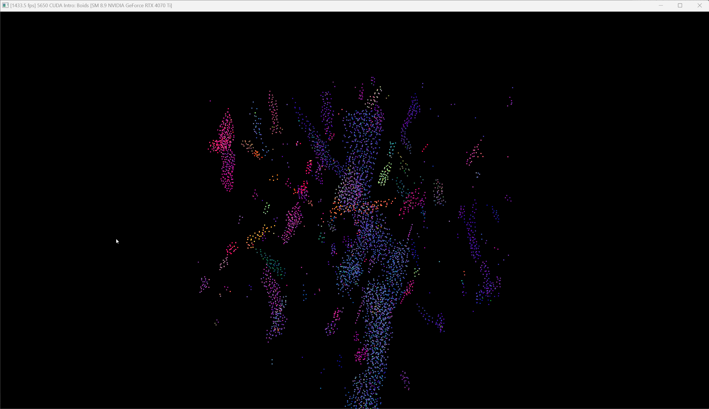
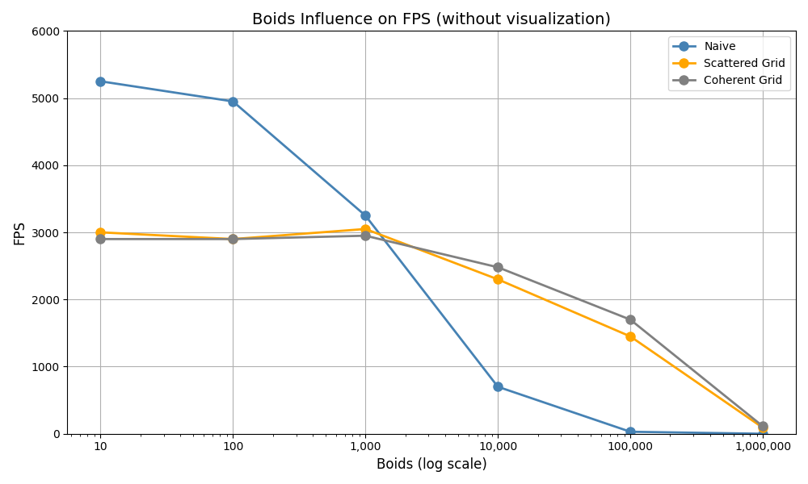
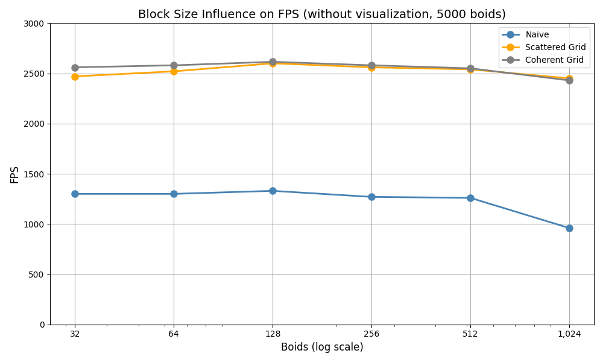

# University of Pennsylvania, CIS 5650: GPU Programming and Architecture,
## Project 1 - Flocking

* Zixiao Wang
  * [LinkedIn](https://www.linkedin.com/in/zixiao-wang-826a5a255/)
* Tested on: Windows 11, i7-14700K @ 3.40 GHz 32GB, GTX 4070TI 12GB  4K Monitor (Personal PC)
### Introduction
#### Before graph analysis, it would be better to briefly introduce the methods the project will use to stimulate.
##### The Naive approach can be understood as the most straightforward approach. For each Boid, it compares all of the other Boids to see if they match the influence rules. But it really wastes time on most of the Boids that are obviously not in the influence range.
##### Therefore, to better the preference, the uniform spatial grid is implemented. 

### Visualization of Uniform Grid Search and Semi-coherent Grid Search
**Resolution**: 2560x1440, **Point size**: 4

#### Uniform Grid Search with 5000 Particles, Block Size: 128

#### Semi-coherent Grid Search with 5000 Particles, Block Size: 128

#### Uniform Grid Search with 50000 Particles, Block Size: 128

#### Semi-coherent Grid Search with 50000 Particles, Block Size: 128

### Performance Analysis
#### Number of Boids Influence on FPS, Block Size: 128

##### For each implementation method, the Boids number influences the FPS a lot. While the naive approach checks all the Boids, it obviously will be slower if the Boids number is high, as there are many redundant Boids to check. Each check will access the global memory to get the velocity and position of the Boid. However, If the Uniform Grid method is used, the redundant checks are eliminated, so the number of global memory access largely decreases. The more Boids it tries to simulate the larger the difference between the Naive approach and Uniform Grid approach. However, it is important to remember, that the less the Boids are, the faster the Naive approach is. The reason is that fewer Boids will limit the total comparison between the Boid with other Boids with the Naive approach. While the Naive approach only searches a small number of Boids, the Uniform Grid has to use more global memory access to compute the grid each Boid belongs to. Once the number of Boids passes a threshold, which is around 1000, as shown in the above graph, the Uniform Grid will be faster than the Naive approach. Further, while the Coherent Grid ensures it accesses the velocity and position data is contiguous, the improvement is really that huge as the number of global memory access does not reduce dramatically. Instead, once the number of the Boids reach a high number(with out changing scene scale), all Boids are close to each other, so the reduced accesses might be ignored.

#### Block Size Influence on FPS, 5000 Boids

##### The block size does not influence the FPS too much if the shared memory is not implemented. Less Block size might not fully utilize the GPU ability, while more blocks will pressure the register and memory leading to the downgrade of the performance and even failure because it cannot host that many blocks. The best block size for 5000 Boids in this project is about 128. However, I believe the number of block sizes should be increased if shared memory is implemented and used to handle the global memory access within the block.

