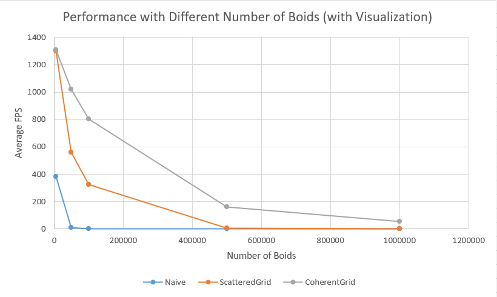
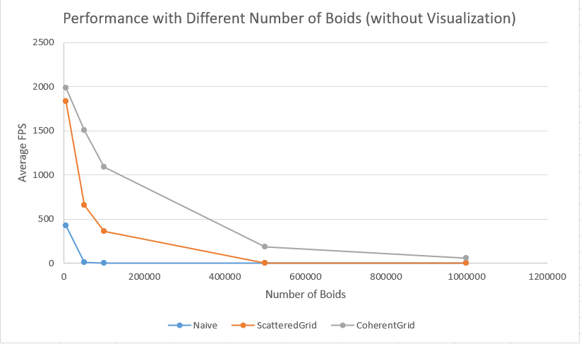
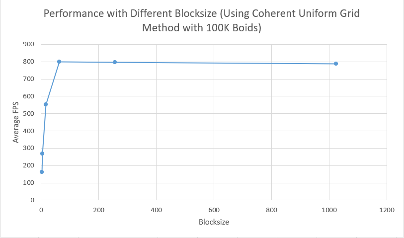

**University of Pennsylvania, CIS 565: GPU Programming and Architecture,
Project 1 - Flocking**

* Zhuohao Lin
  * [LinkedIn](https://www.linkedin.com/in/zhuohao-lin-960b54194/)
* Tested on: Windows 10, i7-10875H @ 2.30GHz 16GB, NVIDIA Grforce RTX 2060 6GB (personal machine)

# Features
I implemented 3 ways to find neighbors of boids for velocity computation and flocking boids simulation.
* Naive method: Simply check through all of boids to find neighbors of a boid.
* Scattered uniform grid: Put boids in uniform grids based on their position, and then find neighbor grids in order to find neighbor boids.
* Coherent unfiform grid: Use the uniform grid method, and rearrange position and velocity data so that they are contiguous in memory.

# Screenshots

# Performance Analysis

### Figure 1

### Figure 2

### Figure 3

### *For each implementation, how does changing the number of boids affect performance? Why do you think this is?*

The performance drops as the number of boids increases as we can see in figure 1 and 2. This is because the number of threads required for computation exceeds the number of threads limit in each block.As the number of boids increases, there are more and more threads waiting for computation.

 

### *For each implementation, how does changing the block count and block size affect performance? Why do you think this is?*

The performance improves as the block size increases at the beginning. However, when block size reaches a threshold, the performance would not improve any more but remain at the same level. The reason is that there are more threads running in parallel as the block size increases. The performance doesn't improve after the block size reaches a threshold because the computing power of the GPU is limited.

 

### *For the coherent uniform grid: did you experience any performance improvements with the more coherent uniform grid? Was this the outcome you expected? Why or why not?*

As the number of boids becomes larger, the performance improvements with coherent uniform grid becomes more significant. This is expected since the GPU will access the the global memory more frequently when the number of boids increases and that gradually becomes a large cost. With coherent uniform grid, the GPU reduces the times to access global memory. Therefore, it is faster.

 

### *Did changing cell width and checking 27 vs 8 neighboring cells affect performance? Why or why not?*

Changing cell width and checking 27 vs 8 neighboring cells affects performance. Checking 27 cells is faster than checking 9 neighboring cells, and the difference becomes significant when the number of boids is large enough. This is because we're actually checking less neighbor boids when checking 27 cells. 
The cell width we use for checking 27 cells is (1 * maxRuleDistance), thus the total checking space is (27 * maxRuleDistance3). The cell width we use for checking 8 cells is (2 * maxRuleDistance), thus the total checking space is (64 * maxRuleDistance3). With less boids to check, we get the performance improvements.
