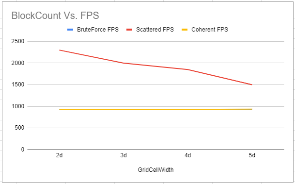
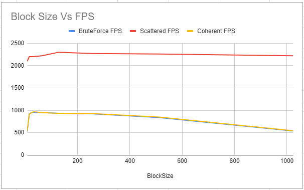
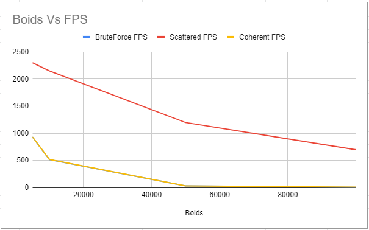

**University of Pennsylvania, CIS 565: GPU Programming and Architecture,
Project 1 - Flocking**

* Edward Zhang
  * https://www.linkedin.com/in/edwardjczhang/
  * https://zedward23.github.io/personal_Website/
 
* Tested on: Windows 10 Home, i7-11800H @ 2.3GHz, 16.0GB, NVIDIA GeForce RTX 3060 Laptop GPU

### ReadMe

Demos:

* For each implementation, how does changing the number of boids affect
performance? Why do you think this is?
* For each implementation, how does changing the block count and block size
affect performance? Why do you think this is?
* For the coherent uniform grid: did you experience any performance improvements
with the more coherent uniform grid? Was this the outcome you expected?
Why or why not?
* Did changing cell width and checking 27 vs 8 neighboring cells affect performance?
Why or why not? Be careful: it is insufficient (and possibly incorrect) to say
that 27-cell is slower simply because there are more cells to check!

Include screenshots, analysis, etc. (Remember, this is public, so don't put
anything here that you don't want to share with the world.)
