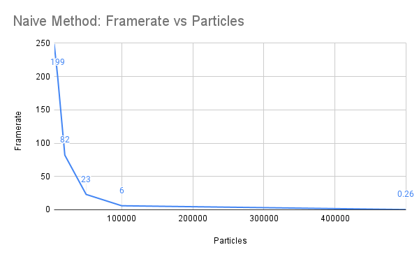

**University of Pennsylvania, CIS 565: GPU Programming and Architecture,
Project 1 - Flocking**

* Yilin Liu
  * [LinkedIn](https://www.linkedin.com/in/yilin-liu-9538ba1a5/), [Personal Website](https://yilin.games/)
* Tested on: Windows 10, i7-10750H @ 2.59GHz 32GB, GeForce RTX 2070 with Max-Q 8GB (Personal Laptop) 

# Project 1 Results

##  Screenshots:
||
|:--:| 
| *1M boids with Uniform Coherent Grid* |

||
|:--:| 
| *200k boids with Unifrom Grid* |

## Analysis

||
|:--:| 
| *Naive method* |

||
|:--:| 
| *Uniform Grid Scattered method* |

||
|:--:| 
| *Uniform Grid Coherent method* |
## Answers:

- For each implementation, how does changing the number of boids affect performance? Why do you think this is?
Answer: 
For the naïve implementation, increasing the number of boids will significantly affect performance. The complexity is exponential related to the number of boids since we need to calculate the distance between every boids
For uniform grid methods, the effect is not that obvious since we only calculate the distance between boids among 8 out of 27 grids. 

- For each implementation, how does changing the block count and block size affect performance? Why do you think this is?
  block size
Answer: 

- For the coherent uniform grid: did you experience any performance improvements with the more coherent uniform grid? Was this the outcome you expected? Why or why not?
Answer: 
  

- Did changing cell width and checking 27 vs 8 neighboring cells affect performance? Why or why not? Be careful: it is insufficient (and possibly incorrect) to say that 27-cell is slower simply because there are more cells to check!
Answer: 
Changing to 27 cells will significantly improve the performance. This effect is especially obvious when boids are super-dense in the grid, because simply searching through 27 cells may be more efficient than calculating the nearest neighborhoods. 