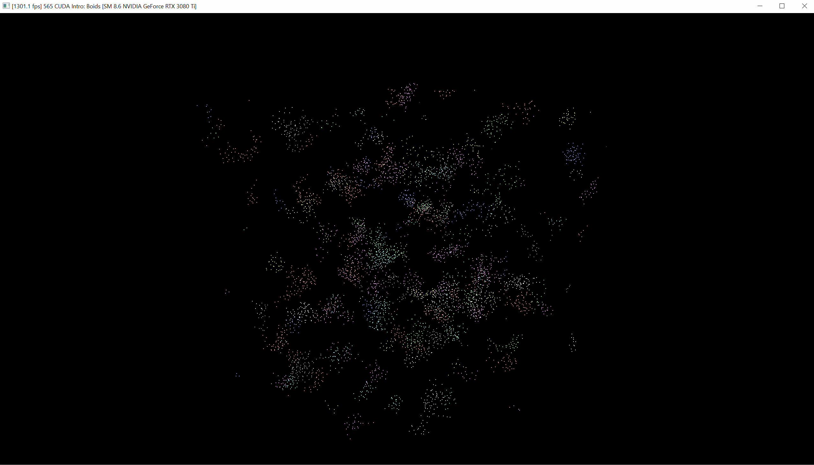

**University of Pennsylvania, CIS 565: GPU Programming and Architecture,
Project 1 - Flocking**
### Screenshots
* 5000 Boids

* 50000 Boids

* 500000 Boids

* 1000000 Boids

* Haoquan Liang
  * [LinkedIn](https://www.linkedin.com/in/leohaoquanliang/)
* Tested on: Windows 10, Ryzen 7 5800X 8 Core 3.80 GHz, NVIDIA GeForce RTX 3080 Ti 12 GB

### Performance Analysis
### Questions and Answers
