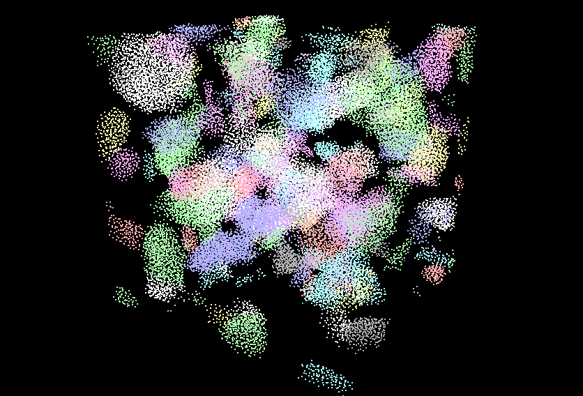
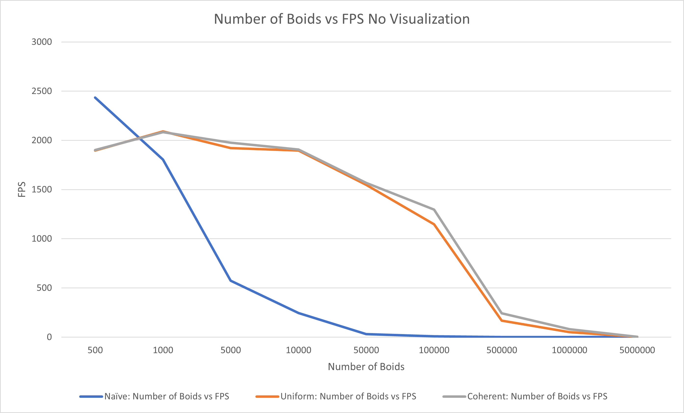
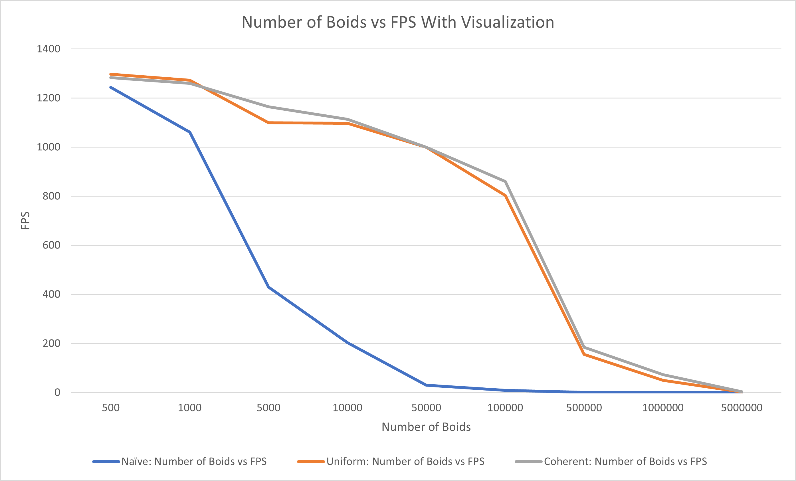
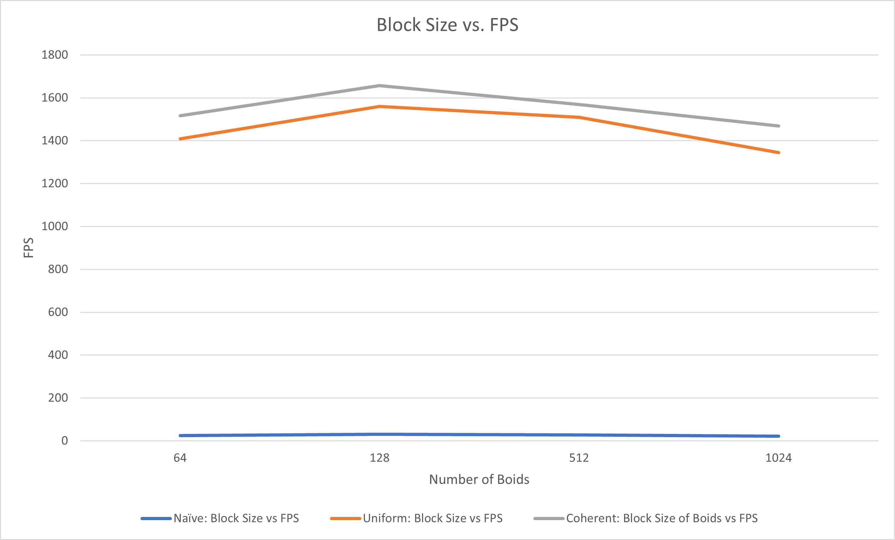
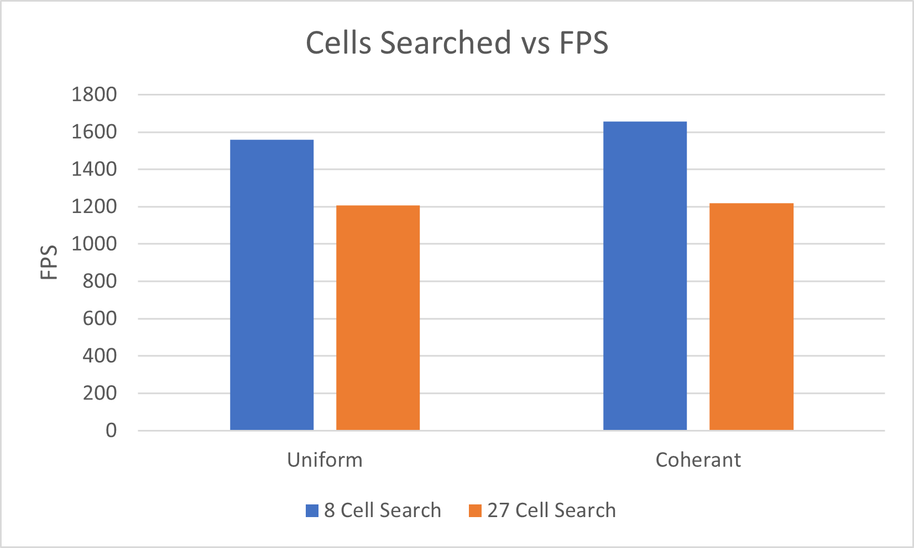
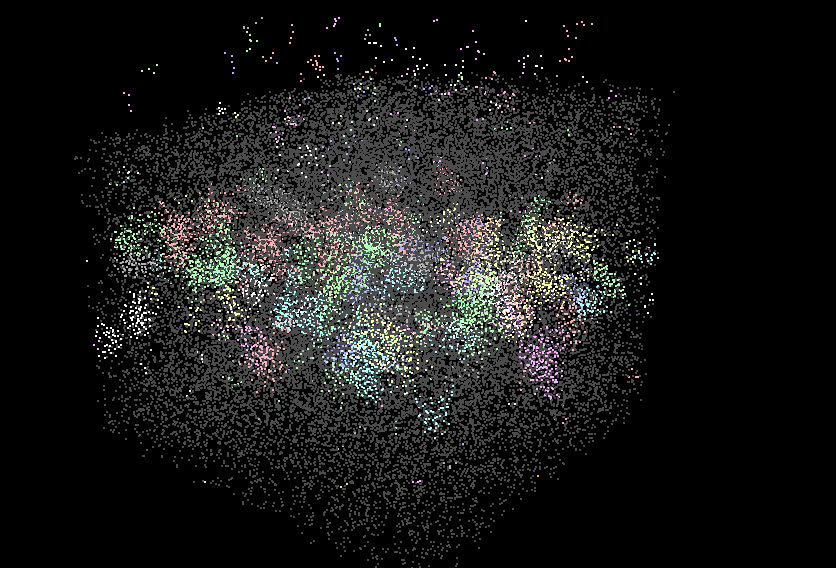

**University of Pennsylvania, CIS 565: GPU Programming and Architecture,
Project 1 - Flocking**

* Tom Donnelly
  * [LinkedIn](https://www.linkedin.com/in/the-tom-donnelly/)
* Tested on: Windows 11, AMD Ryzen 9 5900X, NVIDIA GeForce RTX 3070 (Personal Desktop)

---

### Analysis + Questions
***
#### For each implementation, how does changing the number of boids affect performance? Why do you think this is?

*Taken at 128 Block Size*  
As the number of boids increase the performance for all implementations decreases. This is expected as the number of threads available on the GPU to run at the same time is also limited. 
As the number of boids increases more time will be needed to calculate the affect on other boids and performance will decrease. Interesting to note is that at a low number of  boids the Naive implementation as 
better performance. It's likely that checking every boid at a low boid count is faster than computing grid indices and sorting boids.

#### For each implementation, how does changing the block count and block size affect performance? Why do you think this is?

*Taken with no visualization and 50,000 boids*  
Block size did not have a large affect on performance, this is likely due to the number of blocks/threads used being a function of the number of boids. (numObjects + blockSize - 1) / blockSize. 
This means the number of threads running is at maximum of the capability of the GPU or the number of boids being simulated at once. Changing the number of blocks to a smaller amount would break the simulation
for boids > blocks * blocksize. The lowered performance at a higher block size count may be due to inactive threads in a block. If the number of boids does not fit nicely into a block, the last block used will have a larger number 
of inactive threads.
#### For the coherent uniform grid: did you experience any performance improvements with the more coherent uniform grid? Was this the outcome you expected? Why or why not?
There were small performance improvements at a high amount of boids (~100,000). I expected the improvement to be more noticeable and at all counts of boids so this result was unexpected. It may be the memory performance 
improvements for a coherent grid are not noticeable until being done at a large scale.
#### Did changing cell width and checking 27 vs 8 neighboring cells affect performance? Why or why not? Be careful: it is insufficient (and possibly incorrect) to say that 27-cell is slower simply because there are more cells to check!

*Taken with no visualization and 50,000 boids*  
Changed the cell width and checking 27 neighboring cells decreased performance for both uniform and uniform coherent implementations. Searching the cells may have impacted performance however as the grid cells were only the 
maximum size of the impacted rules, there were less boids per cell to search and likely less boids checked against flocking distance rules. What likely hurt performance more was the indexing of boids in the larger grid.
As the cell width went down the grid resolution had to increase along with the number of cells. This may have made locating start and end indices take longer.
### Blooper

