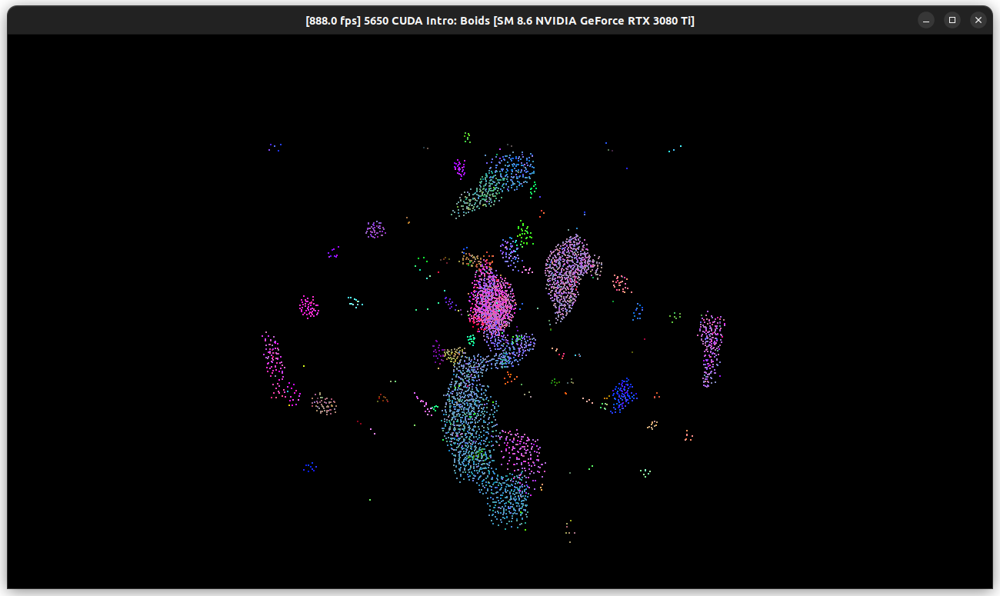
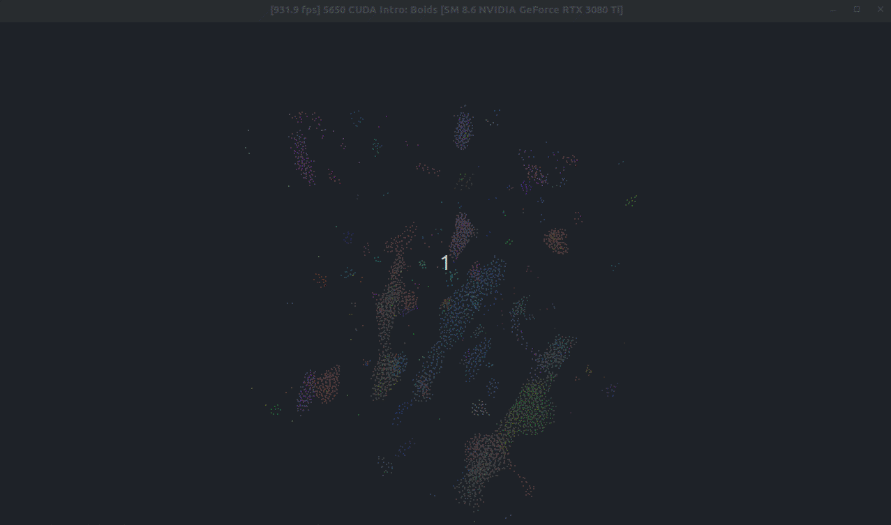
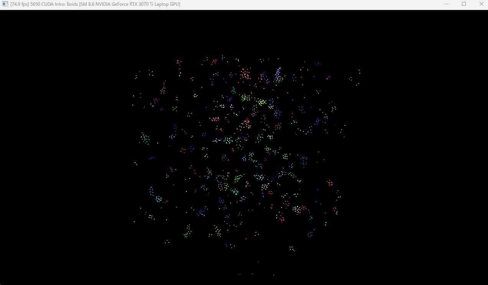
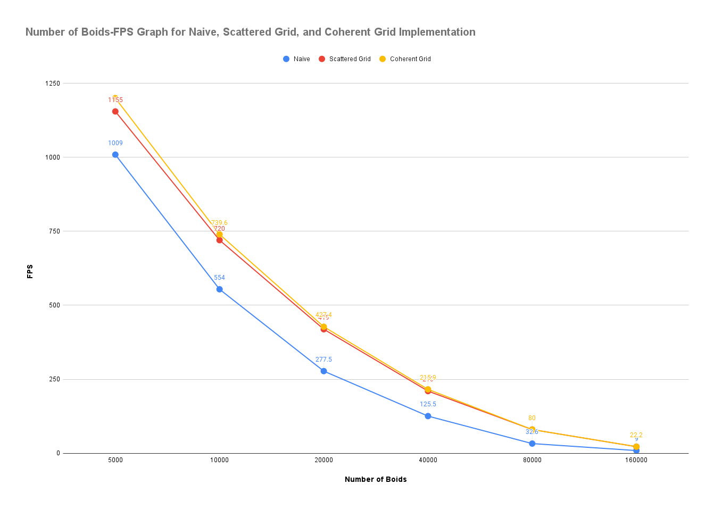
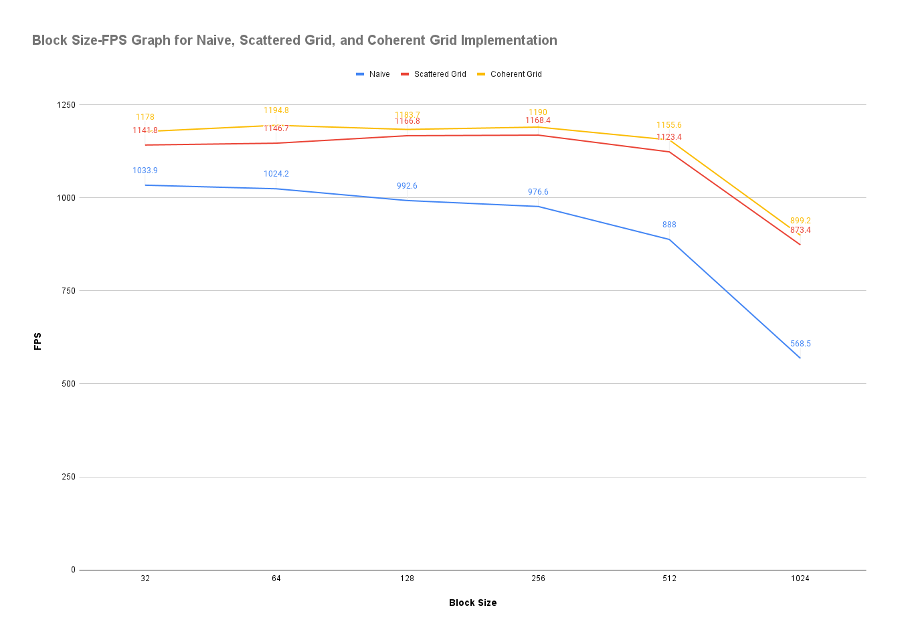

**University of Pennsylvania, CIS 5650: GPU Programming and Architecture,
Project 1 - Flocking**

* Xinran Tao
  * [LinkedIn](https://www.linkedin.com/in/xinran-tao/), [Personal Website](https://www.xinrantao.com/), [GitHub](https://github.com/theBoilingPoint).
* Tested on: 
  - Ubuntu 22.04, i7-11700K @ 3.60GHz × 16, RAM 32GB, GeForce RTX 3080 Ti 12GB (Personal)

### Visualisation

Below are the GIFs of different implementations with 5000 boids.

#### Naive Implementation

#### Scattered Grid Implementation

#### Coherent Grid Implementation

### Performance Analysis
All experiments are conducted with VSync disabled and visualisation turned off.

#### FPS Change with Number of Boids

##### Method
The block size is fixed at 128 and the cell width is fixed at 2 units for all experiments.

Given that calculating the average FPS per `n` number of iterations (and printing them out in the terminal) decreases the FPS, the FPS listed below are the mean of the maximum and minimum FPS after the algorithm has converged (i.e. after running for 60s). 

##### Experiment Results

###### Raw Data
| Number of Boids    | FPS-Naive | FPS-Scattered Grid | FPS-Coherent Grid |
| ------------------ | --------- | -------------------| ----------------- |
| 5000               | 1009.0    | 1155.0             | 1200.0            |
| 10000              | 554.0     | 720.0              | 739.6             |
| 20000              | 277.5     | 419.0              | 427.4             |
| 40000              | 125.5     | 210.0              | 215.9             |
| 80000              | 32.6      | 80.0               | 80.0              |
| 160000             | 9.0       | 22.1               | 22.2              |

###### Graph

##### Results Analysis
For each implementation, the FPS decreases as the number of boids increases. All three implementations share the same FPS change pattern. The drop rate sof each FPS roughly follows the increase rate of the number of boids. More specifically, if the number of boids doubles, the FPS will be halved. 

Overall, the coherent grid implementation has the highest FPS, followed by the scattered grid implementation, and the naive implementation has the lowest FPS. Although as the number of boids increases to above 40000, the advantage of the coherent grid implementation over the scattered grid implementation becomes less significant.

The general pattern of the FPS change with the number of boids is as expected. The naive implementation has the lowest FPS because it has the highest time complexity. The scattered grid implementation has a higher FPS than the naive implementation because it reduces the number of boids that need to be checked for each boid. The coherent grid implementation has the highest FPS because it reduces the number of memory accesses. 

Nonetheless, the FPS of all implementations decreases as the number of boids increases. In the naive implementation, each boid checks every other boid, leading to a quadratic increase in computations, while the grid-based implementations reduce this to a more manageable linear complexity by limiting checks to local grid cells. However, even with these optimizations, the workload still doubles as the number of boids doubles, leading to proportional FPS reductions. Additionally, increased memory traffic and GPU resource limits, such as bandwidth and cache usage, further contribute to the performance drop, as the system struggles to handle the larger number of boids efficiently. Thus, the FPS is inversely proportional to the number of boids, resulting in a halving of FPS as the boid count doubles.

#### FPS Change with Block Size

##### Method
The number of boids is fixed at 5000 and the cell width is fixed at 2 units for all experiments.

Once again, the FPS listed below are the mean of the maximum and minimum FPS after the algorithm has converged (i.e. after running for 60s). 

##### Experiment Results
Note that initialising `blockSize` to 2048 and above will result in a CUDA error.

###### Raw Data
| Block Size    | FPS-Naive | FPS-Scattered Grid | FPS-Coherent Grid |
| --------------| --------- | -------------------| ----------------- |
| 32            | 1033.9    | 1141.8             | 1178.0            |
| 64            | 1024.2    | 1146.7             | 1194.8            |
| 128           | 992.6     | 1166.8             | 1183.7            |
| 256           | 976.6     | 1168.4             | 1190.0            |
| 512           | 888.0     | 1123.4             | 1155.6            |
| 1024          | 568.5     | 873.4              | 899.2             |

###### Graph

##### Results Analysis
Overall, the coherent grid implementation still has the highest FPS, followed by the scattered grid implementation, and the naive implementation has the lowest FPS. The reason for this is the same as the previous analysis.

At smaller block sizes (32–64), the GPU can efficiently handle computations, as the workload is well distributed across threads, and there is relatively little overhead in managing thread blocks. The higher FPS values observed at small block sizes are due to:
- **Optimal resource utilization**: The smaller block sizes allow the GPU to fully load its processing cores, maximizing parallel execution.
- **Efficient memory access**: At small block sizes, threads within a block are generally accessing contiguous memory, reducing memory latency and maximizing cache utilization.

FPS shows marginal increases or plateaus at medium block sizes (128–256), depending on the implementation. The initial benefit of increasing block size diminishes as the block size grows. While a medium block size still allows good parallelization, the performance benefit tapers off due to:
- **Saturation of GPU resources**: As the block size increases, the number of threads per block also increases, and eventually, the GPU’s available resources (e.g., registers, shared memory) are fully utilized. Any further increase in block size provides diminishing returns.
- **Thread divergence and memory contention**: Larger block sizes may introduce thread divergence and increased contention for shared resources (e.g., memory bandwidth), which can limit performance gains.

FPS starts to decrease significantly for all implementations at larger block sizes (512–1024). This performance drop is primarily due to the fact that as block size increases, the overhead of managing threads and memory becomes a bottleneck:
- **Inefficient resource usage**: Larger blocks may result in fewer blocks being executed concurrently on the GPU, leading to underutilization of GPU cores. The GPU cannot launch enough thread blocks simultaneously to hide memory latency, reducing overall throughput.
- **Increased memory pressure**: As block size grows, the amount of memory accessed per block increases, leading to higher memory traffic and contention for global memory bandwidth. This causes a significant drop in FPS as memory access becomes the limiting factor.
- **Worse memory access patterns**: Larger blocks tend to access memory more randomly or in scattered patterns, which can degrade the memory coalescing benefits seen at smaller block sizes. This increases memory latency and reduces performance.

#### FPS Change with Cell Width
For all three implementations, increasing the cell width from 2 to 3 units decreases the FPS. This is expected because each boid will have to check more cells in the grid, leading to more memory accesses and computations. 