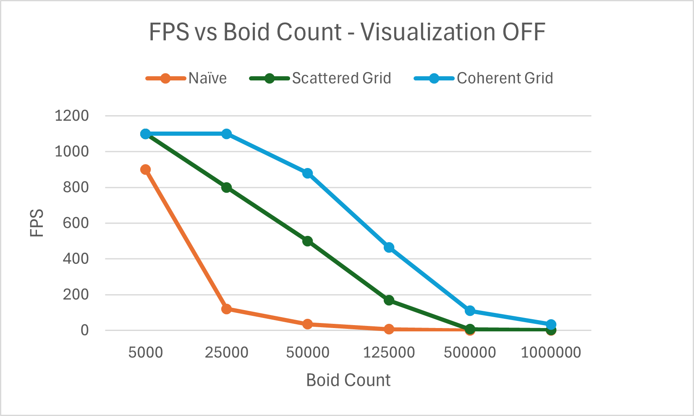
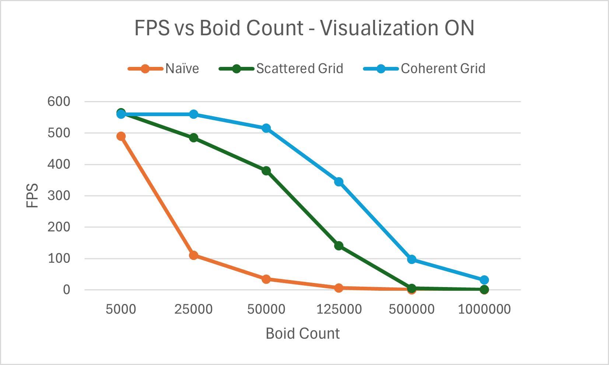
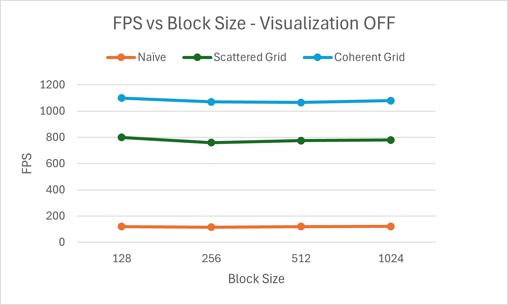
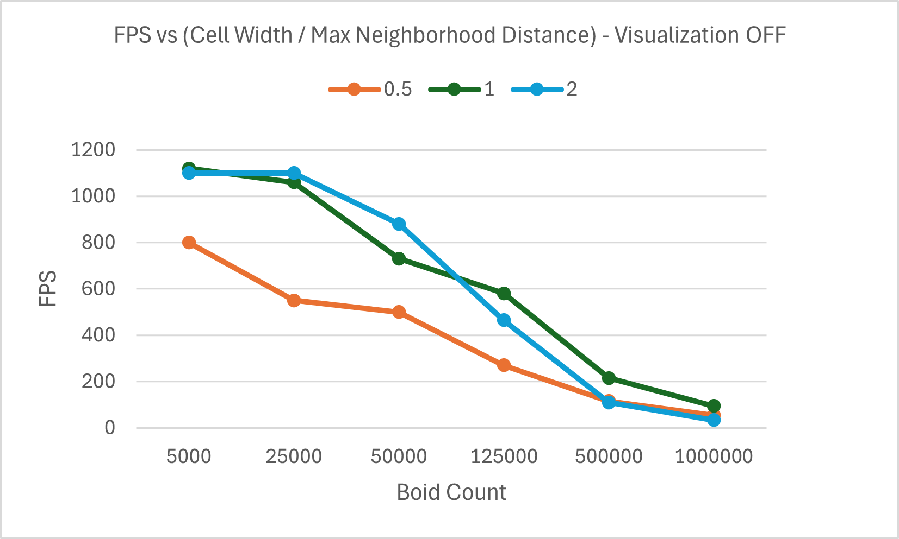

**University of Pennsylvania, CIS 5650: GPU Programming and Architecture,
Project 1 - Flocking**

* Michael Rabbitz
  * [LinkedIn](https://www.linkedin.com/in/mike-rabbitz)
* Tested on: Windows 10, i7-9750H @ 2.60GHz 32GB, RTX 2060 6GB (Personal)

## Part 1: Introduction

In the Boids flocking simulation, particles representing birds or fish
(boids) move around the simulation space according to three rules:

1. **Cohesion** - boids move towards the perceived center of mass of their neighbors
2. **Separation** - boids avoid getting to close to their neighbors
3. **Alignment** - boids generally try to move with the same direction and speed as
their neighbors

These three rules specify a boid's velocity change in a timestep.
At every timestep, a boid thus has to look at each of its neighboring boids
and compute the velocity change contribution from each of the three rules.

The implemented algorithm for the three rules is based on [Conard Parker's notes](http://www.vergenet.net/~conrad/boids/pseudocode.html)
with slight adaptations. For the purposes of an interesting simulation,
we will say that two boids only influence each other by a given rule if they
are within the rule's **neighborhood distance** of each other, respectively.

Below are two outputs from the simulation, slowed down for ease of viewing:

|25,000 Boid Count|
|:--:|
||

|500,000 Boid Count|
|:--:|
||

## Part 2: Implementation Details
Three methods of implementation were used to highlight their respective performance implications.

#### Method 1: Naive Neighbor Search
A given boid iterates through every other boid in the simulation to check if their relative distance falls within the neighborhood distance defined by any of the three rules.
For each applicable rule, the given boid's velocity change is calculated based on that rule’s criteria.

#### Method 2: Uniform Grid Scattered Neighbor Search
In a preprocess step, "bin" the boids into a uniform spatial grid data structure.
With the clever use of a few buffers, this means that pointers to boids within the same grid cell are contiguous in memory.
However, the boid data itself (velocities and positions) is scattered all over the place. Hence, the "Scattered" in Uniform Grid Scattered Neighbor Search.

After the preprocess step, we apply the three boid rules to update a given boid's velocity by only considering other boids that are in nearby grid cells.

To determine which nearby grid cells a boid should consider,
start by dividing twice the maximum neighborhood distance of the three boid rules by the grid cell width.
If the result is not a whole number (e.g. 4.2), round up to the next whole number (e.g. 4.2 rounds up to 5).
This number represents the ± offset in each dimension around the boid's current cell,
defining the range of neighboring cells to check for interactions with other boids.

For example, if the maximum neighborhood distance is 5 and the cell width is 10, the result is (2 * 5) / 10 = 1.
This means you should consider the boid's own cell, plus the adjacent cells with an offset of ±1 in each dimension.
In this case, the relevant cells are represented by ([x - 1, x + 1], [y - 1, y + 1], [z - 1, z + 1]), where (x, y, z) is the boid's cell.
This yields a total of 33 = 27 cells, including the boid’s own cell.

You then iterate through the boids in these cells to apply the three boid rules, updating the velocity of the given boid accordingly.

*During this iteration is where we "reach" for the boid data that is scattered in memory.*

#### Method 3: Uniform Grid Coherent Neighbor Search
Everything is the same as Method 2, except we eliminate the "reach" for the boid data that is scattered in memory.
We do this by rearranging the boid data itself so that all the velocities and positions of boids in the same grid cell are also contiguous in memory.

#### Grid-Looping Optimization for Methods 2 and 3:
As described in Method 2, we first identify the grid cells containing the boids relevant for applying the three boid rules to a given boid.

To optimize this, we calculate the closest point on each of these cells to the given boid's position and check if this distance is within the maximum neighborhood distance defined by the boid rules. If the distance exceeds this threshold, we exclude the boids in that cell from consideration.

To find the closest point, we clamp the given boid's position to the bounds of the cell along each dimension, and then compute the difference between the boid's position and this closest point.

## Part 3: Performance Analysis
- Frames Per Second (FPS) is the measurment of performance in this section. FPS is measured using a GLFW timer within the main loop.
- In cases where Visualization of the boids is disabled, the FPS reported will be for the simulation only.

### 3.1: FPS vs Boid Count
**Section 3.1 fixed variables: block size of 128**

#### 3.1.1: Visualization OFF

| Boid Count | Naive FPS | Scattered Grid FPS | Coherent Grid FPS |
| ---------- | --------- | ------------------ | ----------------- |
| 5,000      | 900       | 1100               | 1100              |
| 25,000     | 120       | 800                | 1100              |
| 50,000     | 35        | 500                | 880               |
| 125,000    | 6         | 168                | 465               |
| 500,000    | N/A       | 6                  | 110               |
| 1,000,000  | N/A       | 2                  | 33                |

 

#### 3.1.2: Visualization ON

| Boid Count | Naive FPS | Scattered Grid FPS | Coherent Grid FPS |
| ---------- | --------- | ------------------ | ----------------- |
| 5,000      | 490       | 565                | 560               |
| 25,000     | 110       | 485                | 560               |
| 50,000     | 34        | 380                | 515               |
| 125,000    | 6         | 140                | 345               |
| 500,000    | N/A       | 5                  | 97                |
| 1,000,000  | N/A       | 1                  | 31                |

 

#### 3.1.3: Observations
The steep performance drop in Naive Neighbor Search is expected due to its O(n2) complexity, which scales poorly with increasing boid count.
In contrast, both Uniform Grid Scattered Neighbor Search and Uniform Grid Coherent Neighbor Search, with their O(n) complexity, handle increasing boid count more efficiently.
However, these methods also experience performance degradation as the grid becomes densely populated and every cell is filled with boids.
This could perhaps be mitigated by increasing the scene scale as the number of boids increase, which would decrease the density of boids per cell.
As we push the limits of the Uniform Grid methods, Coherent Neighbor Search always outperforms Scattered Neighbor Search simply because of the way heavily-accessed data is stored contiguously in memory.

 

### 3.2: FPS vs Block Size
**Section 3.2 fixed variables: boid count of 25,000**

#### 3.2.1: Visualization OFF

| Block Size | Naive FPS | Scattered Grid FPS | Coherent Grid FPS |
| ---------- | --------- | ------------------ | ----------------- |
| 128        | 120       | 800                | 1100              |
| 256        | 115       | 760                | 1070              |
| 512        | 120       | 775                | 1065              |
| 1024       | 121       | 780                | 1080              |

 

#### 3.2.2: Observations
For each implementation method, changing the block count and block size has no significant impact on performance.
It is worth noting that the GPU used for this test has 1920 CUDA cores (Streaming Processors) across 30 SMs (Streaming MultiProcessors), which equates to 64 cores per SM. Futher, it can handle 1024 max resident threads per SM, 16 max resident blocks per SM, and 1024 max threads per block.
Given these specificationss, it makes sense why there is minimal performance variation across the tested block sizes.
This is due to the GPU's efficient occupancy and scheduling, as well as the kernels' lack of dependence on synchronization or shared memory, which are more sensitive to block size changes.

 

### 3.3: FPS vs (Cell Width / Max Neighborhood Distance) Ratio
**Section 3.3 fixed variables: maximum neighborhood distance, block size of 128 and implementation method of Uniform Grid Coherent Neighbor Search with Grid-Looping Optimization**

The (Cell Width / Max Neighborhood Distance) Ratio is a fancy term to describe the uniform grid cell size relative to the maximum distance of the three boid rules.
If we assume a fixed Max Neighborhood Distance of the default value of the simulation, which is 5, we can intuitively see how the ratio has a positive correlation to cell size.

As a reminder of the importance of this ratio, which is referenced in Part 2 under Method 2:

*To determine which nearby grid cells a boid should consider,
start by dividing twice the maximum neighborhood distance of the three boid rules by the grid cell width.
If the result is not a whole number (e.g. 4.2), round up to the next whole number (e.g. 4.2 rounds up to 5).
This number represents the ± offset in each dimension around the boid's current cell,
defining the range of neighboring cells to check for interactions with other boids.*

We can rewrite
$$\frac{2 \cdot \text{Max Neighborhood Distance}}{\text{Cell Width}}$$
as
$$\frac{2}{\left(\frac{\text{Cell Width}}{\text{Max Neighborhood Distance}}\right)}$$

Note the rewritten equation includes the (Cell Width / Max Neighborhood Distance) Ratio of this section.

Once we have the ± offset of cells to consider for a given boid, we can calculate the total number of cells in 3D space to consider as:

$((2 \cdot \text{offset}) + 1)^3$

Here are the results of what we use in this section's performance test:

| Cell Width | Max Neighborhood Distance |      Ratio      |  ± offset  | Total number of cells to consider |
| ---------- | ------------------------- | --------------- | ----------- | --------------------------------- |
| 2.5        | 5                         | 2.5  / 5 = 0.5  | 2 / 0.5 = 4 | ((2 * 4) + 1)3 = 729   |
| 5          | 5                         | 5.0  / 5 = 1.0  | 2 / 1.0 = 2 | ((2 * 2) + 1)3 = 125   |
| 10         | 5                         | 10   / 5 = 2.0  | 2 / 2.0 = 1 | ((2 * 1) + 1)3 = 27    |

However, keep in mind the Grid-Loop Optimization, where we only continue to consider the boids in any of these cells only if the cell's nearest distance from the boid is not greater than the Max Neighborhood Distance.

#### 3.3.1: Visualization OFF

| Boid Count | 0.5 Ratio FPS | 1.0 Ratio FPS | 2.0 Ratio FPS |
| ---------- | ------------- | ------------- | ------------- |
| 5,000      | 800           | 1120          | 1100          |
| 25,000     | 550           | 1060          | 1100          |
| 50,000     | 500           | 730           | 880           |
| 125,000    | 270           | 580           | 465           |
| 500,000    | 115           | 215           | 110           |
| 1,000,000  | 54            | 95            | 33            |

 

#### 3.3.2: Observations
When boid counts are low, using larger cells with fewer neighbors results in better performance because each cell contains fewer boids to evaluate.
In these scenarios, the overhead from examining more grid cells outweighs the advantage of having fewer boids per cell.
This trend is evident at lower boid counts (e.g. 5,000 and 25,000), where higher ratios (1.0 and 2.0) consistently outperform the lower 0.5 ratio.

As the boid count increases, the advantage of smaller cells (a lower ratio) becomes apparent.
Smaller cells reduce the number of boids per cell and consequently the number of interactions to manage, improving efficiency in high-density scenarios.
For instance, at 500,000 boids, the 0.5 ratio outperforms the 2.0 ratio.
The 1.0 ratio, offering a balanced approach where cell size matches the maximum neighborhood distance, generally provides the best overall performance.

Thus, while higher ratios are more effective at lower boid counts, a lower ratio becomes more efficient as boid density increases, as the cost of checking more neighbors is offset by fewer interactions per cell.
However, a balance is crucial. The middle ratio of 1.0, which aligns with the maximum neighborhood distance, clearly offers the best overall performance across various boid densities.
