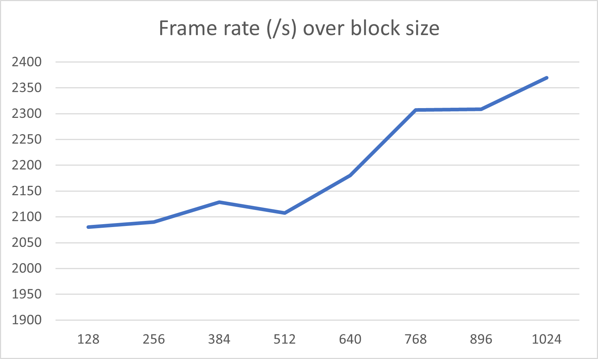
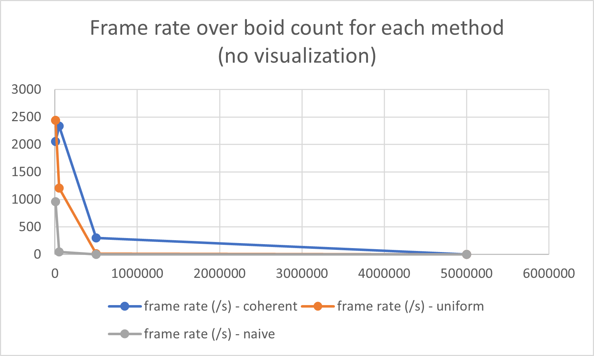
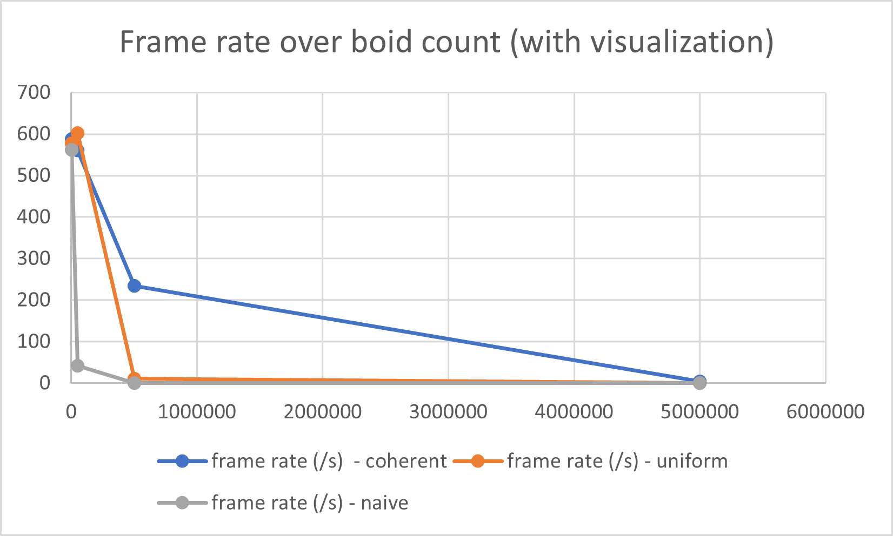

**University of Pennsylvania, CIS 565: GPU Programming and Architecture,
Project 1 - Flocking**

Constance Wang  
- [LinkedIn](https://www.linkedin.com/in/conswang/)

Tested on AORUS 15P XD laptop with specs:  
- Windows 11 22000.856  
- 11th Gen Intel(R) Core(TM) i7-11800H @ 2.30GHz 2.30 GHz  
- NVIDIA GeForce RTX 3070 Laptop GPU  

### Analysis

#### For each implementation, how does changing the number of boids affect performance? Why do you think this is?
Increasing the number of boids causes performance (frame rate) to decrease. This is because:
- preprocessing steps take longer (need to sort 5mil boids instead of 5k)
- individual boid processing takes longer - need to check more neighbours

#### For each implementation, how does changing the block count and block size affect performance? Why do you think this is?
Changing the block size by updating the blockSize macro does not have a large effect on performance. This is because block count is calculated as (N + blockSize - 1) / blockSize, meaning the total amount of parallelism will always be N + blockSize - 1, aka. launch enough blocks to run each calculations for each of N boids in parallel. The only way to achieve more parallelism might be to parallelize each boid checking its neighbouring grid cells - but we still have to collect the results to calculate average speed, velocity, etc. This is probably not worth the overhead, since each boid checks at most 8 neighbours.

I noticed that testing with coherent uniform grid, with visualization off, and number of boids = 5000, the frame rate increases slightly with increased block size. This could be noise, although it's also possible that with increased block size, we have a decreased block count which results in better scheduling - eg. for N = 5000 and blockSize = 1024, we have block count = (5000 + 1024 - 1) / 1024 -> 6 blocks. Meanwhile, (5000 + 128 - 1) / 128 -> 40 blocks, it's possible not all warps in the blocks are able to run in parallel? But the effect is negligible. In addition, increasing block size wouldn't negatively affect performance since each thread doesn't use much resources (it's just getting and loading a few neighbours, doing minimal calculations).

#### For the coherent uniform grid: did you experience any performance improvements with the more coherent uniform grid? Was this the outcome you expected? Why or why not?
The coherent uniform grid performs better than the uniform grid at higher boid counts (say, 50k boids), but worse at lower boid counts (5k boids).

This is expected because: 
- at lower boid counts, the overhead of sorting the position and velocity arrays outweighs the performance gains from eliminating random accesses - we aren't accessing the pos/vel arrays that often anyway
- at higher boid counts, the performance gain of continguous access of position/velocity arrays enables us to take advantage of GPU hardware caching, and is worth the overhead costs

Coherent uniform grid and uniform grid both performed better than naive boid count because naive's O(n) neighbour search time for each boid is just too slow.

#### Did changing cell width and checking 27 vs 8 neighboring cells affect performance? Why or why not? Be careful: it is insufficient (and possibly incorrect) to say that 27-cell is slower simply because there are more cells to check!
Define/undefine #neighbours_27 to check. Halving cell width and checking 27 cells instead does not affect performance much. I tried it on the 5k boid coherent grid with no visualization and frame rate was about the same (2k fps).

In theory, it could make performance worse because:
- the overhead of calculating grid indices is slightly increased due to having more grid cells to check
- we essentially still access the exact same set of neighbours (eg. if with 8 cells, we are checking dev_pos from indices 0 to 10, with 27 cells, we will still be checking dev_pos from 0 to 10), meaning performance will be about the same for each boid's neighbourhood calculation, not really improved

On the other hand,
- there is less branching in the code structure that checks 27 neighbours, that would increase performance

Both are probably not that noticeable though, at least at 5k boids

