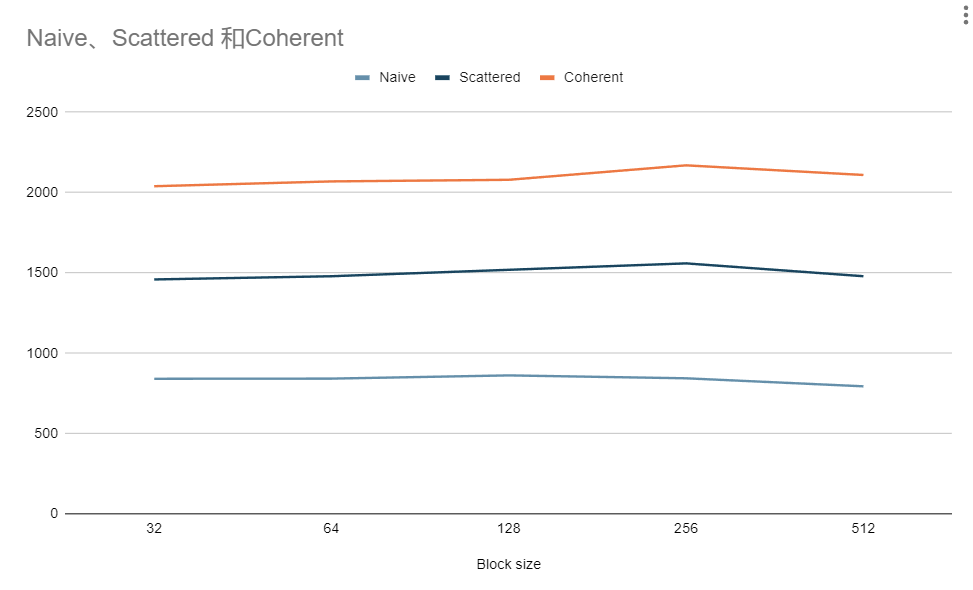
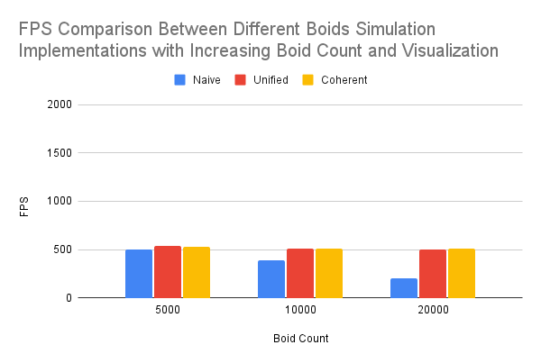
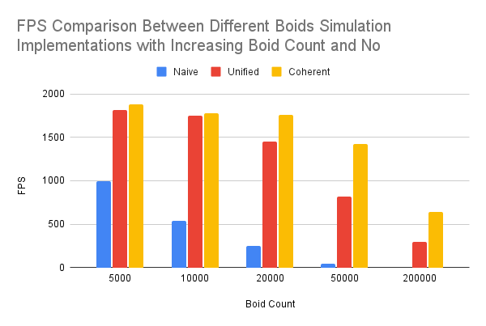

**University of Pennsylvania, CIS 565: GPU Programming and Architecture,
Project 1 - Flocking**

* David Li
* [LinkedIn](https://www.linkedin.com/in/david-li-15b83817b/)
* Tested on: (TODO) Windows 10, Intel(R) Core(TM) i9-10980HK CPU @ 2.40GHz 32Gb, GTX 2070 Super (Personal Computer)

[Repo Link](https://github.com/theCollegeBoardOfc/Project1-CUDA-Flocking)

This is a flocking simulation with three different implementations on the GPU. A naive simulation that checks every particle with every other particle. A uniform grid that only checks particles in neighbooring grid cells, and a coherent uniform grid, which further reduces the number of buffers used, thus reducing the amount of global memory access. 

The following gifs are of the three different implementations in action, simulating 50000 boids.

### Naive:

### Uniform Grid:

### Coherent Uniform Grid:

Here are some fps comparisons when changing block size.

The boid count remains at 5000 for all test instances. In general, the fps decreases as block size increases, but the block size seems to have a more detrimental effect on the naive simulation fps than the grided simulation fps'. I would hypothesize that when the program uses fewer larger blocks rather than many smaller blocks, the global memory access becomes a limiting factor. In other words, the total amount of global memory access afforded to a block does not change with size due to the architecture of the gpu. So larger blocks are more limited by how much data they can pull from global memory. This also explains why the naive implementation, which uses much mroe global memory access sees a larger decrease in fps.

Here are the fps comparisons with changing boid count and visualization. Block size is always 128.

It's quite obvious that fps would decrease with an increase in boid count. With more boids, there is simply more computation and global memory access required. What is perhaps more notable is that the naive implementation begins performing much worse. This again likely indicates that each thread in the naive implementation performs much more global memory access. To give a brief comparison: each thread around N global memory accesses, where N is the number of boids. The uniform grid only needs to access a fraction of that N. Also, the chart indicates that both the coherent and uniform grids maintain around 500fps for all boid counts. This is likely because the drawing rate of the gpu is capped or limited in some way. Perhaps, this is simply as fast as the GPU can render the particles.

Indeed, when we look at the boid count with no visualization the performance increase from the grid becomes much more noticable. The optimization increase from the coherent grid is not made that apparent until the boid counts get very high. The coherent grid again makes less accesses to global memory, but not by much, so it makes sense that this is only apprent at higher boid counts. Reducing the number of grid cell accesses likely has a similar effect, as each grid cell we check in a thread implies more accesses to global memory.

