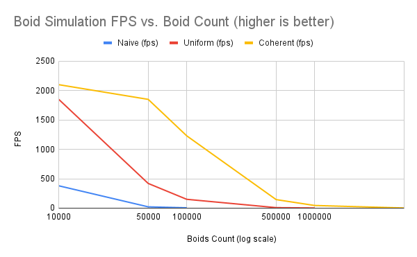
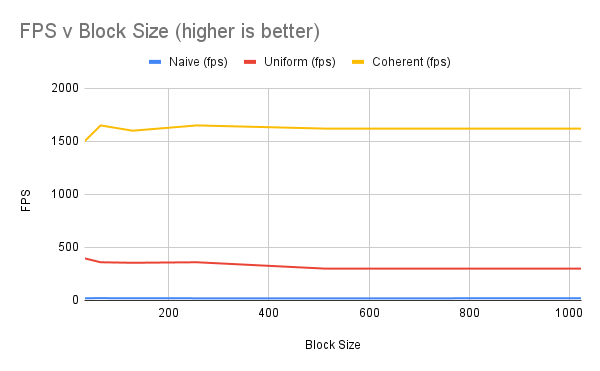

**University of Pennsylvania, CIS 5650: GPU Programming and Architecture,
Project 1 - Flocking**

* Maya Diaz Huizar
* Tested on: Windows 10, R7-5700X @ 3.8GHz 32GB, RTX 3080 8GB

### Questions
* For each implementation, how does changing the number of boids affect
performance? Why do you think this is?
    * Increasing the number of boids had the most extreme effect on the naive solution, due to the greatly increased time as each boid checks each other boid (O(N^2) complexity). For the uniform grid implementation, increasing the number of boids still had an adverse effect, but to a reduced degree, as the number of neighbors to check in adjacent grid cells increase to a lesser degree as compared to the total number of boids. My testing seemed to show that the uniform and coherent grid approaches scaled similarly with boid count, albeit with the performance boost of the coherent approach further increasing fps.
* For each implementation, how does changing the block count and block size
affect performance? Why do you think this is?
    * I found channging these did not significantly affect performance, which makes sense given that no aspect of the boid algorithm really depends on blocks being synchronized, at least not at a level below all boids. 
* For the coherent uniform grid: did you experience any performance improvements
with the more coherent uniform grid? Was this the outcome you expected?
Why or why not?
    * Yes, I noticed very large performance improvements with the coherent grid, which makes sense as accessing contiguous memory is faster and the memory access overhead is greater than the compute needed to cohere the data. 
* Did changing cell width and checking 27 vs 8 neighboring cells affect performance?
Why or why not? Be careful: it is insufficient (and possibly incorrect) to say
that 27-cell is slower simply because there are more cells to check!
    * Yes, but as above, not simply because of the number of cells. Checking 8 neighboring cells was faster because it meant that memory reads were had more contiguity, even if there were more boids in each cell. 

## Part 4: Performance Write-up
- Framerate change with increasing # of boids for naive, scattered uniform grid, and coherent uniform grid (without visualization)
     
- Framerate change with increasing block size

   
