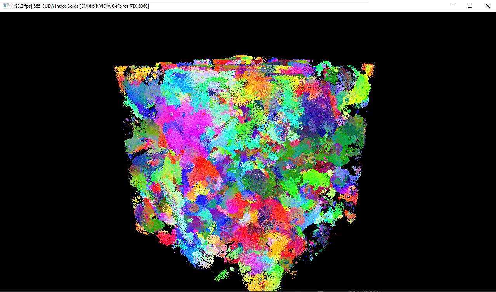
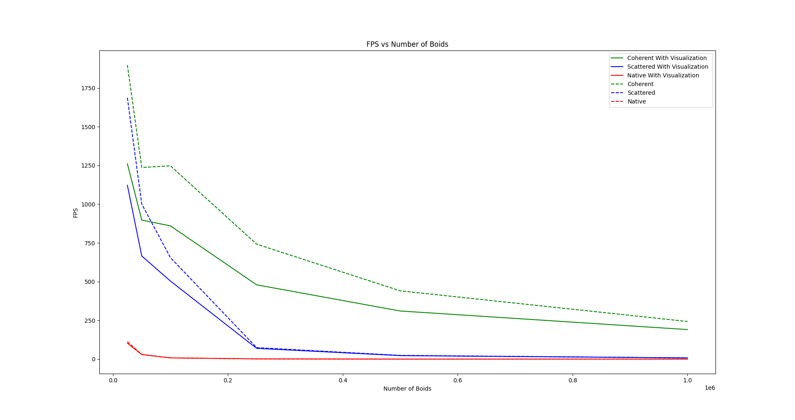
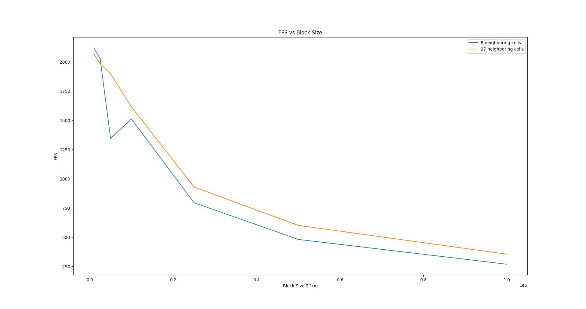

Project 1 Boids Flocking
====================
**University of Pennsylvania, CIS 565: GPU Programming and Architecture,
Project 1 - Flocking**

* Yu-Chia Shen
  * [LinkedIn](https://www.linkedin.com/in/ycshen0831/)
* Tested on: Windows 10, i5-11400F @ 4.3GHz 16GB, GTX 3060 12GB (personal)

# Result

# Overview
The obective of this project is to simulate the boid flocking. For the following image, every colored dot is a boid, and every color represents a group of boids. A boid is a bird-like particle and moves arround the simulation spzce according to the three rules:

  * cohesion - boids move towards the perceived center of mass of their neighbors
  * separation - boids avoid getting to close to their neighbors
  * alignment - boids generally try to move with the same direction and speed as their neighbors

These three rules specify a boid's velocity change in a timestep. At every timestep, a boid thus has to look at each of its neighboring boids and compute the velocity change contribution from each of the three rules. Thus, a bare-bones boids implementation has each boid check every other boid in the simulation.

# Performance Analysis
* FPS vs Number of Boids

* FPS vs Block Size

* 8 neighboring vs 27 neighboring

# Questions
* For each implementation, how does changing the number of boids affect performance? Why do you think this is?
  
  _When the number of boids increase, the performance decrease. This is beacause the number of boids represent the complexity to this problem. When the number increase, there are more boids to check for updating one single boid. Therefore, the computation will also increase, and thus decrease the performance._

* For each implementation, how does changing the block count and block size affect performance? Why do you think this is?

  _According to the image above, we can see that there is no significant difference in performance between each block size. However, we can also observe that there is a slight performance drop for block size 32. I think this is because there are maximum number of blocks per SM. Therefore, there will be occupancy waste if we have too many blocks, and thus limit the performance. Also, large block sizes may decrease the performance since there are resource limit(e.g. registers). But this doesn't happened in this case._

  [Reference](https://forums.developer.nvidia.com/t/how-to-choose-how-many-threads-blocks-to-have/55529)

* For the coherent uniform grid: did you experience any performance improvements with the more coherent uniform grid? Was this the outcome you expected? Why or why not?
  
  _Yes, the coherent uniform grid has a better performance as I expected. Since with the coherent structure, there are fewer times to access the Global Memory. Without coherent structure, we have to access memory for all neighbors of one boid every time. Hence, although we have to rearange the arraies every time, we still spend fewer times to access the Global Memory._

* Did changing cell width and checking 27 vs 8 neighboring cells affect performance? Why or why not? Be careful: it is insufficient (and possibly incorrect) to say that 27-cell is slower simply because there are more cells to check!

  _Yes, according to the image above, the 27-neighboring version is slight better than 8-neighboring as the number of boids increase. I think this is because the volume of 27 small grids is less than the volume of 8 big grids. Therefore, there will be fewer boids needed to be checked, and thus increase the performance. However, when the number of boids decreases, the performance decreases, since we have to check more grid cells in 27-neighboring version (27 > 8)._
