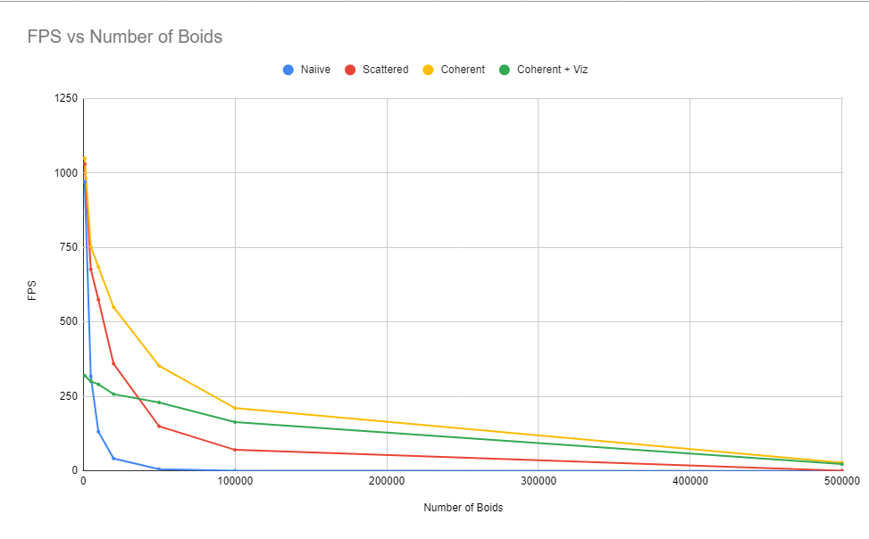
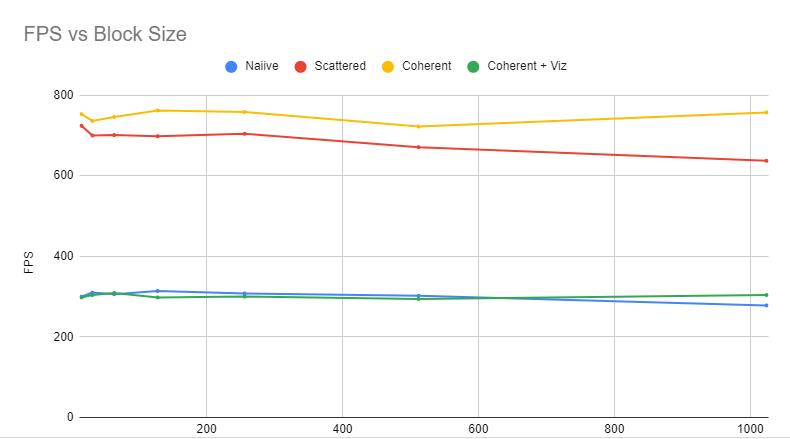

**University of Pennsylvania, CIS 565: GPU Programming and Architecture,
Project 1 - Flocking**

* Ryan Tong
  * [LinkedIn](https://www.linkedin.com/in/ryanctong/), [personal website](), [twitter](), etc.
* Tested on: Windows 10, i7-8750H @ 2.20GHz 16GB, GeForce GTX 1060 6144MB (Personal Laptop)

### Demo

## Performance Vs Number of Boids
As expected, the performance decreases as the number of boids increases since more boids results in more computations needed during neighbor checking. Here is a plot showing the performance (FPS) compared to the number of boids.

As seen in the chart, with all methods, FPS decreases with number of boids added since the number of computations needed is directly correlated with number of boids (more neighbors). 

## Coherent Method
The coherent method offers siginificant performance over the scattered uniform grid. This is expected because the coherent method optimizes memory access to take advantage of continuos memory using the addition of the parallel sorted positon buffer.

## Performance Vs Block Size

The block size does not seem to have a siginificant affect on performance for all methods. I think that because block size does not directly influence the number of computations but rather the structure of the parallelization, the performance gains of using an optimal block size are minor since they can only optimize smaller things such as continuos memory access in the context of threads within the block.

## 27 vs 8 Cells
When checking 27 cells and using a cell width of  max radius, there is a noticable perfomance gain when the number of boids is large. This performance gain can be explaine by the fact that using the 27-cell method searches less volume than the 8-cell method and thus has a smaller number of expected neighbors which means a smaller number of expected computations per boid: 
(2 * radius) * (2 * radius) * 8 = 32*radius^2 > radius * radius * 27 = 27*radius^2
