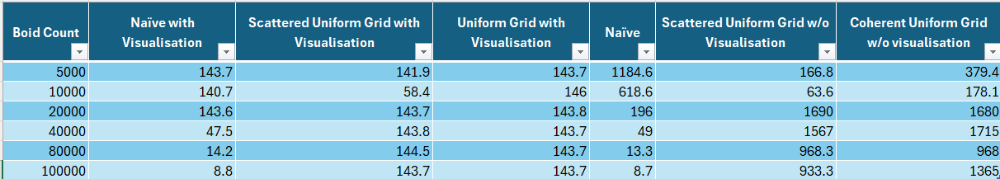
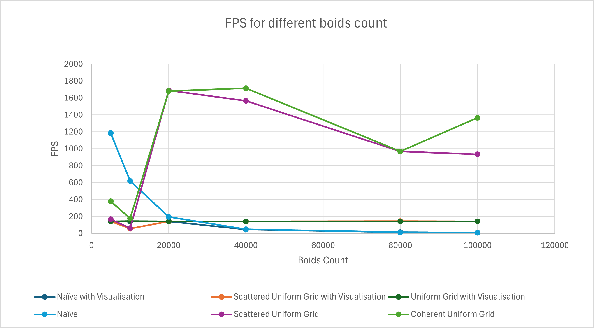
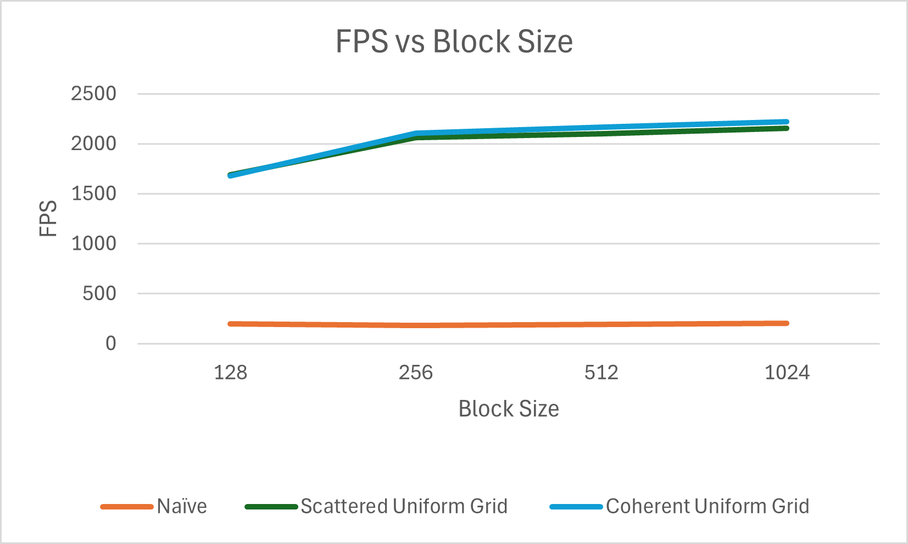
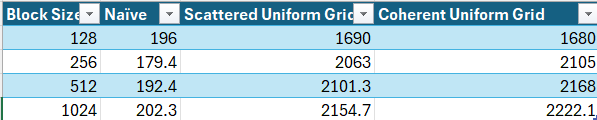

**University of Pennsylvania, CIS 5650: GPU Programming and Architecture,
Project 1 - Flocking**

* Manvi Agarwal
  * [LinkedIn](https://www.linkedin.com/in/manviagarwal27/)
   Tested on: Windows 11, AMD Ryzen 5 7640HS @ 4.30GHz 16GB, GeForce RTX 4060 8GB(personal)

# Performance Analysis

## 1. FPS vs Boids Count

The following gif shows boids flocking simulation showing each boid movement as per the three rules:
1. Cohesion
2. Seperation
3. Alignment

For this particular simulation, Uniform grid data structure is used to implement the three rules in order to calculate the velocity and position of boids for next time step.

## 2. Comparative Analysis for different methods of Boid flocking simulation

### 1. FPS vs Boids Count
The three methods compared are:
1. Naive: Here for each boid, every other boid's position and velocity is checked for next step velocity and position compute for the boid.
2. Scattered Uniform Grid: Here Uniform grid is implemented and each boid is checked only against neighboring boids within defined grid cells.
3. Coherent Uniform Grid: This is similar to Scattered Uniform Grid except that here the data is rearranged in order to speed up access by accessing consecutive memory.

Note: Higher the FPS, better the performance
For this test case, block size is kept constant to 256.

### 2. FPS vs Block Size

The three methods defined above are further compared for different block size to see difference in performance. For this particular test case, boid count is kept constant to 20000.

# Some project insights

## 1. For each implementation, how does changing the number of boids affect performance?
The increase in number of boids causes the fps to reduce. This effect is observed in all the three methods used for comparative analysis. This inverse relationship can be attribute to increase in number of loads and hence the computaion. 

## 2. For each implementation, how does changing the block count and block size affect performance? 
As the block size increases, we can see that performance improves. This shows that as more blocks are used for the computation, more parallelization can be introduced thereby reducing the computation time.

## 3. For the coherent uniform grid: did you experience any performance improvements with the more coherent uniform grid? Was this the outcome you expected?
The coherent uniform gris shows some performance improvement as compared to uniform grid. The major difference between the two approaches is that in coherent the position and velocity buffer is rearranged as per the grid cell index. This allows more efficient use of cache because of accessing consecutive memory in the computation. 

## 4. Did changing cell width and checking 27 vs 8 neighboring cells affect performance? Why or why not? Be careful: it is insufficient (and possibly incorrect) to say that 27-cell is slower simply because there are more cells to check!
The performance for 27 neighboring cells was almost comparable if not better than 8 cells in the case of coherent uniform grid. Despite the increase in search space per boid and the expected increase in computation by almost thrice, the fps didn't reflect the drop in performance by proportion as expected. This can be due to faster memory access due to caches and rearranging buffer before searching for boid neighbours.   

