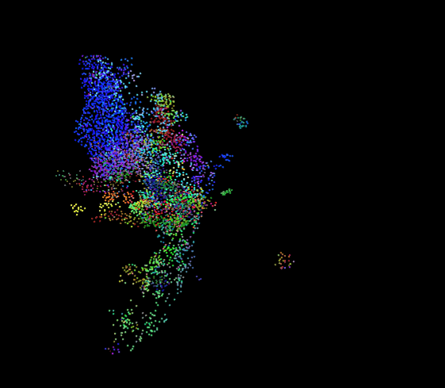
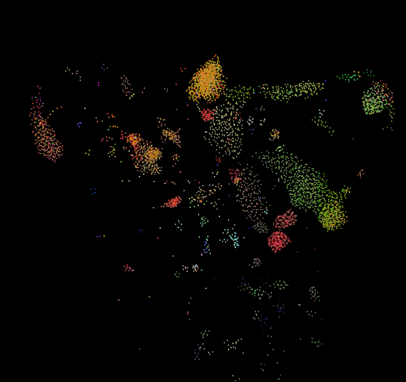
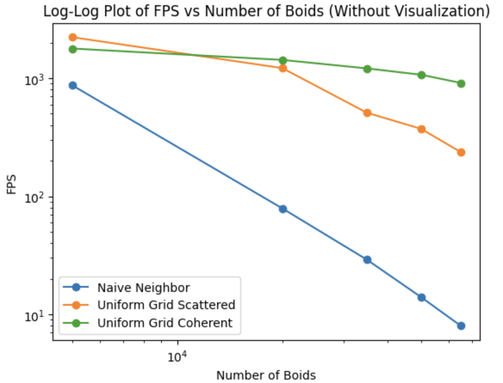
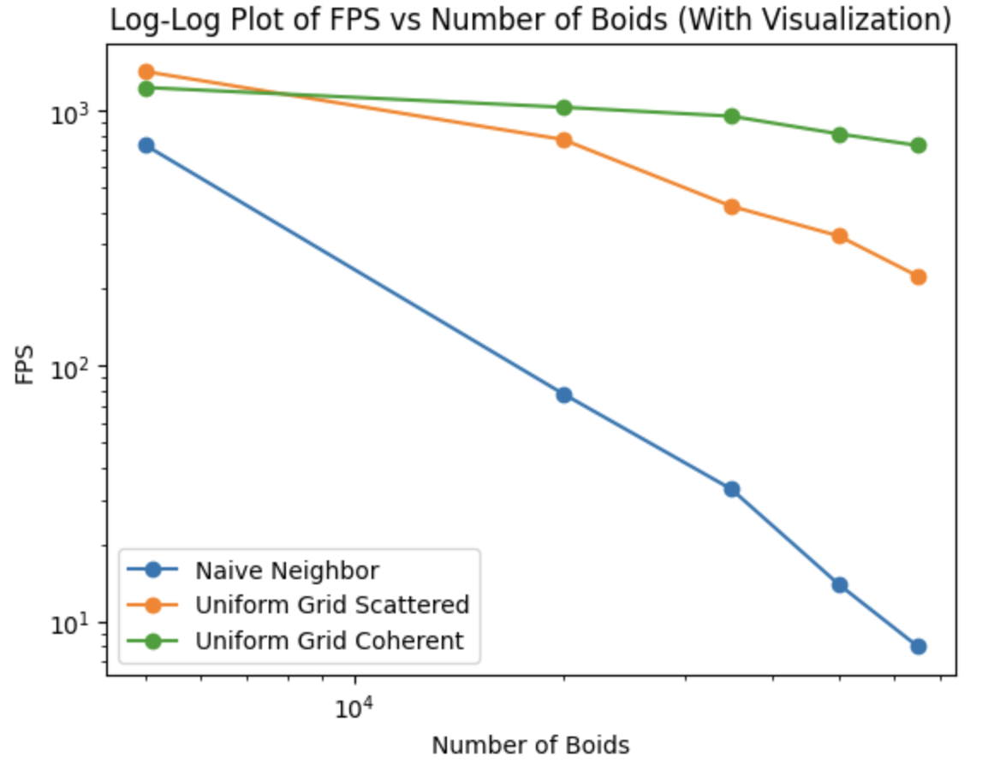
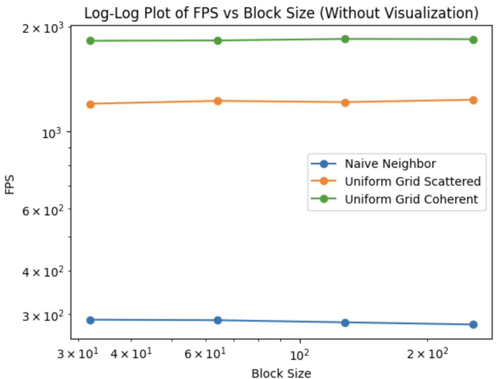
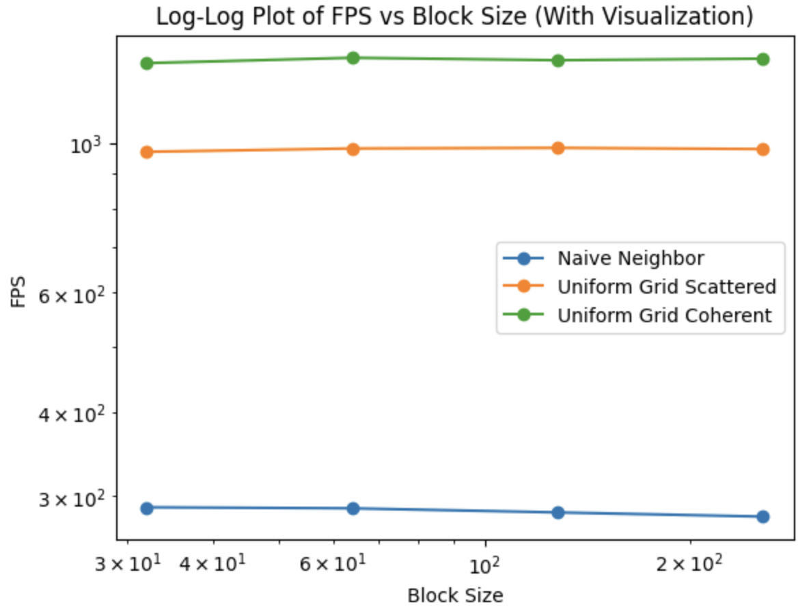
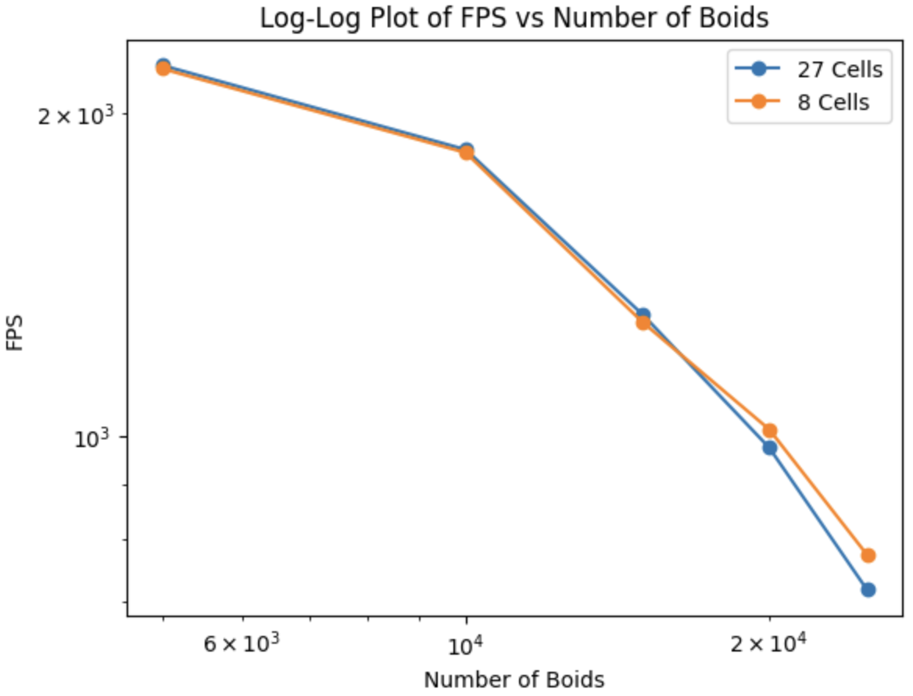

**University of Pennsylvania, CIS 5650: GPU Programming and Architecture,
Project 1 - Flocking**

* Shreyas Singh
  * [LinkedIn](https://linkedin.com/in/shreyassinghiitr), [personal website](https://github.com/shreyas3156), etc.
* Tested on: Windows 10, i7-12700 @ 2.1GHz 32GB, T1000 (CETS Lab)
### Boids Flocking Simulation

This project is a CUDA-based simulation of the Boids Flocking algorithm, and its performance with respect to parameters like number of boids, and number of threads in each block of the GPU.

### Performance Analysis

* The Naive Neighbor Search algorithm yields the slowest performance that can be explained by the $O(n^2)$ complexity as each boid is evaluated against the other. The Uniform Grid Scattered is more than 5x faster than the Naive Neighbor Search owing to a more refined search space. Moreover, the coherent uniform grid search produces slightly faster results than the scattered version as the boid count was increased beyond 5000, because of the contiguous memory traversal of boid data pointers. These results are consistent across simulations both with and without visualizations.

* The performance of all three algorithms remain roughly constant as the block size and block count is increased from 32 to 256, mainly because the scheduling is managed by "warps" of 32 threads each. The coherent uniform grid search has the best performance among the three algorithms which is as expected. 

* From the plots above, it is clear that the coherent search algorithm infact offers improved performance because of the efficient memory access of position and velocity data for the boids.

* The number of cells being increased to 27 from 8 cells marginally increases the performance until the boid count is increased beyond 20,000. This is because even though the number of cells to be searched is lesser in the latter case, the search space is still large, meaning more number of boids to search.

