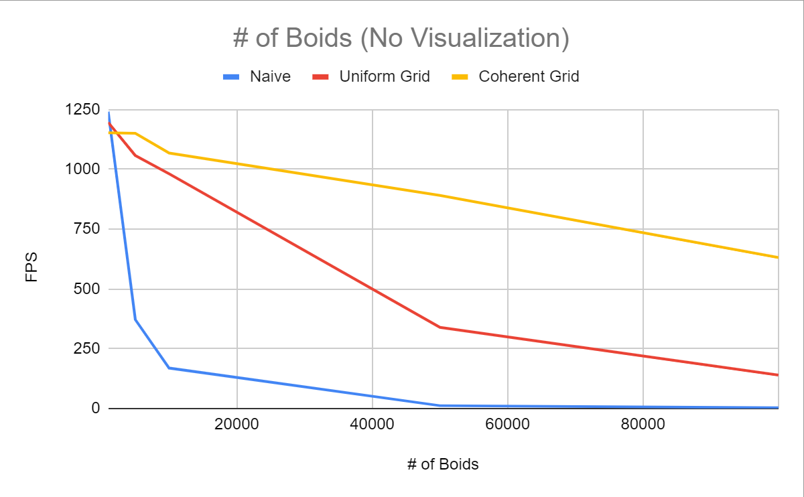
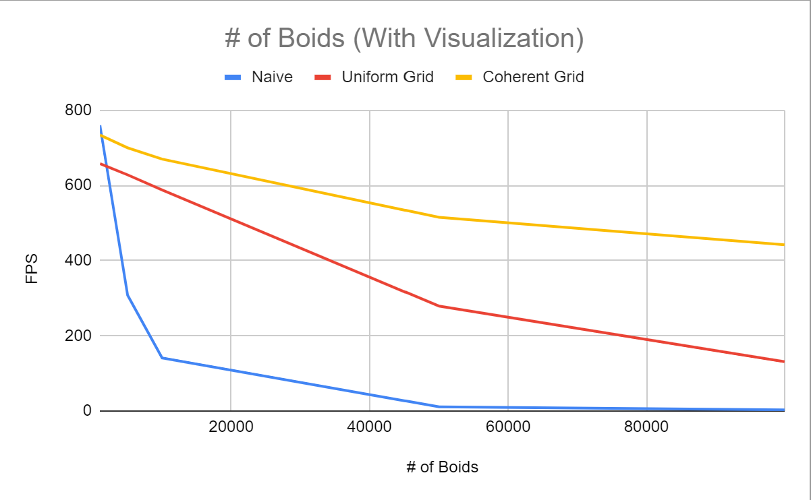

**University of Pennsylvania, CIS 565: GPU Programming and Architecture,
Project 1 - Flocking**

* Eyad Almoamen
  * [LinkedIn](https://www.linkedin.com/in/eyadalmoamen/), [personal website](https://eyadnabeel.com)
* Tested on: Windows 11, i7-10750H CPU @ 2.60GHz 2.59 GHz 16GB, RTX 2070 Super Max-Q Design 6GB (Personal Computer)

Naive Simulation

Uniform Grid Simulation

Coherent Grid Simulation

Performance as a function of # of Boids

Performance as a function of Block Size

**For each implementation, how does changing the number of boids affect performance? Why do you think this is?**

Increasing the number of boids tends to decrease performance to varying levels; in the naive simulation, the dropoff was fast as we increased the number of boids due to the fact that for every boid, we're checking all the other boids. It also decreased performance in the uniform and coherent grid implementations, however not to the same extent, however the reasoning behind it is similar.

I did, however, note that at lower numbers of boids, the naive implementation tends to run a bit faster than the optimized implementations. I suspect that as the space becomes more sparse, the overhead for optimizing overtakes the number of boids we have to check.

**For each implementation, how does changing the block count and block size affect performance? Why do you think this is?**

Changing the block size and count didn't seem to affect performance all that much. I think this might be due to the nature of the program we're running, since each thread essentially runs independently, and we don't use a huge amount of memory, there's no reason for there to be a huge effect.

**For the coherent uniform grid: did you experience any performance improvements with the more coherent uniform grid? Was this the outcome you expected? Why or why not?**

Yes, at higher boid counts, the coherent uniform grid runs faster than the scattered uniform grid. I think this is due to the number of memory accesses we're sparing by computing them upfront; so instead of accessing all the index numbers for every spanning gridcell for every boid (which creates many redundant memory accesses), we directly have the index by computing it upfront.

**Did changing cell width and checking 27 vs 8 neighboring cells affect performance? Why or why not? Be careful: it is insufficient (and possibly incorrect) to say that 27-cell is slower simply because there are more cells to check!**

In my experience, the 27 neighboring cells runs faster than the 8 neighboring cells. My suspicion as to why that is, is that we're skipping any non-neighboring boids anyways, and that the amount of computation it takes to decide which 8 neighboring gridcells to search might overtake the amount of computation it takes to traverse a few more gridcells.