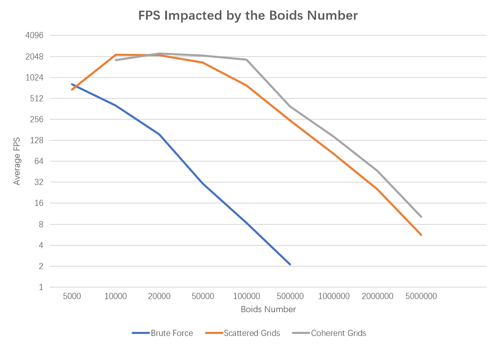
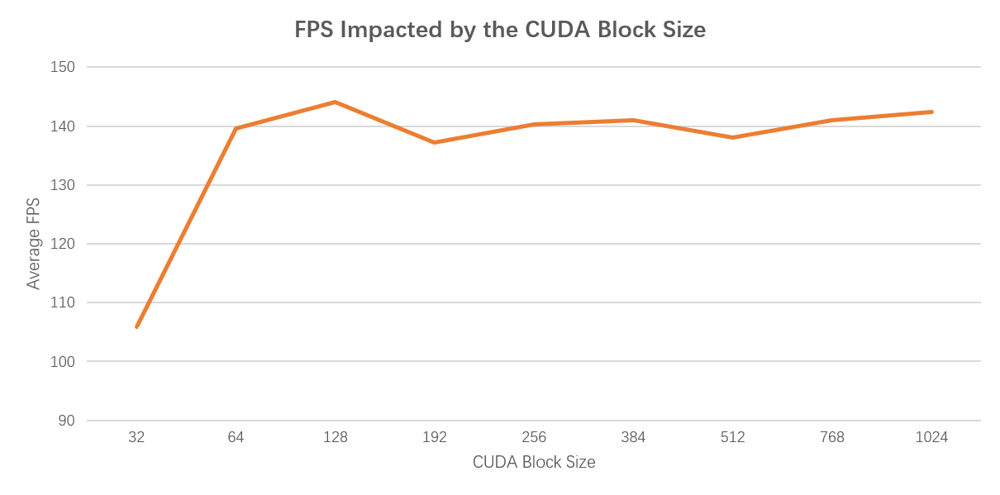

**University of Pennsylvania, CIS 565: GPU Programming and Architecture**

* Alex Fu
  * [LinkedIn](https://www.linkedin.com/in/alex-fu-b47b67238/)
  * [Twitter](https://twitter.com/AlexFu8304)
  * [Personal Website](https://thecger.com/)
* Tested on: Windows 10, i7-10750H @ 2.60GHz, 16GB, GTX 3060 6GB

# CIS 565 - Project 1: Flocking

## Results

### Brute force, 50,000 boids, 30+ fps

### Scattered grids, 50,000 boids, 144+ fps

### Scattered grids, 1,000,000 boids, 70+ fps

### Coherent grids, 1,000,000 boids, 144+ fps

## Analysis

I use the average FPS over 1-10 secs to represent the performance of the application. I have tested the impact on performance by the boids number, CUDA block size, and grid cell size.

### Average FPS Impacted by the Boids Number

#### Without Visulization

#### With Visualization

### Average FPS Impacted by the CUDA Block Size

Tested in coherent grids. The boids number is 1,000,000. 

## Answers to the Questions

## Feedback

* There is a bug in coherent grids when boids size is small. See the [my post in Ed Discussion](https://edstem.org/us/courses/28083/discussion/1757498).

* At first all my boids would disapear quickly. It took me a while before I realize it's because some values were divided by zero. Then I added `glm::epsilonequal` to solve the problem.

* I observe that in scatered grids, the FPS is low at the begining. Then the fps increases as the boids gathering. The situation of the coherent grids is contrary.
