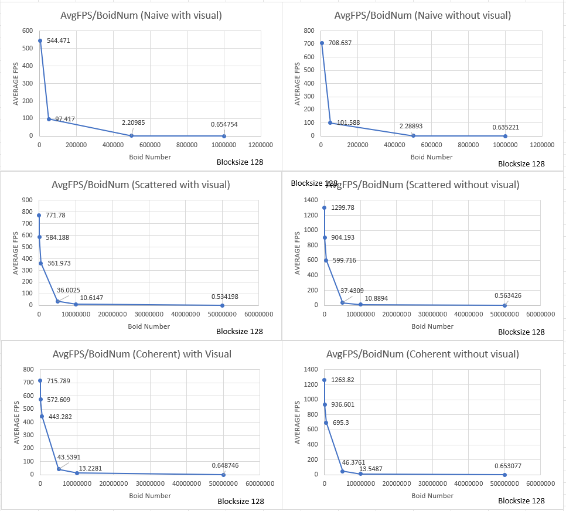
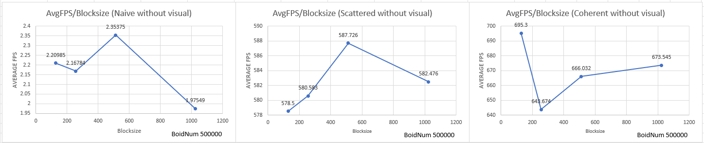

**University of Pennsylvania, CIS 5650: GPU Programming and Architecture,
Project 1 - Flocking**

* Yin Tang
  * [Linkedin](https://www.linkedin.com/in/yin-tang-jackeyty/), [Github](https://github.com/JackeyTY), [Personal Website](https://jackeytang.com/)
* Tested on: Windows 11 Pro, AMD Ryzen 9 7950X @ 5.00GHz 64GB, NVIDIA GeForce RTX 4090 24GB (personal desktop)

### Overview

In this project, I implemented a simple flocking simulation based on the [Reynolds Boids algorithm](https://vergenet.net/~conrad/boids/pseudocode.html) in CUDA. In the Boids flocking simulation, particles representing birds or fish (boids) move around the simulation space according to three rules:

* cohesion - boids move towards the perceived center of mass of their neighbors
* separation - boids avoid getting to close to their neighbors
* alignment - boids generally try to move with the same direction and speed as
  their neighbors

These three rules specify a boid's velocity change in a timestep. At every timestep, a boid thus has to look at each of its neighboring boids and compute the velocity change contribution from each of the three rules. Three level of optimizations are implemented to speed up the process.

**Naive Neighbor Search**

Each boid will check every other boid for next timestamp update.

**Scattered Uniform Grid-based Search**

The space is divided into uniform spatial grid and we use the grid to reduce the number of boids and sorting for fast retrieval.

**Coherent Uniform Grid-based Search**

In additional to sorting the boid index, pos and vel arrays are also rearranged to match the sorted order for fast read/write.

### Performance Analysis

*Framerate change with respect to increasing boid number*

We can see that as the number of boids increases, framerate drops drastically both with and without visual for all cases. Tests are conducted using 128 blocksize and 27 neighbour search size.

*Framerate change with respect to block size*

Changing the block size does not affect framework in a distinct pattern for all cases. Tests are conducted using 500000 blocksize with no visual.

### Questions

**For each implementation, how does changing the number of boids affect performance? Why do you think this is?**

Increasing the number of boids will exponentially decrease the framerates and thus dropping the performance. This is because the higher the number of boids, the more threads/memory we need for calculation and also higher the density of boids in each grid to calculate the next timestamp.

**For each implementation, how does changing the block count and block size affect performance? Why do you think this is?**

There is no significant impact on performance for changing the block count or block size in all three cases. I think the reason is because the memory reading/writing is not that intense for this project so latency hiding is minimal for all blocksize.

**For the coherent uniform grid: did you experience any performance improvements with the more coherent uniform grid? Was this the outcome you expected? Why or why not?**

Yes I did see some improvements in performance comparing coherent uniform grid to scattered uniform grid. This outcome is expected since we have contiguous memory access to boid pos and vel data directly for update, which are stored in global memory, with one less level of indirection.

**Did changing cell width and checking 27 vs 8 neighboring cells affect performance? Why or why not? Be careful: it is insufficient (and possibly incorrect) to say that 27-cell is slower simply because there are more cells to check!**

There is slight improvement in performance from checking 27 vs 8 neighbor cells. I think the reason is because by using more granular grid, we leverage more parallelism when GPU is not fully utilized. 
