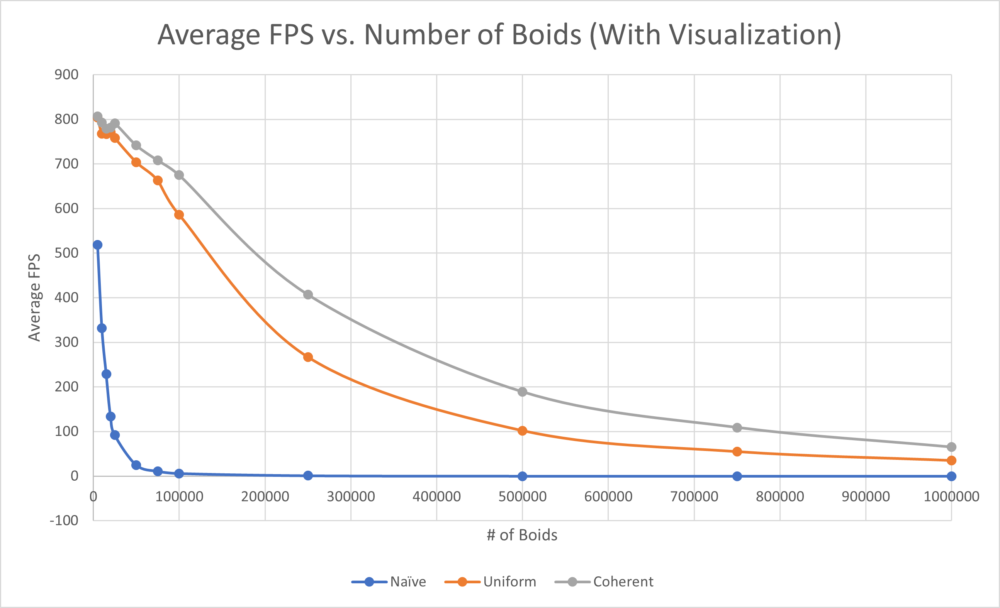

**University of Pennsylvania, CIS 565: GPU Programming and Architecture,
Project 1 - Flocking**

* Nick Moon
  * [LinkedIn](https://www.linkedin.com/in/nick-moon1/), [personal website](https://nicholasmoon.github.io/)
* Tested on: Windows 10, AMD Ryzen 9 5900HS @ 3.0GHz 32GB, NVIDIA RTX 3060 Laptop 6GB (Personal Laptop)

### Results

5000000 boids, 1.75 dt timestep, 400.0 scene scale, 1.5 max speed

5000 boids, 0.2 dt timestep

5000 boids, 1.0 dt timestep

**Performance Analysis**

As can be seen by the below two graphs, increasing the number of boids simulated results in a larger runtime.

Below is a graph measuring the impact of various block sizes, i.e. the number of threads allocated to each block. 
As shown, the runtime of the grid-based simulation stays relatively constant at levels greater than 256, where it peaks.
Block size values less than this result in penalties in performance.
Note that all block sizes measured are multiples of 32. If a block size is not a factor of 32, this will result in .

As expected, the coherent grid simulation was faster than the 

Did changing cell width and checking 27 vs 8 neighboring cells affect performance? Why or why not? Be careful: it is insufficient (and possibly incorrect) to say that 27-cell is slower simply because there are more cells to check!

### Bloopers

Blooper caused by accessing wrong index values for boid position and velocity arrays.

For more bloopers, see images/bloopers.