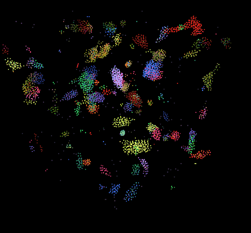

<!-- 

  <b>
    University of Pennsylvania, CIS 5650: GPU Programming and Architecture,
    Project 1 - Flocking
  </b>

<ul>
  <li>
    Michael Mason
    <ul>
      <li><a href="https://www.michaelmason.xyz/">Personal Website</a></li>
    </ul>
  </li>
  <li>Tested on: Windows 11, Ryzen 9 5900HS @ 3.00GHz 16GB, RTX 3080 (Laptop) 8192MB</li>
</ul>

 -->

> University of Pennsylvania, CIS 5650: GPU Programming and Architecture, Project 1 - Flocking
> * Michael Mason
>   + [Personal Website](https://www.michaelmason.xyz/)
> * Tested on: Windows 11, Ryzen 9 5900HS @ 3.00GHz 16GB, RTX 3080 (Laptop) 8192MB 

# CUDA Boids

|  |   |  |
| :--: | :--: | :--:
| *5,000 boids* | *50,000 boids* | *100,000 boids*

<!-- ## Table of Contents

- [TODO](#todo)
- [Analysis](#analysis) -->

## ☑️ TODO:

1. Take a screenshot of the boids and use a gif tool like licecap to record an animations of the boids with a fixed camera. Put this at the top of your README.md. Take a look at How to make an attractive GitHub repo.
2. Add your performance analysis. Graphs to include:
    - Framerate change with increasing # of boids for naive, scattered uniform grid, and coherent uniform grid (with and without visualization)
    - Framerate change with increasing block size

## 📃 Analysis

- For each implementation, how does changing the number of boids affect performance? Why do you think this is?
- For each implementation, how does changing the block count and block size affect performance? Why do you think this is?
- For the coherent uniform grid: did you experience any performance improvements with the more coherent uniform grid? Was this the outcome you expected? Why or why not?
- Did changing cell width and checking 27 vs 8 neighboring cells affect performance? Why or why not? Be careful: it is insufficient (and possibly incorrect) to say that 27-cell is slower simply because there are more cells to check!