## University of Pennsylvania, CIS 565: GPU Programming and Architecture
# 
 Project 1 - Flocking 

- Name: Tongwei Dai
	- [LinkedIn Page](https://www.linkedin.com/in/tongwei-dai-583350177/)
- Tested on: Windows 10, i7-8700 @ 3.20 GHz 16GB, RTX 2070

## Showcase
- 5k boids (naive)
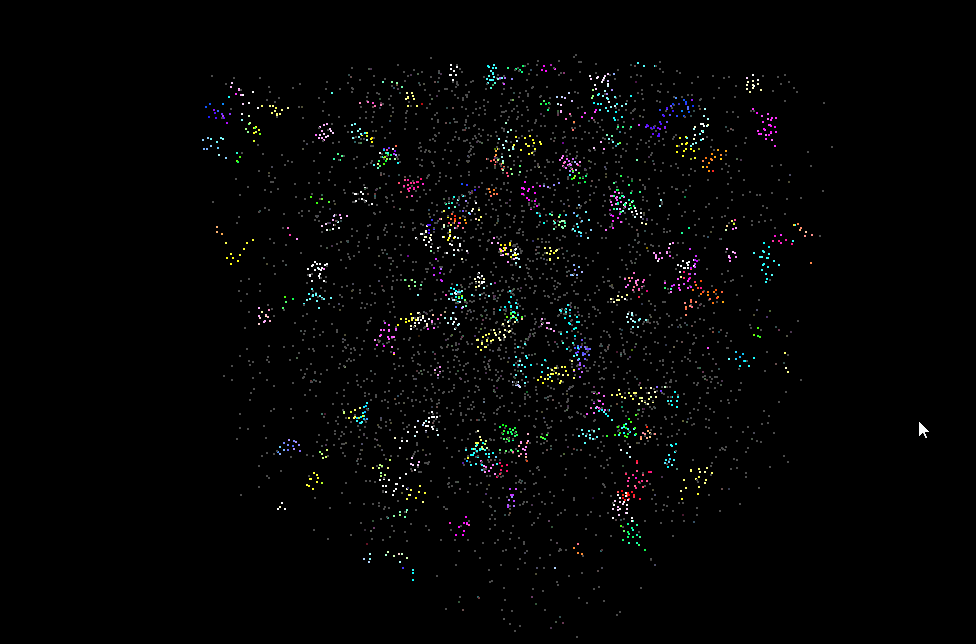
- 20k boids (coherent grid)
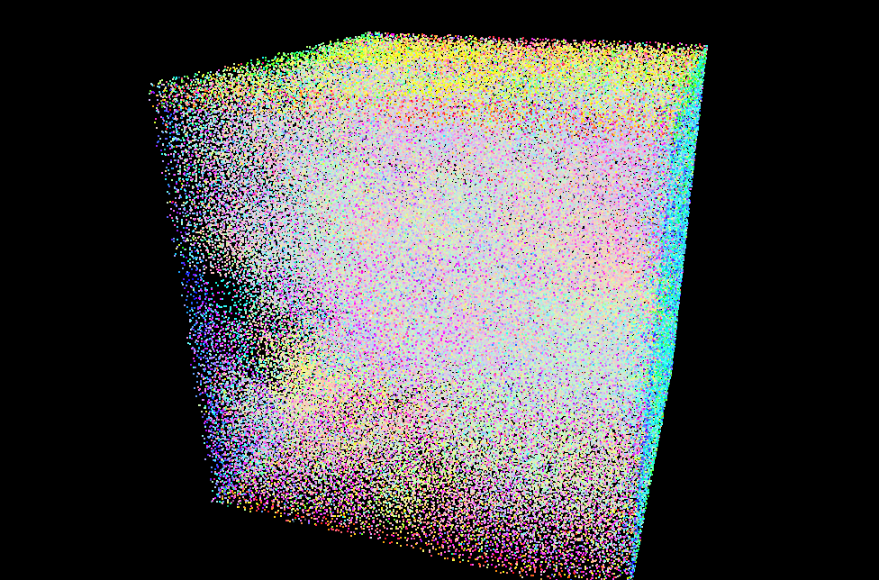

## Changes to Source Code Besides the Requirement
- modified line 97 of the file `cmake/CUDAComputesList.cmake`
	- because my hardware or CUDA do not support `compute_30`
	- see the [Ed Question Thread](https://edstem.org/us/courses/28083/discussion/1723078) for more info
- modified `CMakeLists.txt`
	- added a new header `profiling.h` for performance data collection.
	- this header is automatically generated by a python script, see the section below.

## Answers to the Questions
- For each implementation, how does changing the number of boids affect performance? Why do you think this is?
	- the performance goes down when the number of boids increases, because there is more computation.

- For each implementation, how does changing the block count and block size affect performance? Why do you think this is?
	- If the block size is over 1024, then warps will be queued up in the scheduler, leading to less parallelism and therefore worse performance
	- Otherwise, there appears to be no strong corelation between block size and performance

- For the coherent uniform grid: did you experience any performance improvements with the more coherent uniform grid? Was this the outcome you expected? Why or why not?
	- I observed performance gains with coherent grid (see the graphs in performance analysis). The difference begins to show after 10k boids. Coherent grid scales better than uniform grid because it has better spatial locality.

- Did changing cell width and checking 27 vs 8 neighboring cells affect performance? Why or why not? Be careful: it is insufficient (and possibly incorrect) to say that 27-cell is slower simply because there are more cells to check!
	- There are 3 possible implementations; assuming the checking distance is `d`
		1. cell width = d AND check 27 neighbors
		2. cell width = 2d AND check 8 neighbors
		3. cell width = 2d AND check 27 neighbors
	- as shown, the doted lines delineate all possible areas that the neighbors of the boids in the cell may appear, for cell width = d and = 2d respectively
		- 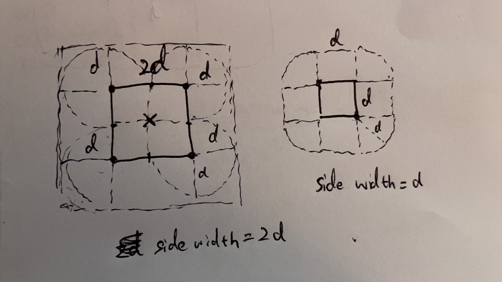
	- I can make 3 conclusions so far (they may be wrong):
		1. when cell width = 2d, we can blindly check all 27 neighbors (i.e. the dot line area)
		2. when cell width = 2d, we can optimally check 8 neighbors if we know which of the four quadrant the boid falls within the cell.
		3. when cell width = d, we need to check 8 neighbors in all scenarios and not fewer.
	- In theory, implementation based on conclusion 3 is the most optimal and probably the fastest because:
		- it does not need to distance-check the boids in the same cell (they are definitely neighbors)
		- it only checks 8 neighboring cells, which is as few as it can go.
		- it does not need to do the quadrant-checking in conclusion 2.
	- I only did implementations based on conclusion 1 and 2. You can toggle the macro `IMPL_8` in `kernel.cu` to switch between them. In practice, they have nearly identical performance even at 200k boids.
	- All in all, I think checking 8 neighbors and using cell width = d is the most efficient.

## Performance Analysis
- Framerate is used as the primary metric to measure performance
	- The program is run for **5** seconds, and the average framerate is chosen.
- Two factors, the number of boids and thread block size, are investigated for their impact on the performance of the simulation
- Each section lists the framerate vs. factor graph for each of three implementations, i.e., Naive, Naive Uniform Grid, Coherent Uniform Grid.

### An approach to Automate Performance Analysis
- the `performance_analysis/profile.py` script simply does the following:
	- for each pre-configured profiling parameters (e.g. implementation type, number of boids, block size, etc.)
		- generates a `profiling.h` with appropriate `#define`s based on the parameters
		- calls `MSBuild` to build the solution and runs the program.
	- draws the graphs based on the yielded data

### Performance Impact by The Number of Boids
- the block size is fixed at **128**
#### Naive
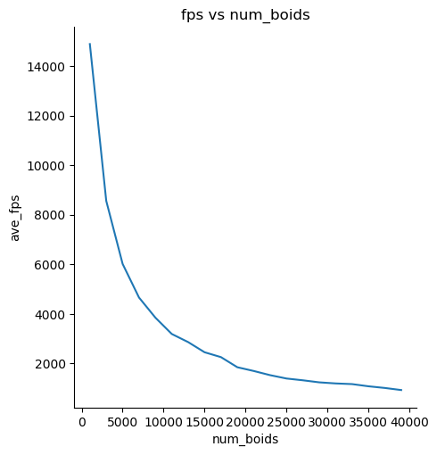
- in theory, the time complexity of the naive implementation is O(n2).
- the number of boids appears to have an inverse square relationship with the framerate

#### Uniform Grid
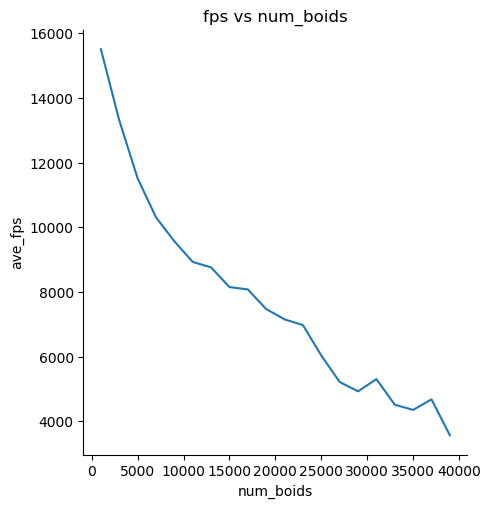
- the time complexity should be O(n) in theory
- we can see that the algorithm scales much better with the number of boids; the relationship is roughly linear
#### Coherent Grid
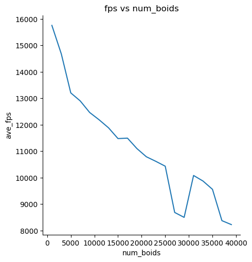
- in theory, this implementation should have the same time complexity as the uniform grid, but the constant factor should be lower
- as shown, the average frame rate is higher compared with uniform grid
- however, there are frame rate drops beginning at 25,000 boids. I can't find a reasonable explanation yet, but I assume it is because of noises during data collection. (e.g. background apps using GPU)

### Performance Impact by Block Size
- the number of boids is fixed at **5000**
#### Naive
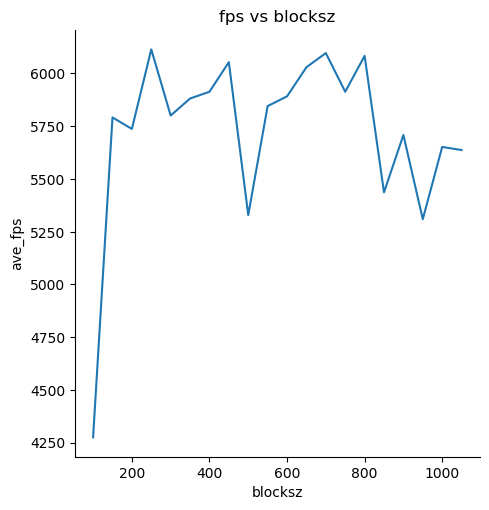
#### Uniform Grid
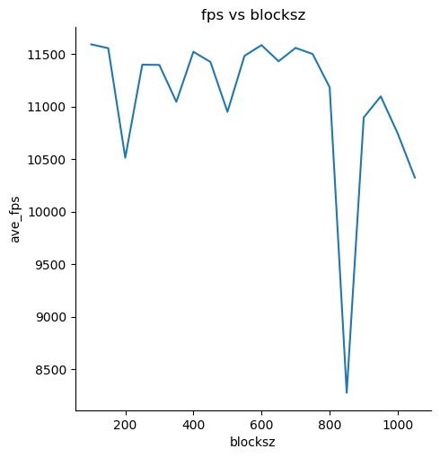
#### Coherent Grid
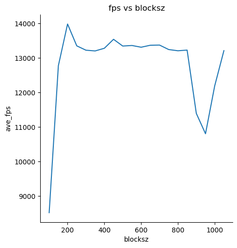
- the thread dimension used in my implementation is `(ceil(N/B) x B)` where `B` is the block size and `N` is the number of objects
	- note: the number of objects can refer to anything being computed, e.g. grids and boids
- There appears to be no strong corelation between block size and framerate
- Some observations:

1. A huge FPS drop occurs with 100 blocks for the naive and coherent grid implementations.
2. All implementations experience FPS drops at around 900-1000 block size
- Possible Explanation for the observations: Maybe it has to do with the way the scheduler in each SM groups threads into warps. Maybe branch divergence happens to be more significant for the block sizes around 100 and around 900?

### Performance Impact by Both Factors
- this section contains plots of average framerate as a function of both factors for better visualization
- it seems that the number of boids is a more prominent factor of performance.

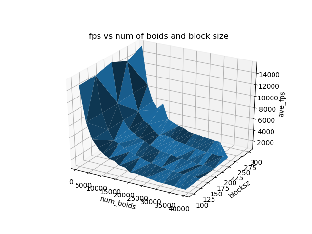
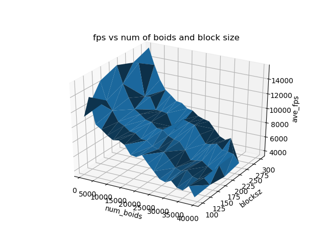
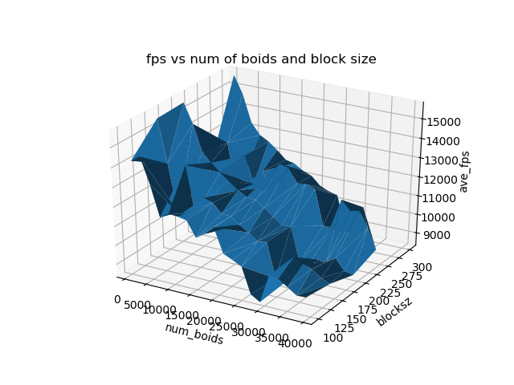