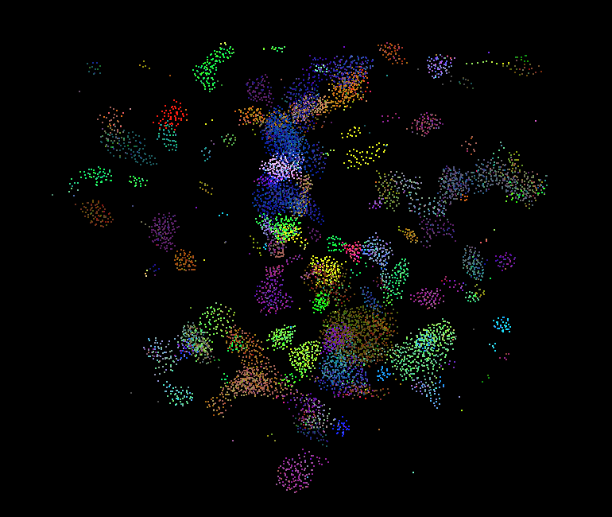
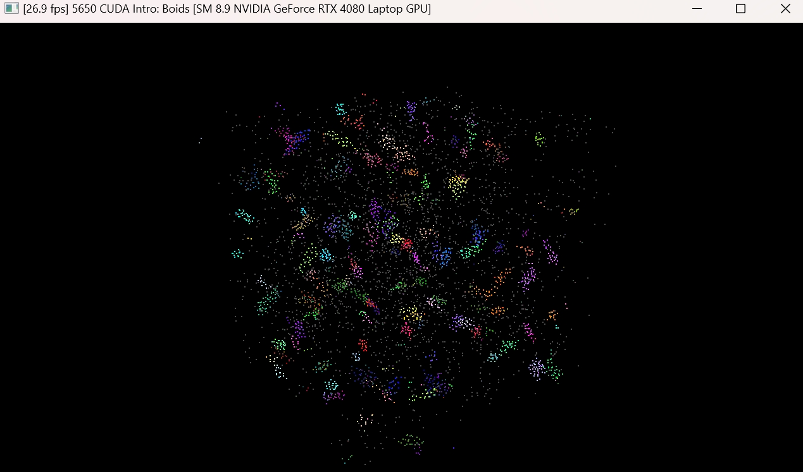
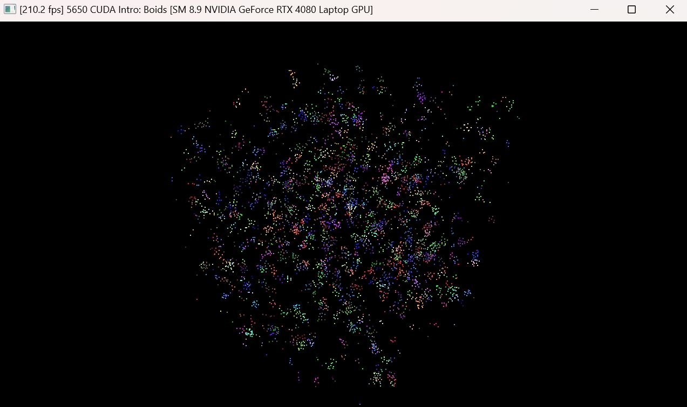
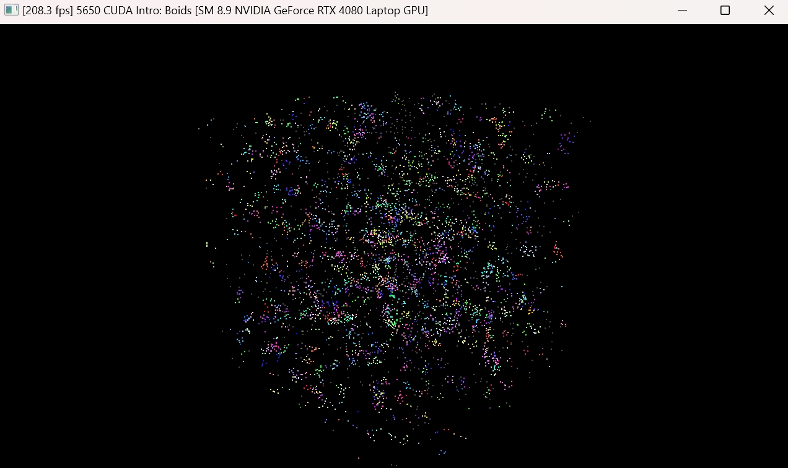
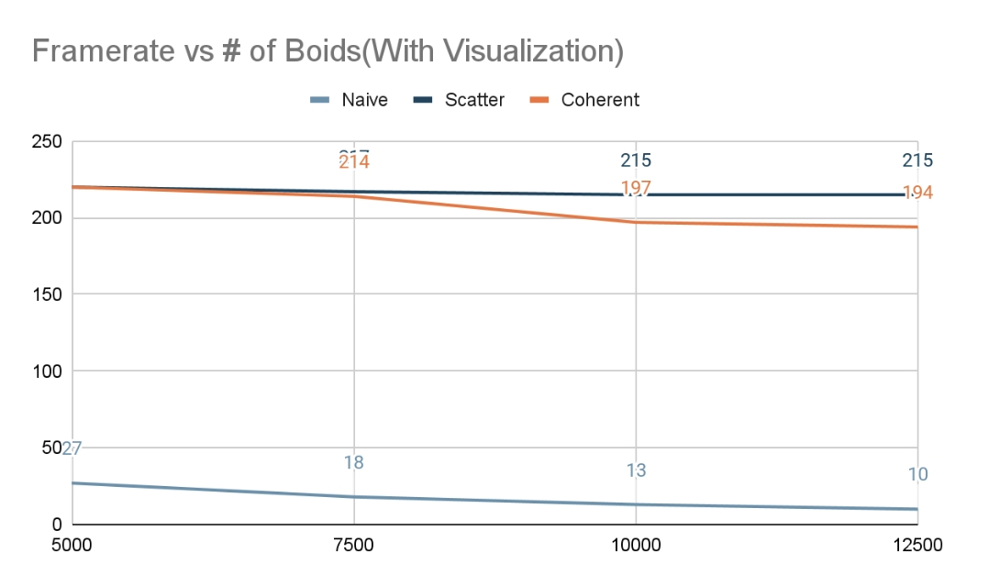
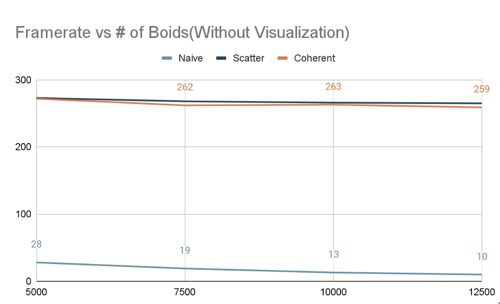
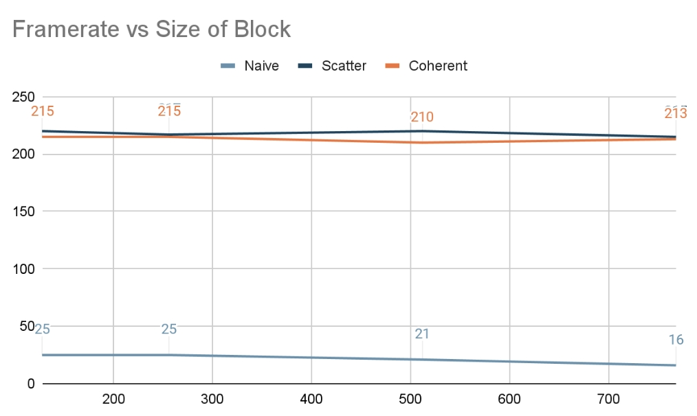

**University of Pennsylvania, CIS 5650: GPU Programming and Architecture,
Project 1 - Flocking**

* Runjie Zhao
  * https://www.linkedin.com/in/runjie-zhao-sde/
* Tested on: Windows 11, i9 185H 2500 Mhz, GTX 4080 Laptop GPU

### Project CUDA Flocking

Boids Flocking Simulation:

Boids FPS with naive approach:

Boids FPS with scatter uniform approach:

Boids FPS with coherent uniform approach;

Performance analysis:

