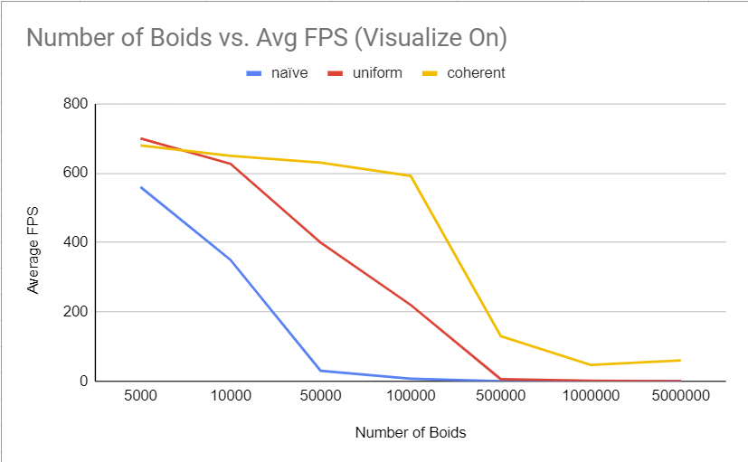
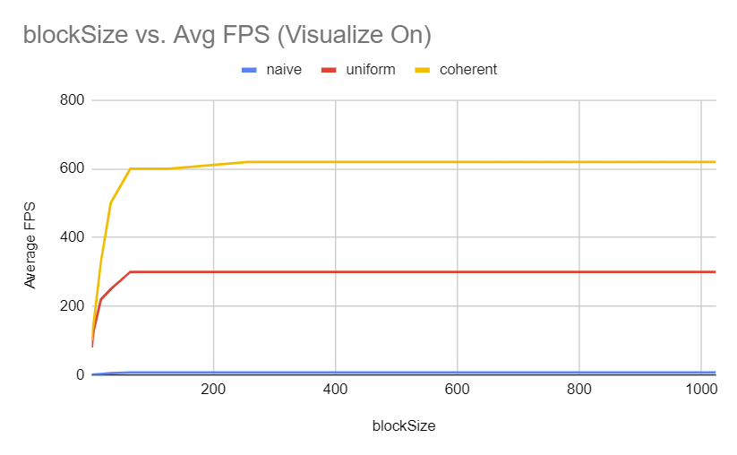
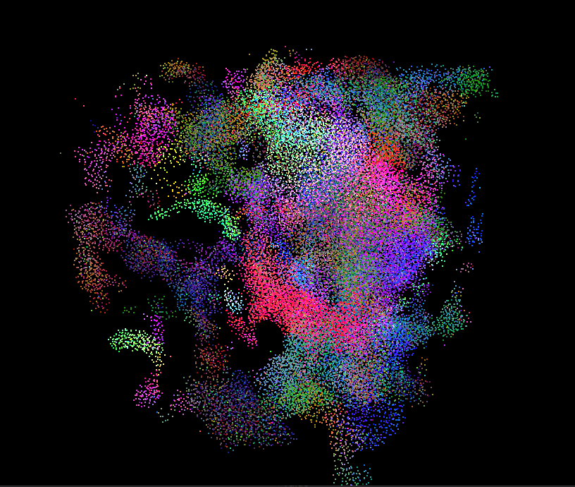
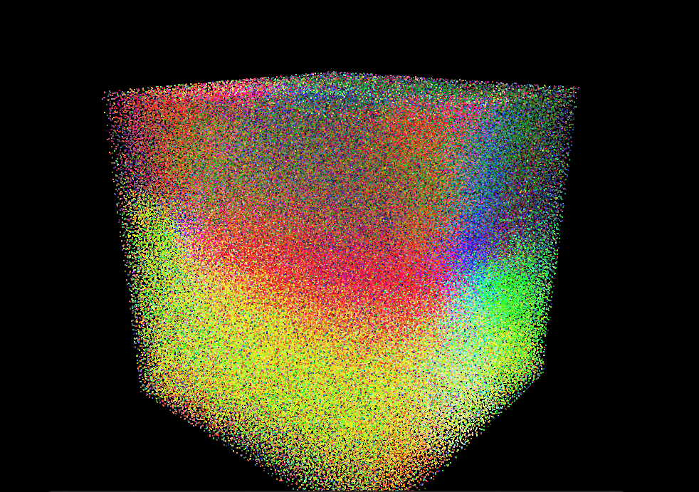
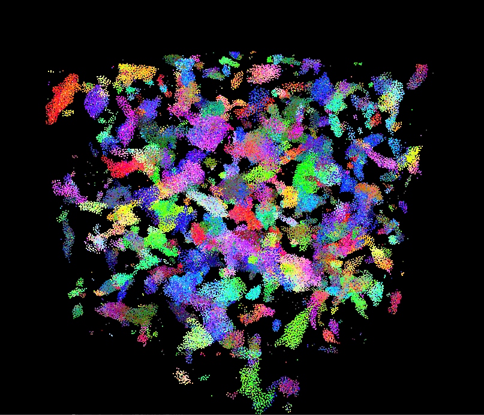

# University of Pennsylvania, CIS 565: GPU Programming and Architecture, Project 1 - Flocking

* Di Lu
  * [LinkedIn](https://www.linkedin.com/in/di-lu-0503251a2/)
  * [personal website](https://www.dluisnothere.com/)
* Tested on: Windows 11, i7-12700H @ 2.30GHz 32GB, NVIDIA GeForce RTX 3050 Ti

## Introduction

In this project, I simulate flocking behavior for a 200 x 200 x 200 cube of scattered boids by using CUDA kernel functions
to calculate their position and velocity on each dT. Based on Craig Reynold's artificial life program, for which a SIGGRAPH paper was written in 1989,
the following three behaviors are implemented:

1. cohesion - boids move towards the perceived center of mass of their neighbors
2. separation - boids avoid getting to close to their neighbors
3. alignment - boids generally try to move with the same direction and speed as
their neighbors

In the simulation results, the color of each particle is a representation of its velocity.

_Coherent Grid Flocking with 50,000 boids_

## Implementation and Results
To measure the performance of my code, I ran my program on release mode with VSync disabled. There are 
three implementations: with the first being naive neighbor search, and each subsequent part 
utilizing more optimizations.

#### Part 1. Naive Boids Simulation

The first simulation is a naive neighbor search, where each boid searches every other boid in existence and checks 
whether they are within distance for cohesion, separation, or alignment. If a non-self boid is within any such distance,
then its position and velocity will be taken into account for the respective rule. 

_Naive Grid Flocking with 5,000 boids_

#### Part 2. Uniform Grid Boids

The second simulation is a neighbor search that takes into account the largest neighborhood distance among the 3 rules. 
The simulation space is divided into grid cubes. Using these cubes, Each boid only needs to check the cubes that overlap
with its spherical neighborhood.

Each boid calculates the extremities of its reach by using its own radius and position. With these extremities, I can calculate
the maximum and minimum of my desired cells to scan. Hence, the number of useless boid scans are reduced, resulting in a much
faster simulation!

_Uniform Grid Flocking with 5,000 boids_

#### Part 3. Coherent Grid Boids

The third simulation builds on the second simulation. This time, we also rearrange the position and velocity information such that 
boids that are in a cell together are also contiguous in memory. 

_Coherent Grid Flocking with 5,000 boids_

## Part 3. Overall Performance Analysis

* Number of Boids vs. Performance

* BlockSize vs. Performance (N = 100,000)

**For the coherent uniform grid: did you experience any performance improvements
with the more coherent uniform grid? Was this the outcome you expected?
Why or why not?**

I experienced a significant performance improvement with coherent uniform grid when the boid number
is very high. For example, on 500,000 boids, coherent grid can comfortably give me ~130 FPS, while
uniform grid just about dies at ~6 FPS. For fewer boids, the performance improvement is not that obvious (for example, 
FPS is fairly similar between coherent and uniform grids when we have 5,000 boids.)

**Did changing cell width and checking 27 vs 8 neighboring cells affect performance?
Why or why not? Be careful: it is insufficient (and possibly incorrect) to say
that 27-cell is slower simply because there are more cells to check!**

My understanding is that given scene scale 100 and 100,000 boids, decreasing cell size
(thus checking more cells) will increase performance. This is because given the same density
of boids in a cell, we can check more cells and run more calculations in parallel. However,
if the scene scale were larger with the same number of boids, then this could potentially 
decrease efficiency, because 

To test my thinking, I used the following two scenarios:

_Constants:_ 

* _Coherent grid_
* _Number of boids: 100,000_ 

1. Scene Scale: 100

I observed around 100 FPS **increase** when I used cell width == neighborhood size.

2. Scene Scale: 200

I observed nearly 200 FPS **decrease** when I used cell width == neighbordhood size.

## Part 4: More Images and Results!

_Naive Flocking with 50,000 boids_

_Coherent Flocking with 100,000 boids_

_Coherent Flocking with 500,000 boids, could not get a gif of this onto github_

_100,000 boids on 200 scene scale instead of 100_
