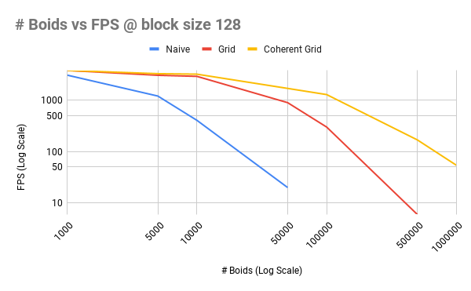
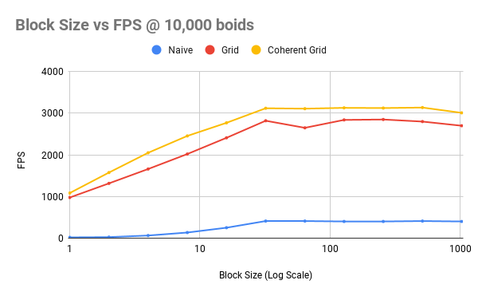
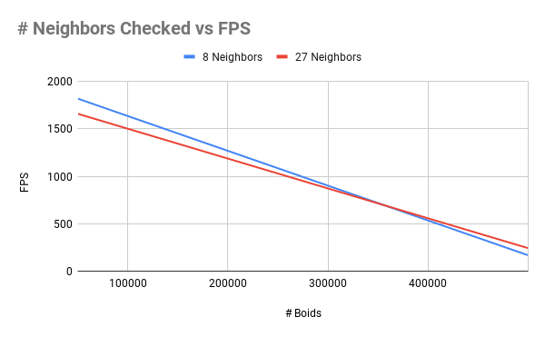

**University of Pennsylvania, CIS 5650: GPU Programming and Architecture,
Project 1 - Flocking**

* Rahul Aggarwal
  * [LinkedIn](https://www.linkedin.com/in/rahul-aggarwal-32133a1b3/)
* Tested on: Ubuntu 20.04, i7-12700H @ 2.3GHz, RTX 3050 Ti Laptop 4GB (Personal)

### Performance Analysis

Performance information was collected using the FPS in the window title.

#### \# Boids vs FPS

| # Boids | Naive | Grid | Coherent Grid |
| ------- | ----- | ---- | ------------- |
| 1000    | 3000  | 3700 | 3700          |
| 5000    | 1180  | 2980 | 3200          |
| 10000   | 400   | 2840 | 3130          |
| 50000   | 20    | 880  | 1660          |
| 100000  |       | 296  | 1260          |
| 500000  |       | 6    | 167           |
| 1000000 |       |      | 53.9          |

##### Naive Implementation

As we increase the number of boids in the naive implementation, our performance degrades exponentially (observe that the plot is a log-log plot.) This makes sense because while we are updating the velocities of each boid in parallel, each boid has to check against all other boids, which means that the algorithm itself without parallelism is $O(N^2)$. This will be very slow at high boid counts, and boid counts of >50000 are not simulateable on my hardware.

##### Uniform Grid Implementation

As we increase the number of boids in the uniform grid implementation, we still observe exponentially degrading performance; however, it occurs more slowly than in the naive case and only degrades very quickly **after** the naive implementation cannot simulate any further. I believe the performance still degrades quickly because after there are enough boids, even within the eight neihboring cells, there will still be many boids to loop over per thread, which will cause varying runtimes across threads and therefore certain blocks will reside in memory longer than they should.

##### Coherent Grid Implementation

As we increase the number of boids in the coherent grid implementation, the exponentially degrading performance becomes much flatter, meaning that the rate of performance decrease is lowered as compared to the uniform grid implementation. We expect to see this performance degradation for the same reason we do in the uniform grid implementation as there are enough boids to loop over within the closest cells to over-saturate and keep some blocks running. 

##### Grid Implementation Comparison
The performance gain we see in comparison to the uniform grid implementation makes sense because we no longer are accessing very disparate regions of memory when we are checking neighboring cells. Instead, we can simply load the chunks of memory for a specific grid cell, which is much faster than possibly getting cache misses.

#### Block Size vs FPS

| Block Size | Naive | Grid | Coherent Grid |
|------------|-------|------|---------------|
| 1          | 18    | 975  | 1083          |
| 2          | 24    | 1315 | 1575          |
| 4          | 62    | 1660 | 2050          |
| 8          | 134   | 2020 | 2455          |
| 16         | 250   | 2410 | 2770          |
| 32         | 410   | 2820 | 3120          |
| 64         | 410   | 2650 | 3110          |
| 128        | 400   | 2840 | 3130          |
| 256        | 400   | 2850 | 3125          |
| 512        | 410   | 2800 | 3137          |
| 1024       | 400   | 2700 | 3010          |

As we increase the block size from 1 to 32, we see a linear gain in performance across all three implementations. This makes sense because a warp **must** be 32 threads, and having any block size less than that will essentially be wasting performance as there will be idle threads that are not being used. However, the performance remains relatively constant after we pass the block size of 32. I believe this occurs because a block size of 32 already achieves good occupancy of the GPU SMs, and increasing it, while increasing parallelism, means that less blocks can be run on each SM, and therefore the performance gains and detriments cancel out.

#### \# Neighbors Checked vs FPS
Tested using the coherent grid implementation, at 128 block size.

| # Boids | 8 Neighbors | 27 Neighbors |
| ------- | ----------- | ------------ |
| 50000   | 1820        | 1660         |
| 500000  | 167         | 242          |

At low boid counts, checking only 8 neighbors is faster, but as we increase the number of boids, checking 27 neighbors becomes faster. My opinion is that because when you are doing a 27 neighbor check, the grid size is much smaller. Therefore, although you are checking more grid cells, the actual number of boids checked is lower as compared to a 8 neighbor check that checks very large cells with many boids. Intuitively, we can think of it as when there are a small number of boids the density of boids per grid cell is significantly less, which causes other costs like sorting to dominate. However, when the density of boids is very high, the cost of sorting compared to checking many boids is relatively smaller and therefore the 27 neighbor check becomes faster overall.

