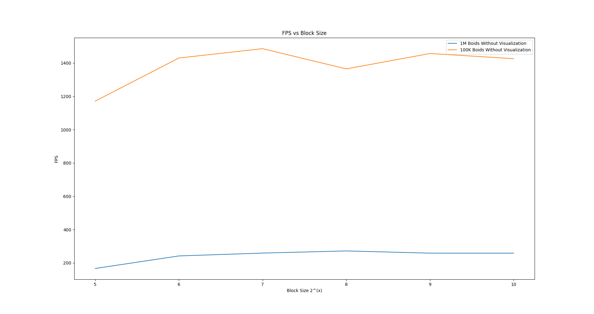

**University of Pennsylvania, CIS 5650: GPU Programming and Architecture,
Project 1 - Flocking**

* ANNIE QIU
  * [LinkedIn](https://github.com/AnnieQiuuu/Project0-Getting-Started/blob/main/www.linkedin.com/in/annie-qiu-30531921a)
* Tested on: Windows 11, i9-12900H @2500 Mhz, 16GB, RTX 3070 Ti 8GB (Personal)

## Screenshots
### Screenshot 1
- Optimized coherent; number of boids = 10000; block size = 128

### Screenshot 2
- Optimized coherent; number of boids = 500000; block size = 128

## Performance Analysis

### Framerate change with increasing # of boids

- Descriptions: The dashed lines represent the performance without visualization, and the solid lines represent performance with visualization. I chose 1000, 5000, 10000, 20000, and 50000 boids for testing. The y-axis is the frames per second (FPS), and the x-axis is the number of boids. All the performances decreased as the number of boids increased. The Naive simulation is affected the most. And the scattered and coherent have a milder impact.

### Framerate change with increasing block size

- Descriptions: I chose 8, 16, 32, 64, 128, 256 and 512 as block size. As the complexity of naivee simulation is high, even the increased of the block size may not have a big improvement on performance. And the scatted and coherent reach peak performance in 64 and 128 and get stable after that.

### Answers according to Analysis
1. For each implementation, how does changing the number of boids affect performance? Why do you think this is?
 -  As the number of boids increases, the FPS decreases, and leads to reduced performance.
 -  Naive simulation:  This is the slowest among the three implementations, and the FPS drops drastically as the number of boids increases. This is because the Naive Simulation requires looping through every single boid, resulting in O(N^2) complexity. As N increases, the speed becomes significantly slower.
 -  Scattered simulation:  By using a uniform grid, the number of boids each boid has to check is reduced, so the performance drop is less severe compared to the naive implementation. . However, when the number of boids becomes very large, performance still decreases significantly due to the need to access unsorted boid data during each loop.
 -  Coherent simulation: This is an optimized version of the scattered implementation. By sorting the position and velocity arrays, memory access times are reduced. Although the number of boids still affects performance, it has the best performance overall, with a slower rate of decline compared to the other two implementations.
2. For each implementation, how does changing the block count and block size affect performance? Why do you think this is?
 - The low performance at block sizes smaller than 32 is due to not having enough threads to fit into the warp. If the block size is the multiples of 32, the perfomace can run efficiently in parallel. As the block size increases to a certain point like after 64 and 128, the performance stabilizes because the GPU's resources reach their limit. While larger block sizes mean more threads per block, the GPU’s resources like registers and shared memory are limited. Therefore, I think the further increasing the block size may not lead to additional performance gains.
 - Naive simulation: Since this implementation is highly computationally intensive, even the increased of the block size may not have a big improvement on performance.
 - Scattered simulation: The performace reaches a peak at block sizes of 32 and 64, and then stabilizes as the block size continues to increase. It is not efficient as coherent, but much better than naive.
 - Coherent simulation:  It has the best performance over all simulations. The performance reaches the peak when the block sizes are 64 or 128. After that, it is getting stable as the scattered simulation.
3. For the coherent uniform grid: did you experience any performance improvements with the more coherent uniform grid? Was this the outcome you expected? Why or why not?
 - Yes. This is expected. In the coherent uniform grid, the boids are sorted within the grid cells, which allows us to check neighbors more efficiently. The most time-consuming process in the simulation is memory access. By sorting the boid data, I no longer need to check particleArrayIndices each time during the simulation. As the number of boids increases, the less global memory access pattern becomes more importamt. Therefore, as the number of Boids increases, the performance of the Coherent implementation decreases slower than Scattered. 
 In my analysis screenshot, it shows that when the number of boids is 50000, the decrease rate of scatter is much sharper than coherent.
4. Did changing cell width and checking 27 vs 8 neighboring cells affect performance? Why or why not? Be careful: it is insufficient (and possibly incorrect) to say that 27-cell is slower simply because there are more cells to check!
 - Check 27 neighbors: The width of the grid cell is smaller, and the number of Boid in a grid can be smaller. However, by checking 27 neighbors, the memory access can also increases which cause performance to decrease.
- Check 8 neighbors: The width of the grid cells is larger, and the number of Boid in a grid can be bigger. However, each boid only needs to check 8 neighbors, so the number of neighbor checks is reduced. 
- In summary, if the number of boids get really big, check 27 cells  may be slower due to increased memory access and computation. While, when boids are densely distributed, check 8 cells can be slower as each grid cell is larger and contains more boids to process.