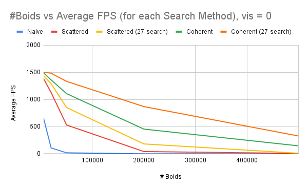
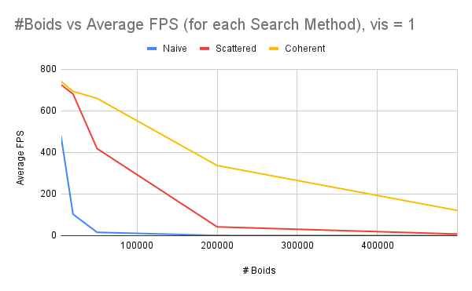
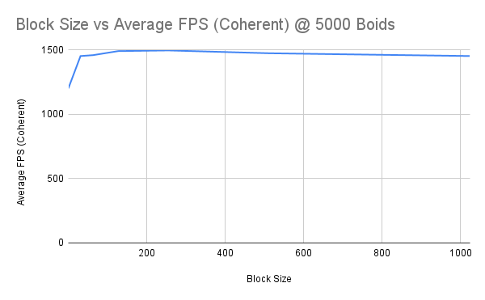

**University of Pennsylvania, CIS 565: GPU Programming and Architecture,
Project 1 - Flocking**

* Evan S
* Tested on: Zephyrus ROG G14 - Windows 11, Ryzen 5800HS @ 3.20GHz, RTX 3060 Notebook

## Visuals
Boid counts of:  
5000,  
  
50,000,   
  
500,000    
    
The larger GIFs may take some time to load (~50 MB).  

## Performance Analysis

Three approaches are used. From expected slowest to fastest:  
- naive search comparing a boid to all others
- scattered search with uniform grid to constrain possibilities
- coherent search version of above, aligning kinematic state buffers (lower memory use)  

All the below benchmarks are averaged FPS, over 20 measurements. The Zephyrus ROG G14 comes out of box with numerous software(GeForce Control Panel, GeForce Now, MyASUS, ARMOURY CRATE), and the like. Many GPU settings are throttled according to the default software specs of the laptop (e.g., ARMOURY CRATE SILENT MODE throttles GPU and CPU to maintain a low fan speed). Subsequently, these benchmarks should be taken as loose estimates.

(27-search) is appended after scattered and coherent for benchmarks using a 27 neighbor half-width grid setting.  
Visualize off (just simulation logic) benchmark:

Visualize (drawing graphical elements) benchmark:   

Benchmark for average FPS for increasing block size on coherent at 5000 boids:

## Question Answers
- For each approach, increasing the number of boids decreases performance. The degree of decrease differs, but in every case performance is dependent on the number of boids, since every boid needs to look at other boids in a neighborhood to determine own kinematic state (e.g., approach 1 compares each boid to every other boid, which is O(n2) runtime complexity).
- Changing block count or block size has an impact on performance - if the block size and block count are both 1 then only one thread is launched. The less clear question is if the overall threads launched is equal to the number of boids, but one of blockSize or blockCount is varied. At a blockSize of 1, as in the graph above, there is a notable dip in FPS. With a blockSize like 1, an extra warp is scheduled, wasting 31 cycles (assuming 32 threads to a warp). Precise metrics that document how block size or block count affects performance would be both application and hardware dependent, but maximing [CUDA occupancy](https://docs.nvidia.com/cuda/cuda-occupancy-calculator/index.html) will generally be coorelated with performance.
- The more coherent uniform grid experiences notable improvement, especially as boid count grows to large numbers. Although there is the overhead of an additional kernel call, we skip indexing into the dev_particleArrayIndices and access the kinematic state of the boid contiguously. This might not have been intuitive, but I expected it since otherwise that part of the assignment would be wildly disappointing and wasteful.
- Checking 27 neighbors instead of 8 gave a general speedup (see graph). I suspect that the additional overhead of checking the quadrant of a boid within its current grid cell to determine which are the closest 8 cells to it is inferior to a simple surrounding 27 neighbors check. This was somewhat unexpected.