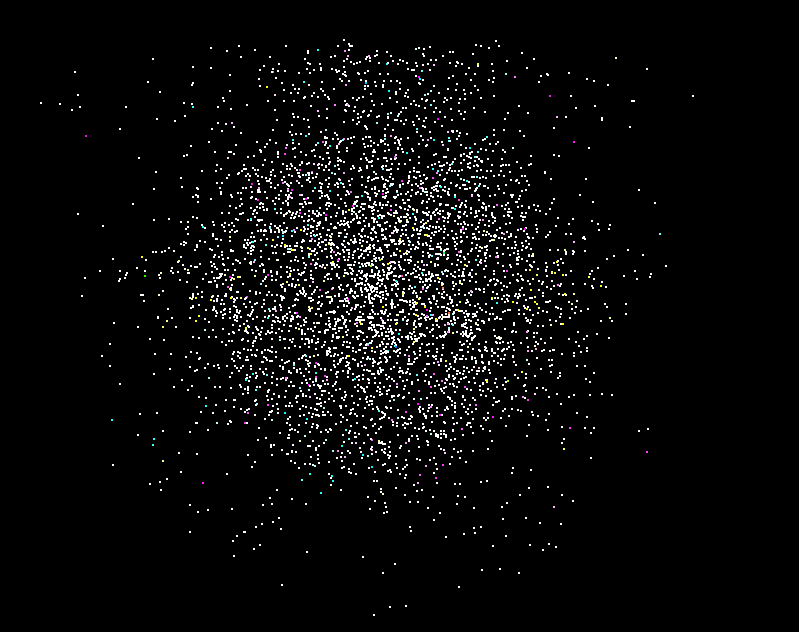

**University of Pennsylvania, CIS 565: GPU Programming and Architecture,
Project 1 - Flocking**

* RHUTA JOSHI
  * [LinkedIn](https://www.linkedin.com/in/rcj9719/)
  * [Website](https://sites.google.com/view/rhuta-joshi)

* Tested on: Windows 10 Home, i5-7200U CPU @ 2.50GHz, NVIDIA GTX 940MX 4096 MB (Personal Laptop), RTX not supported
* GPU Compatibility: 5.0

# Boids Assemble! #

## Introduction

Boids are a computer simulation of an animal(eg. fish/bird) that flies in flocks or swarms.
In this assignment I have implemented a flocking simulation based on the Reynolds Boids algorithm, optimized using a uniform grid. Another level of optimization to be implemented is using a uniform grid with semi-coherent memory access.

## Observations

After 3-4 minutes uniform grid simulation running continuously, we can see that all particles slowly get aligned in one direction

Increasing the maximumspeed of each particle by a factor of 2:

## Blooper

I thought this blooper was an interesting visualization, totally wrong of course. I was calculating the updated velocity incorrectly.

# Performance Analysis #

To be updated
