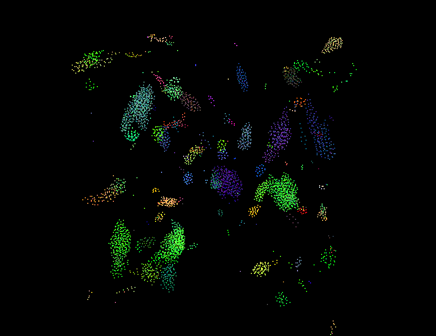

**University of Pennsylvania, CIS 5650: GPU Programming and Architecture,
Project 1 - Flocking**

- Wang Ruipeng
    - [LinkedIn](https://www.linkedin.com/in/ruipeng-wang-681b89287/)
    - [Personal Website](https://wang-ruipeng.github.io/)
- Tested on: Windows 10, i7-10750H CPU @ 2.60GHz 16GB, RTX 2070 Max-Q 8GB

# Result

# Overview

### 1. Naive Boids Simulation

- **Description:** Each boid checks every other boid in the system to compute velocity changes based on cohesion, separation, and alignment.
- **Performance:** This approach is highly inefficient, especially with large numbers of boids, because the algorithm scales poorly (O(n^2) complexity). Every boid must interact with every other boid, resulting in slowdowns as the boid count increases.

### 2. Uniform Grid with Neighbor Search Optimization

- **Description:** This algorithm uses a **uniform grid** to divide the simulation space into cells. Each boid is placed in a cell based on its position, and instead of checking every boid, it only checks boids in neighboring cells. The uniform grid reduces the number of checks dramatically by limiting neighbor interactions to only those within the same or adjacent cells.
- **Performance:** Significant improvement over the naive approach, especially for large simulations. The number of neighbor checks is reduced, making the algorithm more efficient. The sorting of boids into cells was achieved using the **Thrust** library for key-value sorting, which efficiently grouped boids into grid cells.

### 3. Uniform Grid with Coherent Memory Access

- **Description:** This algorithm further improves the uniform grid by arranging the positions and velocities of boids in a way that ensures **coherent memory access**. In the previous uniform grid implementation, boid data (positions, velocities) was scattered in memory. This approach ensures that all boid data within the same grid cell is stored contiguously, which allows for faster memory access and better performance on the GPU.
- **Performance:** The coherent memory access further improves performance compared to the scattered uniform grid. By reducing memory access latency and ensuring that related data is accessed together, the algorithm takes better advantage of the GPU’s memory hierarchy.

# Performance Analysis

## 1. Average Framerate for different methods

The average frame rate is presented as follows. To ensure better accuracy, the FPS from the first second is ignored, as it may be influenced by initialization and setup processes.

| Method | Naive | Uniform | Coherent |
| --- | --- | --- | --- |
| Avg FPS | 516.33 | 638.75 | 819.40 |

*Result of 5000 boids, with visualization, block size 128, Grid size = 2 * Max Rule Distance, within 120 seconds*

To answer the question in the instruction:

> For the coherent uniform grid: did you experience any performance improvements with the more coherent uniform grid? Was this the outcome you expected? Why or why not?
> 

For the **coherent uniform grid**, I did experience notable performance improvements compared to the non-coherent version. This was the outcome I expected.

The coherent memory access ensured that all boids' positions and velocities within the same grid cell were stored contiguously in memory. This layout improved cache efficiency and reduced memory access latency. In contrast, the non-coherent version scattered the boid data across memory, leading to more frequent cache misses and inefficient memory access patterns.

The improvements were particularly evident as the number of boids increased and their interactions became more complex as I will mentioned later in the performance analysis.

## 2. FPS **with Respect to Boid Count**

During the simulation, I observed that the frames per second (FPS) gradually decreases over time across all three algorithms: Naive, Uniform Grid, and Uniform Grid with Coherent Memory Access. To analyze this more precisely, I logged the FPS every second and plotted the data in a line graph. 

*Result of 5000 boids, with visualization, block size 128, Grid size = 2 * Max Rule Distance, within 120 seconds*

If we ignore the unstable frame rate over first few seconds, we could observe a steady decreasing trend over time.

### Potential Causes of FPS Decrease

1. **Boids Formation:**
    - While the number of boids remains constant, their interactions grow more complex over time as they begin to form clusters. This clustering increases the number of boids within each neighboring cell as well, leading to a higher computational load as more boids need to be checked and processed within these densely populated areas.
2. **Memory Bandwidth Saturation:**
    - In the later stages of the simulation, it’s possible that increased memory reads and writes from the GPU memory led to saturation, which could explain the performance drop.
3. **Cache Thrashing:**
    - In the case of the Naive algorithm, every boid is interacting with every other boid, resulting in significant cache misses as the simulation progresses. For the Uniform Grid algorithm, while the number of boids checked is reduced, without coherent memory access, cache thrashing is still a possibility when accessing scattered memory regions.

## 3. **FPS with Respect to Boid Count**

This part of the performance analysis serves to answer this question in the instruction:

> For each implementation, how does changing the number of boids affect performance? Why do you think this is?
> 

Generally speaking, increasing the number of boids causes the FPS to decrease **exponentially**. This is intuitive because as the number of boids increases, the calculations required to simulate them also increases exponentially. 

*Result of visualization, block size 128, Grid size = 2 * Max Rule Distance, within 60 seconds.*

From the data, it's clear that the **Naive algorithm** suffers the most, with FPS dropping sharply as the number of boids increases. This is expected due to its O(n^2) complexity, where each boid checks every other boid.

The **Uniform Grid algorithm** performs significantly better, thanks to the reduced number of boid checks within neighboring grid cells. The FPS remains higher compared to the Naive approach, though it still decreases as the number of boids grows.

The **Coherent Uniform Grid** algorithm consistently outperforms both, exhibiting the highest FPS across all boid counts. While the FPS still declines with more boids, the coherent grid handles the increasing load much more gracefully compared to the other two approaches.

Overall, the Coherent Uniform Grid shows a clear advantage in handling larger numbers of boids, making it the most scalable solution of the three.

## 4. **FPS with Respect to Block Count and Block Size**

This part of the performance analysis serves to answer this question in the instruction:

> For each implementation, how does changing the block count and block size affect performance? Why do you think this is?
> 

Changing the block size has a noticeable impact on performance, especially when considering the number of boids in the simulation. The data provided shows the performance different block sizes for three different boid counts.

*Result of coherent method, with visualization, Grid size = 2 * Max Rule Distance within 45 seconds.*

### Observations:

- **Brute-force and scattered grid access:** Increasing the block size generally improves performance. This can be attributed to the ability of larger blocks to conceal memory access latency by keeping more threads active. When the GPU can schedule more warps, the arithmetic operations help to mask the delays caused by memory access.
- **Coherent grid access:** In contrast, the coherent grid shows little improvement with larger block sizes. This is because coherent memory access is already efficient due to nearly sequential memory access patterns, which result in more frequent cache hits. Therefore, increasing the block size does not provide the same performance gains as it does with other methods.

## 5. FPS with Respect to Cell Width

This part of the performance analysis serves to answer this question in the instruction:

> Did changing cell width and checking 27 vs 8 neighboring cells affect performance? Why or why not? Be careful: it is insufficient (and possibly incorrect) to say that 27-cell is slower simply because there are more cells to check!
> 

Yes, changing the cell width and checking 27 neighboring cells instead of 8 had a significant impact on performance, and surprisingly, the performance actually improved with 27 neighboring cells.

*Result of visualization, block size 128, within 90 seconds.*

This improvement can be explained by a few factors:

1. **Accuracy of the Neighbor Search:**
    - When the cell width is twice the rule distance, some boids in neighboring cells might be outside the actual interaction range (rule distance). This means the simulation ends up checking more boids than necessary, leading to unnecessary global memory accesses.
    - By reducing the cell width to the exact rule distance, although the number of cells to check increases, each cell is smaller and contains fewer boids. This makes the search more accurate, meaning fewer unnecessary boids are checked, reducing memory access overhead.
2. **Improved Memory Access Efficiency:**
    - With smaller cells, the boids are more likely to be grouped within the neighborhood distance. This reduces the number of global memory accesses required for boids that don’t influence each other, improving overall memory efficiency. This effect becomes even more noticeable in denser simulations with higher boid counts.
3. **Less Boids Per Cell:**
    - As the cell width is halved, the number of boids within each cell decreases to 1/8 of the original. Even though there are more cells to search, the total volume covered by the 27 smaller cells is actually less than that covered by 8 larger cells. As a result, fewer boids need to be checked overall.

## 6. FPS with Respect to Visualization

The primary reason I focus on overall performance through visualization is that I believe programming should serve the broader goal of optimizing the entire program, rather than concentrating on isolated stages of performance. The aim of performance analysis is to enhance the program's efficiency as a whole. However, analyzing individual stages can sometimes be useful for identifying bottlenecks. That said, the following performance analysis excludes visualization.

*Result of visualization, block size 128, Grid size = 2 * Max Rule Distance, within 120 seconds.*

When the visualization is disabled, the FPS remains significantly higher across all boid counts. The trend of decreasing FPS with increasing boid count still holds, but the performance is better when visualization is not a factor, as the GPU focuses solely on computation rather than splitting resources between rendering and simulation.

# Extra Credit

## Grid Looping Optimization

> Instead of hard-coding a search of the designated area, limit the search area based on the grid cells that have any aspect of them within the max_distance. This prevents the excessive positional comparisons with the corner points of each grid cell, while at the same time also allowing a more flexible approach (since we're just defining a min cell index and max cell index in all three cardinal directions). That is, there is no longer a manual check for a hard-coded specific number of surrounding cells depending on the implementation (such as the 8 surrounding cells, 27 surrounding cells, etc).
> 

**Please refer to the 'Extra Credit 1' comments in the codebase to review the modifications I have made for this question.**

*Result of visualization, block size 128, Grid size = 2 * Max Rule Distance, within 120 seconds.*

Based on the data provided, the optimization provides tangible benefits, especially for **small to medium number of boids**. However, its effectiveness appears to diminish for very large-scale scenarios. This suggests that the optimization doesn't fundamentally change the algorithmic complexity of the simulation, but rather improves its efficiency within the existing computational framework.

*Result of 5000 boids, with visualization, block size 128, Grid size = 2 * Max Rule Distance, within 120 seconds*

Similar to the first part, we visualized the FPS over the first 120 seconds and plotted it on a chart. It is evident that our Grid Looping Optimization algorithm achieves a noticeable FPS improvement compared to the original algorithm. Additionally, our algorithm demonstrates greater stability in performance compared to the Coherent algorithm.
