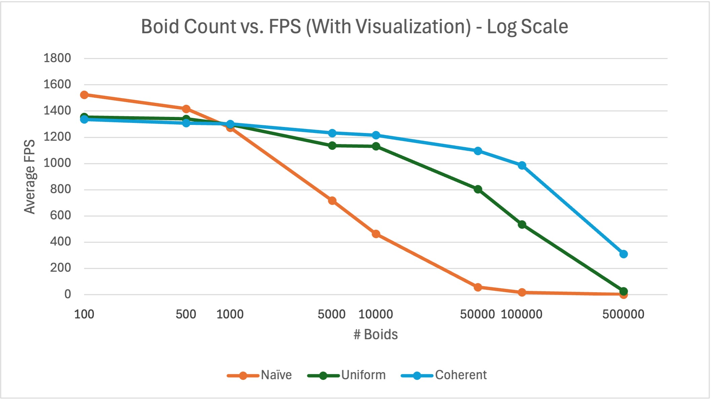
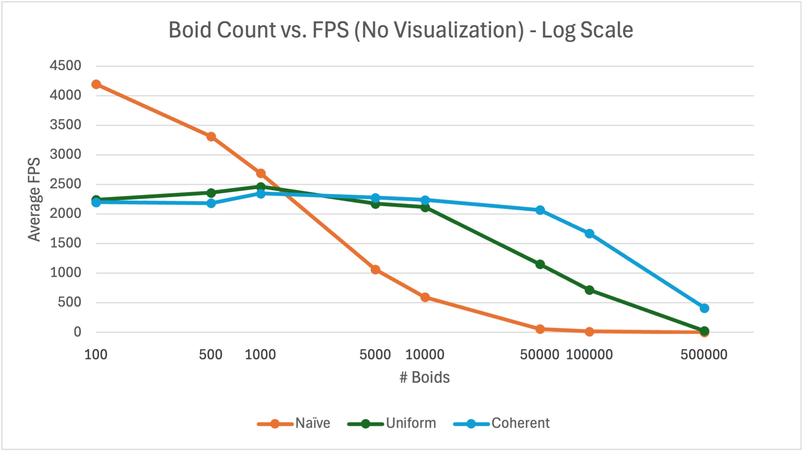
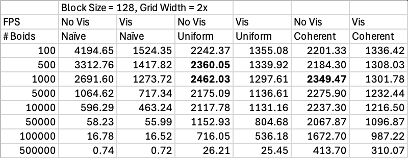
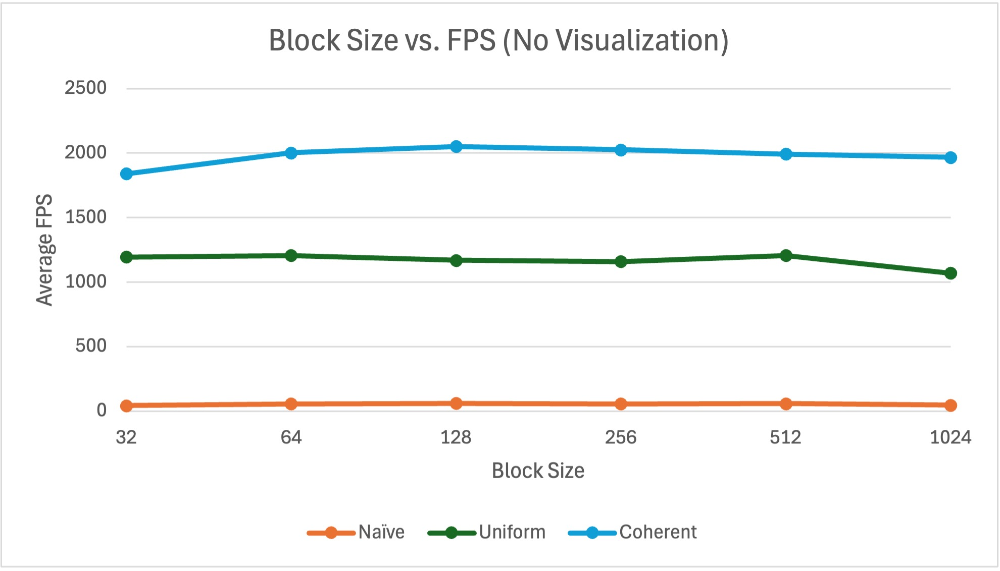
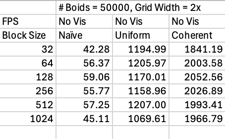
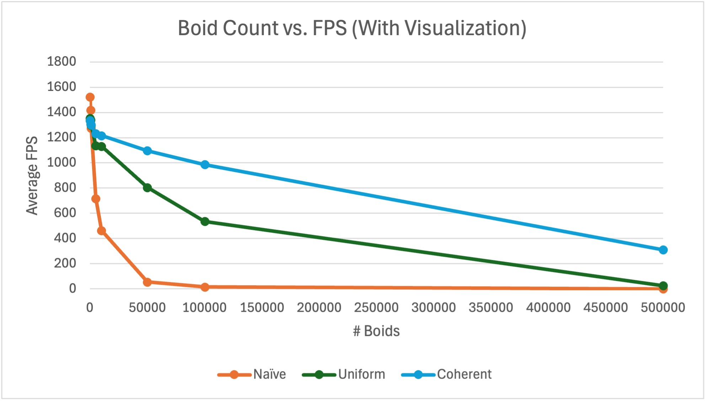
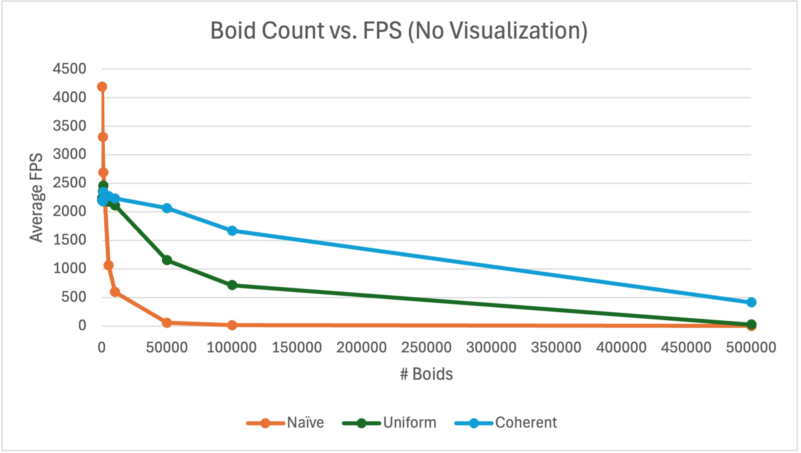

**University of Pennsylvania, CIS 5650: GPU Programming and Architecture, Project 1 - Flocking**

* Jordan Hochman
  * [LinkedIn](https://www.linkedin.com/in/jhochman24), [Personal Website](https://jordanh.xyz), [GitHub](https://github.com/JHawk0224)
* Tested on: Windows 11, Ryzen 7 5800 @ 3.4GHz 32GB, GeForce RTX 3060 Ti 8GB (Compute Capability: 8.6)

## Welcome to my Boid Flocking Simulation Project!

This project is an implementation based on the Reynolds Boids algorithm, along with a few optimizations: using a uniform grid, and a uniform grid with with semi-coherent memory access. If any of the gifs aren't moving, check out the source files for them in `/images/simulation`.

In this Boids flocking simulation, particles representing birds or fish (boids) move around the space according to three rules:

1. cohesion - boids move towards the perceived center of mass of their neighbors
2. separation - boids avoid getting to close to their neighbors
3. alignment - boids generally try to move with the same direction and speed as their neighbors

These three rules specify a boid's velocity change in a timestep, where each timestep, a boid thus has to look at each of its neighboring boids and compute the velocity change contribution from each of the three rules. Thus, a bare-bones boids implementation has each boid check every other boid in the simulation, which can be extremely inefficient.

This project implements the simulation on the GPU by running one thread for each boid that needs to be updated. However, there are still optimizations to be done.

## How the Simulation Works

This project implements the boid simulation in three different ways. First is the naive brute force approach, where at every time step, each boid checks all other boids to find neighbors and update its velocity accordingly. As you can imagine however, this is extremely slow and inefficient.

The second implementation uses a uniform grid to greatly minimize the search space required for each boid. It works by partitioning the entire simulation space into a grid, and then storing references for each grid cell pointing to which boids are in that cell. Then, when a boid is trying to update its velocity, instead of having to iterate over every boid, it only needs to check the grid cells which are nearby (within the neighborhood) and the boids in those cells. As you can imagine, this greatly speeds up the simulation as many fewer boids need to be checked. The detailed performance analysis is performed below.

Lastly, another optimization is performed on the uniform grid search, where it uses semi-coherent memory access instead. In the second implementation, the actual positions and velocities of the boids are stored in a buffer so that when we need to access them, we need to chase down a few pointers before we can actually get the data. Now normally this wouldn't be so bad, but this data is stored in global memory and global memory access on the GPU is extremely inefficient. Thus for this last optimization, we instead sort the position and velocity buffers ahead of time so they are already in the order we need, and we need to do less pointer chasing (which leads to fewer global memory reads). As a result, this again speeds up the simulation.

For more details about this exact process, as well as the specifics of the uniform grid, see `INSTRUCTIONS.md`.

## Running the Simulation

If you are interested in running this simulation, you may first want to ensure your computer is set up to do so. To do this, you can follow the instructions in [Project 0](https://github.com/JHawk0224/CIS5650-Project0-Getting-Started/blob/main/INSTRUCTION.md). After that, you may want to read through the [instructions](INSTRUCTION.md) for this project.

Additionally, you can tweak parameters found in `main.cpp` to change the program settings:

- `VISUALIZE` - turns the visualization on and off
- `UNIFORM_GRID` - turns on and off the optimization of using the uniform grid versus naive brute force
- `COHERENT_GRID` - turns on and off the optimization of the semi-coherent memory access
- `N_FOR_VIS` - controls the number of boids in the simulation
- `DT` - changes the simulation timestep

You may also be interested in changing the simulation parameters in `kernel.cu`:

- `rule1Distance`, `rule2Distance`, `rule3Distance` - the distance each boid simulation rule takes effect in
- `rule1Scale`, `rule2Scale`, `rule3Scale` - the magnitude of the effect of each rule
- `maxSpeed` - the max speed of each boid
- `scene_scale` - the size of the simulation
- `gridCellWidthScale` - **Important**: this controls how big the grid cells are in comparison to the rule distances. For example, if this value is 2, then the grid cells are twice the width of the maximum of the three rule distances above

All of the performance analysis below was performed with the visualization turned off.

### Naive Brute Force Approach

As explained above, in this approach, every boid checks every other boid to see if it is close enough and updates its velocity accordingly. Even when running this on the GPU with one thread per boid, it can be very inefficient. Here is a reference simulation with 5000 boids.

Note that all of the jitteriness/framiness of this gif is due to the limitations of the frame rate of the gif, not the simulation itself. Running the simulation itself looks just fine, and you can check this by looking at the fps counter in the top left corner.

Trying to push this simulation to higher boid counts does not go well. Actually, the intro gif of this project was the naive approach ran on 30000 boids, and you can already see a massive decrease in fps. Trying to run it with more boids will make it run even slower, so we need another approach.

### Scattered Uniform Grid Approach

As explained earlier, this approach uses a uniform grid to greatly minimize the search space required for each boid. See the explanation above for more details on how it works. Here is the simulation running with the same 5000 boids.

As you can see, it's already running much faster than the naive approach (over 1000 fps!). However, it also scales much, much better as we don't need to search every boid every time. Here is the simulation running with 100000 boids.

It barely slowed down compared to the 5000 boid simulation, and is handling it just fine. We're still hitting over 500 fps. However, how far can we push it?

### Coherent Memory Access Uniform Grid Approach

As explained earlier, there is still an issue with the global memory accesses during the simulation updates. We would like to minimize these for each boid, and this would push the performance even further. To do this, we rearrange the position and velocity buffers for the boids so they can be accessed contiguously, which requires one less pointer chase for each boid in each iteration (one less global memory access). Here is the simulation on 5000 boids.

Now we're getting over 1200 fps! How does it run on 100000 boids though?

It's still over 1000 fps, which is insane performance. A more detailed performance analysis will be performed below for better comparison.

### Other Optimizations

In addition to the optimizations mentioned above, there were two others that were done on both the uniform grid approaches. With the uniform grid, one might want to know how many neighbor cells do we need to check for boids? Well this depends on the neighborhood size defined by the three rules for velocity updates, but there are a few ways to implement this.

In the project code, we decided on a cell size which was twice the neighborhood size originally. This was done because then we only need to check the 8 neighboring cells (2x2x2) for boids. However, what if we want a more pragmatic approach? And do we actually need to check all 8 cells?

Of course, we don't. Thus both approaches also implemented the grid-looping optimization, where instead of hard-coding a designated search area (like 2x2x2 or 3x3x3), we limit the search based on any cells with any point *within the neighborhood distance* (which as you can imagine, looks like a sphere). To do this, we first make the smallest cube possible based on going out the distance in any direction from the boid, but then we skip any cells that are too far away within this cube. With this optimization, we don't need to check as many cells for neighbors.

A breakdown of the performance vs. cell size tradeoff will be given below.

There is another optimization that can be done which should **greatly** increase performance, however I did not do it for this project. It involves using shared memory in the GPU to reduce global memory access even further, but implementing it would require a vastly different algorithm. This is because of the limited size of shared memory, we need to be very careful about which boids' information we store in there and when. Because the neighborhood around each boid might contain different cells per boid, to use the shared memory effecively accross boids we would need a different method of partitioning the simulation space. A paper describing such an algorithm can be found [here](https://diglib.eg.org/server/api/core/bitstreams/79528ffd-9609-4232-bb81-57819e7ae747/content), and this is something that would be great to come back to and implement.

## Performance Analysis

First I will discuss the measurement of performance used for the analysis below. They are all comparing FPS (frames per second), where the time is measured by the GLFW timer. The numbers given below correspond to the average FPS over the first 10 seconds of running the program (averaged over 3 tries due to the random generation of boid positions). To find the average FPS over the first 10 seconds, first the number of frames is stored (which is how many iterations of the loop finished), divided by the total time it took to compute all those frames (so not quite 10 but very close, as this should be the total time for every frame to have been computed).

For the below comparisons, they were all done in Release mode, and with Vertical Sync (vsync) turned off. The specs of the computer they were run on is mentioned at the very top. All of the raw data for these runs can be found in the `simulation-data.xlsx` file [here](simulation-data.xlsx), although screenshots are provided throughout for convenience.

### Boid Count vs. Performance

The first performance analysis done was varying the number of boids. Of course, with more boids one would expect the performance to go down while in general, the optimized versions do better. These were run on 100, 500, 1000, 5000, 10000, 50000, 100000, and 500000 boids, each with a block size of 128 and cell width scale of 2 (explained later).

Here are the graphs of the performance tradeoff with and without the visualization respectively, for each of the three methods (which from here on out will be referred to as "Naive", "Uniform", and "Coherent"):

Note these are given in log scale, and if you are interested in seeing the version of this chart without the log-scaled axes, check out the appendix. Below is a summary of the data:

There are a few interesting things to note about these graphs. Starting with the Naive implementation, we see that as the boid count goes up, performance does indeed drop. However, we see that initially, for _very_ low boid counts (less than 1000), the performance for this is actually better than for Uniform or Coherent. The explanation for this is that the Naive method just iterates through every boid, so if there are few boids, this isn't really a big deal. It's not hard to iterate through only a few hundred boids, whereas the uniform grid adds more overhead and cells that have to be checked. Thus this result makes sense. But for large boid counts, iterating through them all would of course only get slower and slower due to its time complexity of O(n^2). The Uniform and Coherent approaches can handle many more boids due to their implementation.

Now comparing the Uniform approach and Coherent approach, we see that for low boid counts (up to about 10000), they perform relatively similar to themselves and to each other. This is because for Coherent, the optimization reduces the number of global memory accesses, but for low boid counts these accesses aren't the limiting factor for compute, but instead it's something elsek (e.g. the overhead for setting up the grid). As a result, limiting these accesses doesn't help all that much. However, as we get to large boid counts, then this does start making a difference. This is why they both don't see much of a performance drop when increasing boid counts below 10000. The bulk of the work doesn't come from the calculations of boid positions/velocities, but rather the overhead of managing the grid.

It's also interesting to compare the performance with and without visualization. It seems like adding the visualization just slightly decreases the total performance evenly for low boid counts, but this effect is less pronounced for high boid counts. This again makes sense because for low boid counts, drawing the visualization takes up much of the time and compute compared to the calculation of the boids' position and velocity. However, for higher boid counts, this position/velocity calculation is proportionally much larger than the time needed to draw the visualization, so adding it or removing it doesn't make as much of a difference.

There is another intriguing part of this data, and that's that the performance for Uniform and Coherent actually _increases_ slightly for around 500 to 1000 boids (see the bolded cells in the data). There is a possibility this is just due to a random variation in the workload of my computer, but it's also worth considering if there could be other causes. One potential explanation for this occurance is that TODO!!!.

### Block Size vs. Performance

The effect of the block size/count versus performance was also measured. Here, the block size means the number of threads that were run in each block for all of the calls to the GPU. The reason one might want to investigate block size is that it can have some differences depending on the hardware the code is run on. Each GPU has a different number of SMs, and each SM can only handle a limited number of blocks and threads at a time. If a block size is too small, then the SM's resources might not be fully utilized, and there is GPU compute power that is being wasted. However, if the block size is too large, then the resources available to each SM might become exhausted (like shared memory or registers). This would cause fewer blocks to be scheduled, and thus reduce the parallelism.

This analysis was run with block sizes of 32, 64, 128, 256, 512, and 1024, the max allowable size. I decided on using 50000 boids for this analysis because it seemed like an amount where the benefits of each method were apparent, and there were noticable performance differences. However one future avenue for performance analysis might be to look into the effect of block size at different boid counts. They were also run with a cell width scale of 2.

At a quick glance of these graphs, it really doesn't look like the block size has much of an effect on the performance. The reason this might be the case is that again, the performance in this project is mostly determined by the boid position/velocity calculation, so as long as enough work is being given to the GPU, there should not be much of a difference. The difference we see here is indeed very small when compared to all the performance differences we were seeing with the varying block size.

However, there are a few noticable changes in this graph that are worth talking about. The

### NEXT SECTION

TODO: describe methodology, changes & comparisons for changes. Give plots

Mention hypotheses and insights

Answer these bullets
Include required graphs

### Appendix

Here is the graphs of the boid count versus FPS without the log scale:

## Extra Bloopers :D

Here are some fun things I came accross doing this project!

I was trying to push how far the simulation could go, so here it is running on 1 million boids! This is the coherent memory uniform grid approach, and it's still running at over 100 fps!

