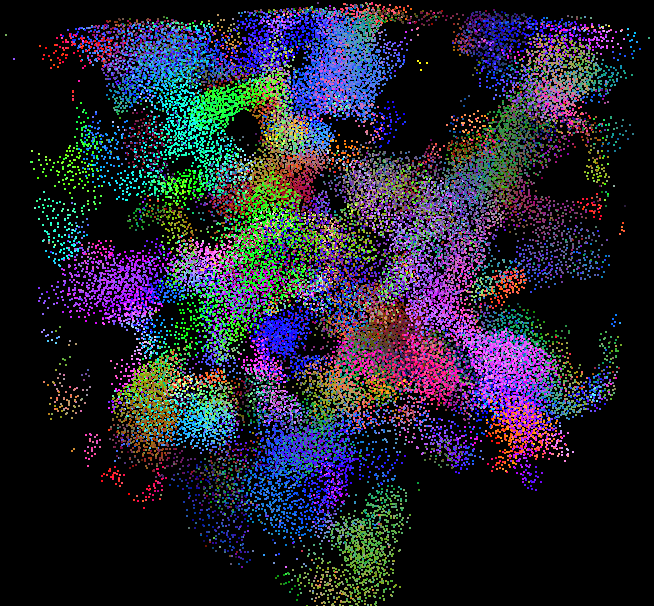
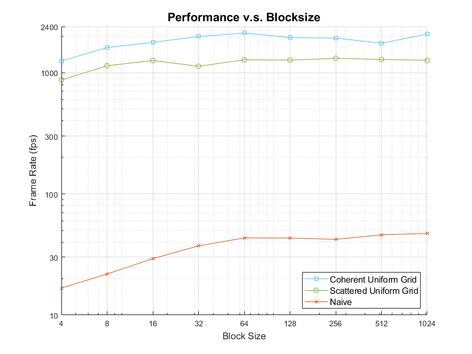
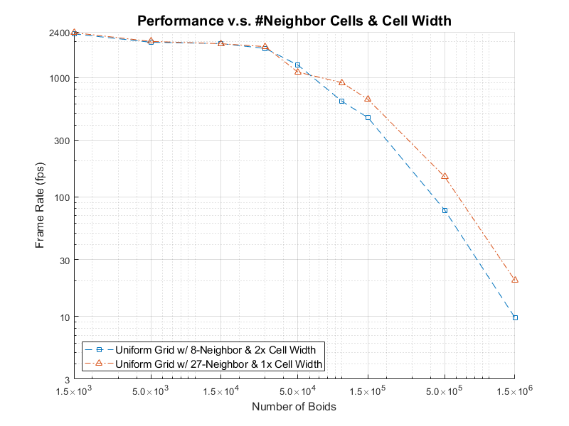

**University of Pennsylvania, CIS 5650: GPU Programming and Architecture,
Project 1 - Flocking**

* Mufeng Xu
  * [LinkedIn](https://www.linkedin.com/in/mufeng-xu/)
* Tested on: Windows 11, i9-13900H @ 2.6GHz 32GB, RTX 4080 Laptop 12282MB (Personal Computer)

## Screenshots

## Performance Benchmarks

Benchmarking Process:
- All benchmarks are executed consecutively and only once per trial.
- Since the benchmarks are run in a sequence, performance results may be influenced by fluctuations in GPU temperature over time.
- Frame rates of "*Performance v.s. Number of Boids*" are measured based on the ***average* FPS over 30 seconds**, starting after the initial program launch. For "*Performance v.s. Blocksize*" and "*Performance v.s. Number of Neighbor Cells & Cell Width*", the frame rates are measured based on the ***average* FPS over 15 seconds**.

***Notice***: All the axes are in **log scale**.

### Performance v.s. Number of Boids

| # of Boids                  	| 1,000  	| 5,000  	| 10,000 	| 50,000 	| 200,000 	| 500,000 	|
|-----------------------------	|-------:	|-------:	|-------:	|-------:	|--------:	|--------:	|
| Naïve w/ Viz                 	| 1067.1 	| 448.6  	| 220.5  	| 30.5   	| 2.4     	| 0.4     	|
| Naïve w/o Viz         	      | 2165.0 	| 637.2  	| 274.9  	| 36.4   	| 8.3     	| 5.4     	|
| Scattered Uniform Grid w/ Viz | 1420.7 	| 1281.8 	| 1211.2 	| 786.6  	| 240.7   	| 71.2    	|
| Scattered Uniform Grid w/o Viz| 2221.4 	| 2152.1 	| 1971.5 	| 1291.1 	| 339.2   	| 81.2    	|
| Coherent Uniform Grid w/ Viz  | 1368.9 	| 1249.5 	| 1367.8 	| 1281.7 	| 620.6   	| 386.2   	|
| Coherent Uniform Grid w/o Viz | 2487.0 	| 2173.5 	| 2148.5 	| 2144.1 	| 1202.0  	| 586.5   	|

From the data above, we can conclude that:
- **Visualization reduces performance**: For the Scattered/Coherent Uniform Grid implementations, enabling visualization results in an average frame rate reduction of approximately 40%. For the Naive implementation, the impact is more variable, with greater fluctuations in frame rates.
- **Coherent Uniform Grid has the best performance**: Coherent Uniform Grid achieved the highest overall FPS because of its optimized memory access strategy.

More analysis are in the *Answers* part.

### Performance v.s. Blocksize

The benchmarking in this section is performed ***without visualization***.

### Performance v.s. Number of Neighbor Cells & Cell Width

The benchmarking in this section is performed ***without visualization***.

## Answers

### For each implementation, how does changing the number of boids affect performance? Why do you think this is?

- **Naive Implementation**: As the number of boids increases, performance drops drastically, especially with visualization. For example, performance drops from 1,067.1 (1,000 boids) to 0.4 (500,000 boids) with visualization. This is because the time complexity of the naive implementation is $O(N^2)$, each boid needs to check all the other boids. As the number of boids increases, the number of interactions grows quadratically, heavily impacting performance.
- **Scattered Uniform Grid Implementation**: The Scattered Uniform Grid approach shows relatively stable performance with fewer boids, but the performance starts dropping significantly beyond 50,000 boids, especially with visualization. This algorithm spatially partitions the boids into grids, which reduces the number of operations needed. However, as the number of boids grows, memory overhead increases, leading to slower performance at higher boid counts.
- **Coherent Uniform Grid Implementation**: The Coherent Uniform Grid maintains the most stable performance as boid counts increase, showing only a gradual decline, even with visualization. The Coherent Grid improves data locality and reduces redundant reads from the slow global memory, making the algorithm more scalable and less sensitive to large numbers of boids.
  
### For each implementation, how does changing the block count and block size affect performance? Why do you think this is?

For all implementations, the trend shows that as block size increases from 4 to 64, the FPS improves significantly, but the frame rate plateaus when the block size varies from 64 to 1024.

This occurs because a warp in CUDA consists of 32 threads, so when the block size is less than 32, idle threads result in wasted performance. With 64 threads (2 warps), the stalls are (nearly) fully covered and the latency is hid, which explains why increasing the block size beyond 64 offers minimal performance gains. At that point, the stalls are already mitigated, and further increases in block size don't significantly improve performance.

### For the coherent uniform grid: did you experience any performance improvements with the more coherent uniform grid? Was this the outcome you expected? Why or why not?

Yes, when the number of boids exceeds 10,000, there is a noticeable improvement in FPS with the coherent grid implementation. The advantage of the coherent grid becomes increasingly evident as the number of boids grows larger. This is expected, because with the coherent grid implementation, there is less access to indices, which lives in the global memory of the GPU. Thus it reduces the overall memory latency, and makes the performance better.

### Did changing cell width and checking 27 vs 8 neighboring cells affect performance? Why or why not? Be careful: it is insufficient (and possibly incorrect) to say that 27-cell is slower simply because there are more cells to check!

When the number of boids is small (1,500 to 50,000), the performance difference between checking 8 or 27 neighboring cells is minimal. However, as the number of boids exceeds 100,000, checking 27 neighboring cells with half the cell width delivers nearly double the FPS compared to checking 8 cells.

This happens because, with fewer boids, the lower overhead of checking only 8 neighboring cells keeps its performance close to that of checking 27 cells. But with larger boid counts, using 8 neighboring cells with double the cell width covers more than twice the volume compared to 27 cells with the original cell width. As the density of boids increases within these larger cells, the time required to check more boids outweighs the benefit of having fewer neighboring cells, leading to a significant performance drop.
