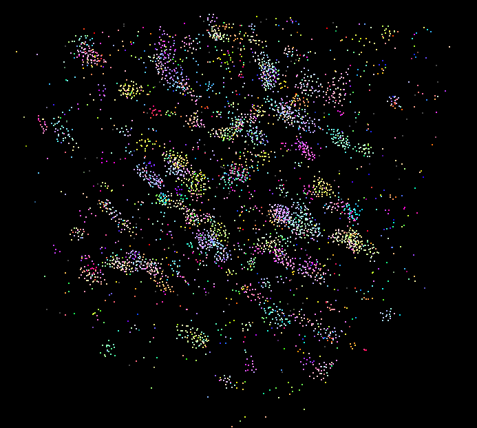
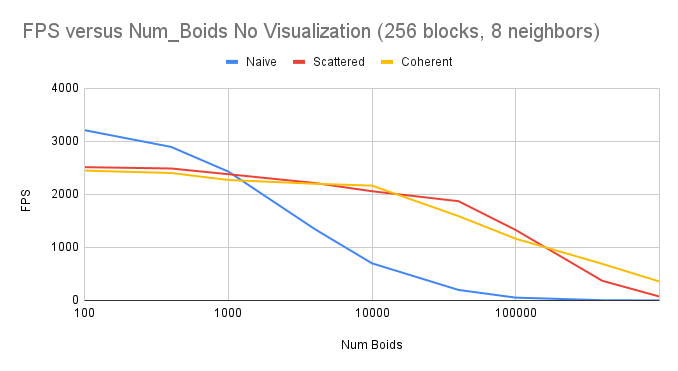
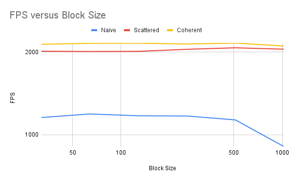

**University of Pennsylvania, CIS 5650: GPU Programming and Architecture,
Project 1 - Flocking**

* Joshua Smith
  * [LinkedIn](https://www.linkedin.com/in/joshua-smith-32b165158/)
* Tested on: Ubuntu 20.04, Ryzen 9 3900x @ 4.6GHz, 24GB RTX 4090 (Personal)

### Visualization:

### Analysis: 

**Q1: How does number of boids affect performance, why?**

For each implementation, increasing the number of boids consistently lowered the achieved FPS. This is expected given that there will be more neighbors to check on average when the number of boids increases. The Naive method had worse performance for most boid sizes. It also tended to scale worse than the uniform grid methods. Similarly, it was expected that the Scattered method would outperform the Naive method, given that it limits its search for neighbors to a smaller feasible region and therefore fewer candidates to check. 

**Q2:
How does changing block size effect performance?**

I found that the block sizes I tested (32 (2^5) -> 1024(2^10)) made little to no change in FPS performance. This is likely due to even the minimum size filling a warp. Therefore, we can reduce standby compute resources. There was a slight drop off in performance for some of the very last trials (blockSize = 512, 1024) which could be caused by filling the SM memory or using up another resource. 

**Q3:
Coherent vs Scattered?**

The Coherent method yielded better performance than scattered for larger boid numbers. This is expected, as the coherent grid method can leverge memory coalescing if the memory addresses to load for some of the threads in the SM are contiguous. For boid_counts of 400k and 1M, the coherent method was over 2x faster!

**Q4: Did changing cell width affect performance?**

Halving the cell with and checking the 27 grid region outperformed the original cell width with an 8 grid volume to check. This is expected, as the overall volume of the 27 grid region is less than that of the 8 grid region, so one would expect fewer boids to be considered/within the region on average. This change effected the Scattered method more than the Coherent method, likely due to the Coherent method spending relatively more time on the sorting/arranging process, and relatively less time on the rule computation process. 
