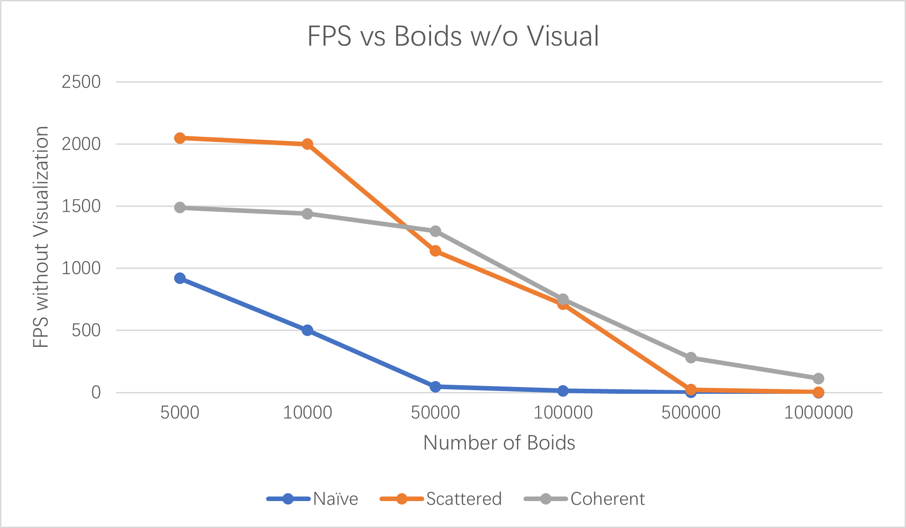
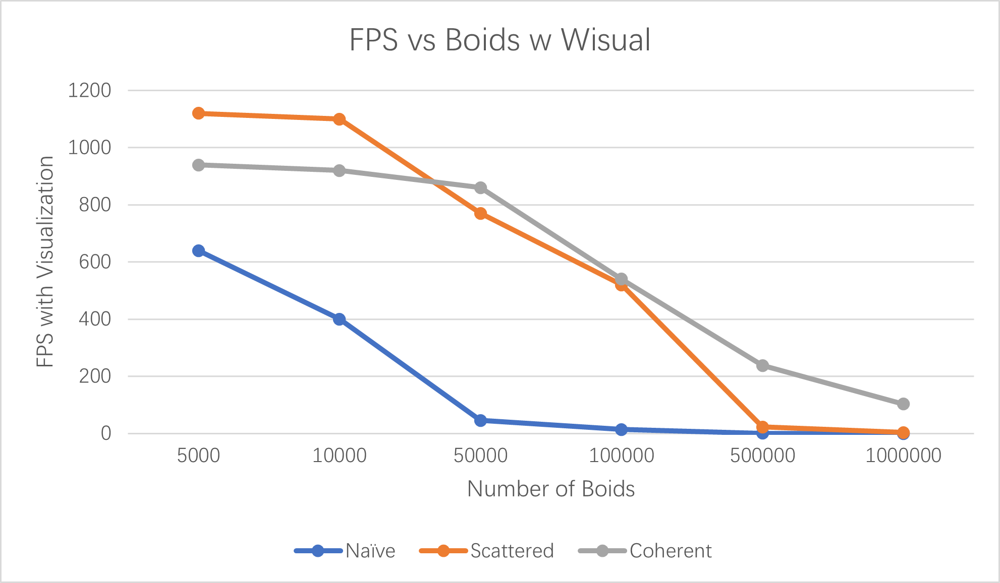
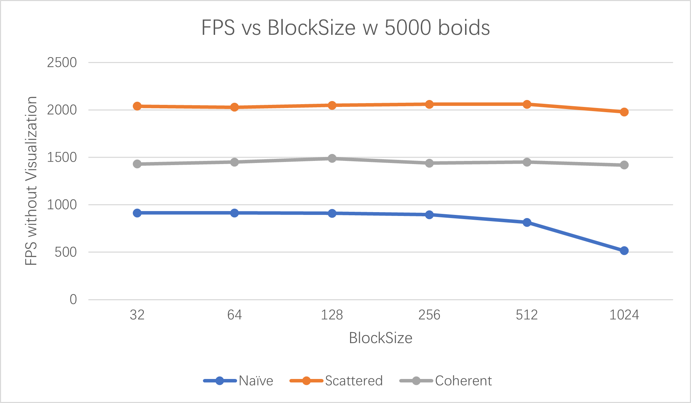

**University of Pennsylvania, CIS 565: GPU Programming and Architecture**
CUDA Project 1 -  Flocking
============================

* Runshi Gu
  * [LinkedIn](https://www.linkedin.com/in/runshi-gu-445648194/)
* Tested on: Windows 10, AMD Ryzen 7 5800X 8-Core Processor @ 3.80 GHz 32GB, RTX3070 24538MB, Personal

## Showcase

## Performance Analysis

### Questions

* For each implementation, how does changing the number of boids affect performance? Why do you think this is?
  * Generally, increase in number of boids will slow down the performance according to the results I got. I think it is because with more boids means more time spent on sorting, data accessing, thread/block management, and basic computing. 
* For each implementation, how does changing the block count and block size affect performance? Why do you think this is?
  * It doesn't affect the result too much with changing in block size, with subtle drop for scattered/uniform methods and a moderate drop for Naive method from 512 to 1024. I think that is because the way we access threads and blocks are not essentially changed as long as we keep the size of a block larger than a wrap which is 32. 
* For the coherent uniform grid: did you experience any performance improvements with the more coherent uniform grid? Was this the outcome you expected? Why or why not?
  * Yes, when the number of boids is larger than 50000, the coherent method produced better performance than scattered one. When it is less than 50000 boids, it is the opposite. It is the outcome I expected because when the number of boids is relatively small, the time benefit from sorting those boids is less than the overhead brought by sorting them. However, when we have a whole lot of boids, after we sort it out at the first frame, the benefit of soring those boids is way greater than the overhead of sorting them every frame (boids are also relatively sorted after first frame). 
* Did changing cell width and checking 27 vs 8 neighboring cells affect performance? Why or why not? Be careful: it is insufficient (and possibly incorrect) to say that 27-cell is slower simply because there are more cells to check!

| Methods | FPS with 500000 boids |
|-|-|
|8 Cells Scattered|24|
|27 Cells Scattered|41.5|
|8 Cells Coherent|280|
|27 Cells Coherent|1721.65|
|Coherent, 27-neighbor, w=2d|356|

  * Yes, using 27 neighbor cells improved the performance by a quite amount! I think because in 8 cells scenario, we also need to determine which quarter of the cell our current boid is in to decide which 8 cells out of those 27 cells need to be checked. However, in 27 cells scenario, we don't need to perform this distance checking and we just check all those 27 cells blindly, so that both methods have some sort of overhead for cell checking (not only 27 cell method!!). On the other hand, 8 cells method needs to check boids in a 4dx4d space, while 27 cells method only needs to check boids in a 3dx3d space, which are likely to include less boids to check if we have a lot of boids in general. 
