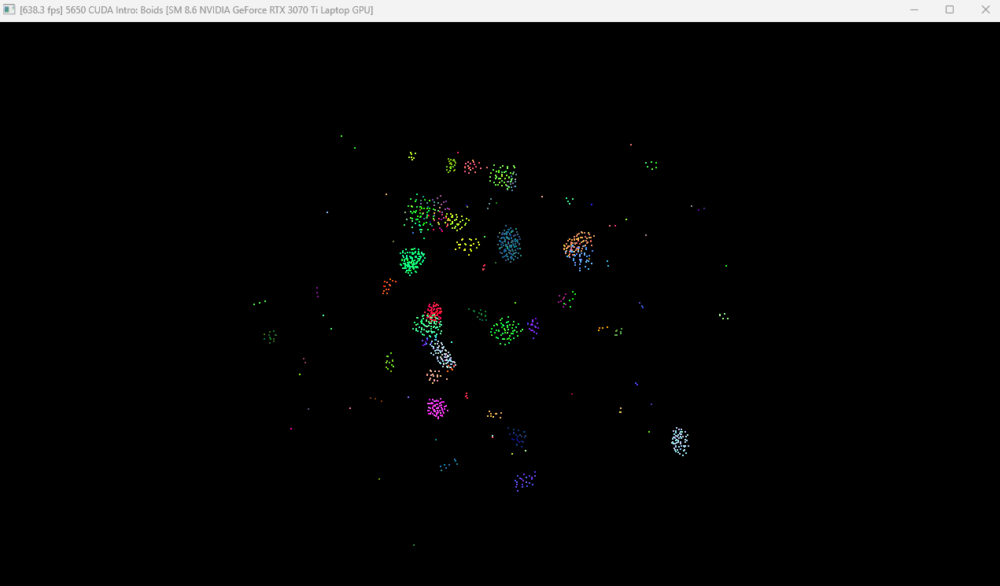
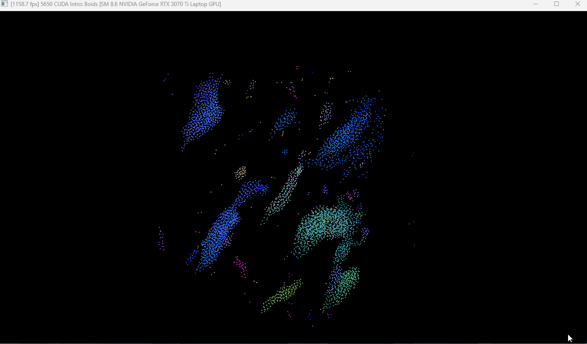
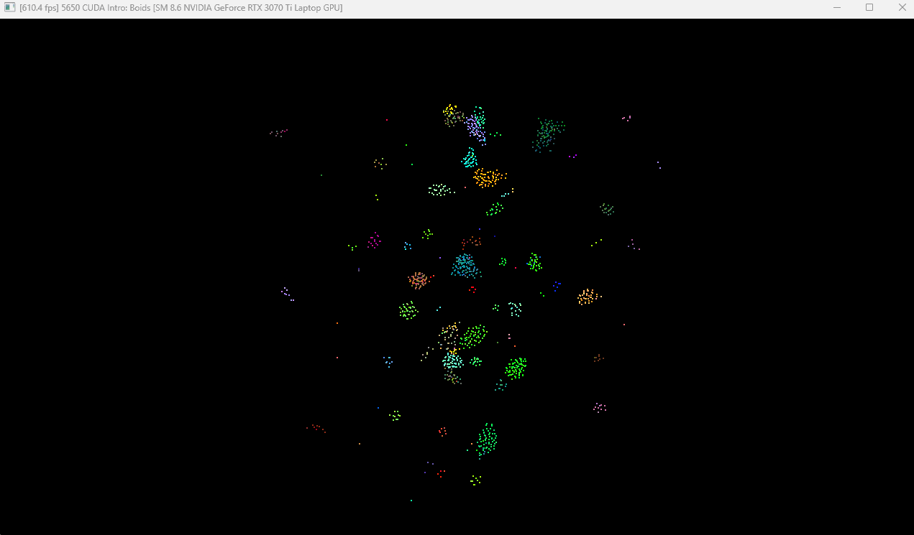
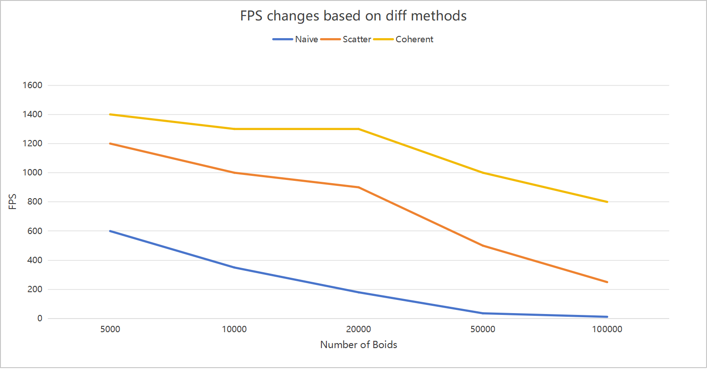
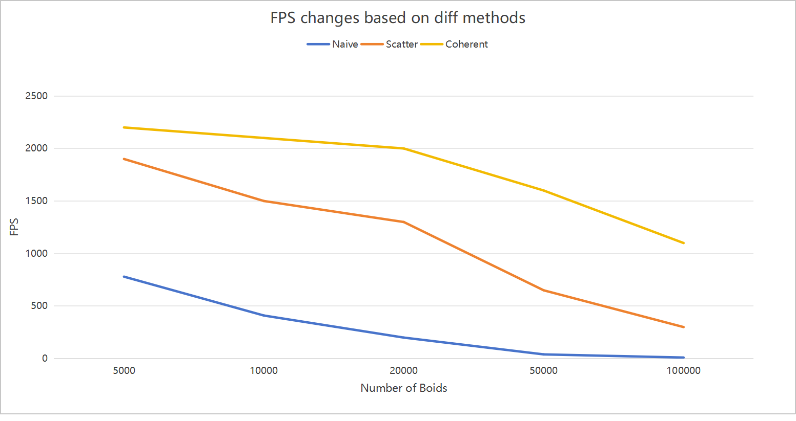
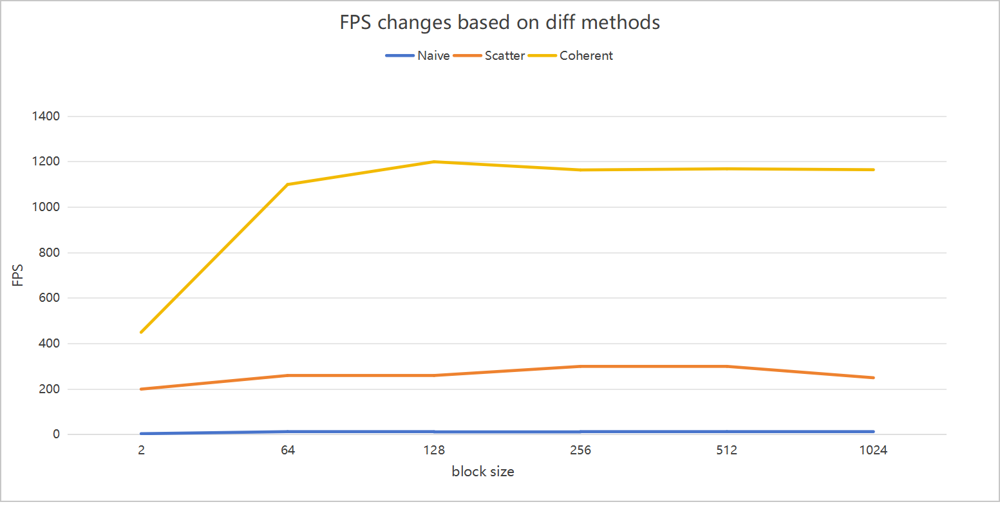

**University of Pennsylvania, CIS 5650: GPU Programming and Architecture,
Project 1 - Flocking**

* Akiko Zhu
  * [LinkedIn](https://www.linkedin.com/in/geming-akiko-zhu-b6705a255/)
* Tested on: Windows 11, i9-12900H @ 2.50GHz 16GB, RTX 3070Ti 8GB (Personal)

### Result
Naive Method:

Scatter Uniform Method:

Coherent Uniform Method:

### Performance Analysis
Visualize On:

Visualize Off:

### Q: For each implementation, how does changing the number of boids affect performance? Why do you think this is?
As shown in the above figures, whenever the visualization option is turned on or off, the brute force(naive) method will always be the slowest method, and ideally, the scatter uniform method and coherent uniform method are much faster. However, if we keep increasing the number of boids, due to the limit of GPU rendering performance, the FPS will keep going down and might eventually close to zero.
### Q: For each implementation, how does changing the block count and block size affect performance? Why do you think this is?
For the naive method, even though I changed block size several times from small to large numbers, the FPS was kept very low. For the scatter method, the block size seems to do nothing change to the FPS. However, when I increased the block size and tested on the coherent method, the FPS was affected. As shown in the figure, especially, when the block size is set between 2 to 64, the FPS has an obvious increase trend. When the block size is larger than 64, it will have little influence on FPS. I think GPU parallel computing has its threshold and once it reaches the maximum, no performance boost will happen during the computing.
### Q: For the coherent uniform grid: did you experience any performance improvements with the more coherent uniform grid? Was this the outcome you expected? Why or why not?
When implementing the coherent method, I did expect the performance will be better than the scatter method. This is because accessing global memory could be very costly, and directly referring to the pos and vel of boids could lead to better performance.
### Q: Did changing cell width and checking 27 vs 8 neighboring cells affect performance? Why or why not?
Checking 27 neighboring cells will be very slow compared to only checking 8. This is because the algorithm traverses more cells, and the slow performance will be very obvious, especially when I increase the number of boids to over 100,000.
