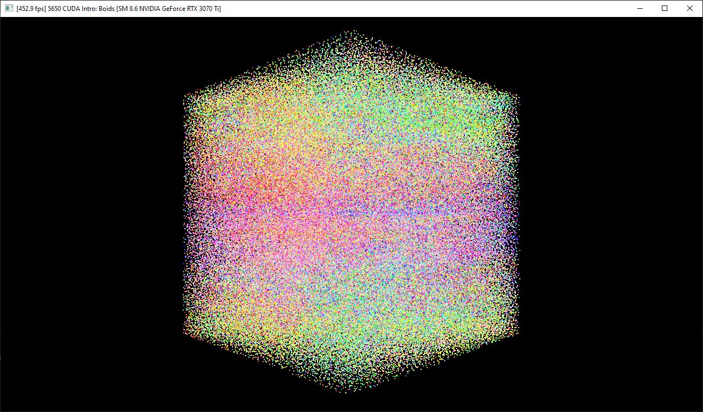
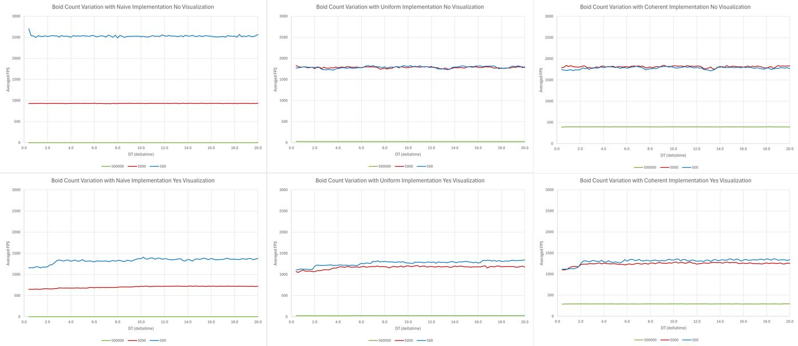
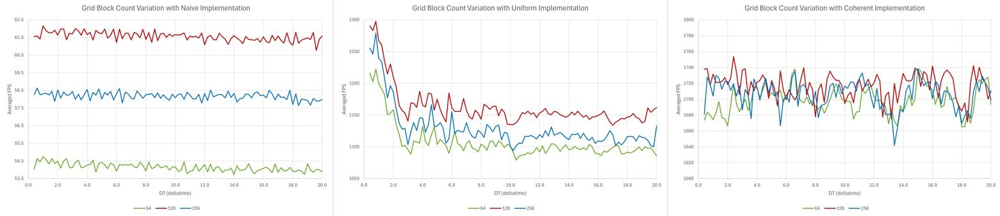
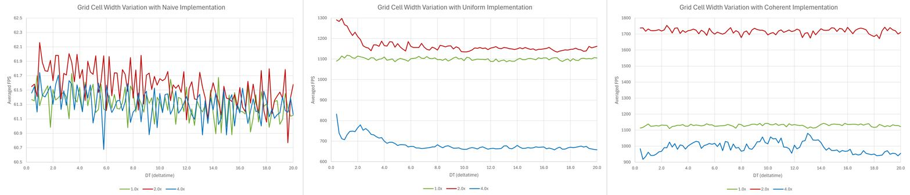

**University of Pennsylvania, CIS 5650: GPU Programming and Architecture,
Project 1 - Flocking**

* Alan Lee
  * [LinkedIn](https://www.linkedin.com/in/soohyun-alan-lee/)
* Tested on: Windows 10, AMD Ryzen 5 5600X 6-Core Processor @ 3.70GHz, 32GB RAM, NVIDIA GeForce RTX 3070 Ti (Personal Computer)

## Boid Simulation

In the Boids flocking simulation, particles representing birds or fish
(boids) move around the simulation space according to three rules:

1. cohesion - boids move towards the perceived center of mass of their neighbors
2. separation - boids avoid getting to close to their neighbors
3. alignment - boids generally try to move with the same direction and speed as
their neighbors

These three rules specify a boid's velocity change in a timestep.
At every timestep, a boid thus has to look at each of its neighboring boids
and compute the velocity change contribution from each of the three rules.

This repository explores three approaches to solving this problem and compares their performance differences.

### Naive Brute Force

A naive solution to this problem is to brute force compare each boid against every other boid and update velocity accordingly. This approach obviously scales really poorly, but it gets the job done and provides us with a reference as to how a correct simulation should look and feel like. 

### Scattered Uniform Grid

One improvement to brute force strategy is to utilize a spatial data structure known as uniform grid, where we split the enclosing 3D domain in which boids travel into uniformly spaced cubic cells of some set width.

Implementation of a uniform grid with CUDA drastically improves the performance and allows us to simulate tens of thousands of boids with couple hundred averaged frames per second.

### Coherent Uniform Grid

However, a bare uniform grid approach faces its own limits when we bump the number of boids to hundreds of thousands, or even more. To improve the scalability, a third approach is also showcased in this repository.

We can rearrange the representation of position and velocity of each boid into contiguous memory based on its encapsulating cell index. This significantly improves cache coherence and reduces stall time due to memory reads.

### Grid-Looping Optimization

In addition to the base exploration, this repository explored optimization of the grid-looping scheme when we search for neighboring boids. For a given boid position, a naive solution explores all 2x2x2, 3x3x3, or otherwise appropriate range of cells surrounding the cell encapsulating the boid.

We optimize this neighbor search scheme by automatically computing the minimum and maximum cell index in all three cardinal directions (x, y, z) that a neighboring cell could be in and looping over them. That is, we compute the normalized position of the current boid with respect to the uniform grid, subtract or add normalized radius of influence (defined as maximum of rules 1, 2, 3 distances divided by the cell width), and appropriately floor and clamp the values into valid ranges.

This prevents excessive positional comparisons with the corner points of each grid cell that we know for sure to be out of range. In addition, we can now simply change the `gridCellWidthScale` variable to automatically alter the neighboring cell lookup scheme as we wish.

The code for this can be found at parts of the code labeled `// Extra Credit`.

## Running the Code

You should follow the regular setup guide as described in [Project 0](https://github.com/CIS5650-Fall-2024/Project0-Getting-Started/blob/main/INSTRUCTION.md#part-21-project-instructions---cuda).

The main variables that affect the configuration are `VISUALIZE`, `UNIFORM_GRID`, and `COHERENT_GRID` for toggles between each mode. You may also change the number of boids with `N_FOR_VIS` and delta time with `DT`. The uniform gird cell width is defined by `gridCellWidthScale` and block size by `blockSize`. Most of the variables are defined at the top of `main.cpp`.

If you wish to run the code in logging mode that produces a log text file after running for `PRINT_COUNT` frames, then you must set `PRINT_FPS` to `1`.

## Performance Analysis

The basis of performance analysis metric in this report is averaged fps. The averaged fps is computed approximately every 1.0 unit of time as dictated by GLFW timer. The number of frames is the number of times we finish our main loop (which is equivalent to the simulation of a singular time step and corresponding memory updates). Therefore, an averaged fps equals the number of frames divided by past time.

It should be noted that due to the randomness of data point generation (such as the start position of boids), each configuration was ran *five* times, each time recording the first 100 averaged fps readings. The five runs were then averaged to be used for plotting of data below. The raw data stored in an excel file can be found at `writeup/rawdata.xlsx`.

It should also be noted that the randomness could have been addressed by locking in a "good" RNG seed and always using the set seed during the course of data collection. However, due to the possibility of the seeds potentially producing specific edge case initializations that perform better or worse for certain configurations and thus creating biased data, this approach was not used.

### Varying the Number of Boids

* For each implementation, how does changing the number of boids affect performance? Why do you think this is?

Changing the number of boids is one of the greatest factors affecting the performance of a given approach. The following graphs were produced by collecting data with boid counts 500, 5000, and 500000 with all other conditions being equal (block count 128, cell width 2.0x, etc).

Let us first observe the first row representing simulated average fps without visualization, i.e. the application just outputs a white window while the simulation runs in the background.

We can notice immediately that for naive implementation, there exists a direct correlation between the averaged fps of the simulation versus the number of boids in the simulation. Seeing that the jump between 500,000 and 5,000 boids is about 1000x and the jump between 5,000 and 500 boids is about 2.5x, we can observe that the speedup is not linear with respect to reduction in the number of boids. We can explain this with the understanding that a naive brute force approach has time complexity of O(n^2).

Both scattered and coherent uniform grid implementations share a similar trend. The averaged fps for 500 and 5,000 boids for these implementations are approximately the same. This average is below the performance of the brute force approach for 500 boids, but still better in the case of 5,000 boids. This showcases the implied lower bound of these approaches due to the overheads of uniform grid construction. That is, it is not worth using these optimization techniques if the number of boids is very low.

The key difference between scattered and coherent uniform grid implementations is the performance of simulating 500,000 boids. The scattered uniform grid still suffers at approximately 26 frames per second, whereas the coherent uniform grid runs smoothly at 400 frames per second. This highlights the power of contiguous memory design of coherent uniform grid.

The effect of turning visualization on is showcased on the second row of the diagram. The average fps dropped across all numbers of boids tested no matter the implementation scheme, though it affected the runs with larger number of boids much more. This is most likely due to the fact that there are more memory read/writes and more things to draw on screen.

### Varying the Block Size / Count

* For each implementation, how does changing the block count and block size affect performance? Why do you think this is?

The following data were collected with 50,000 boids, 2.0x cell width, and no visualization.

Both increasing and decreasing the block size for brute force approach resulted in a worse performance. Though still worse than 128, the algorithm performed better with 256 block size than with 64 block size. Since the brute force approach loops through every other boid per boid, the difference seems to be due to utilization levels of GPU power. That is, 64 block size leads to under utilization of GPU cores and resources compared 256 block size.
A similar trend emerges for the case of scattered uniform grid.

In both cases the differences are, though visibly distinct when displayed on a chart, numerically tiny. On average, the difference between each change is approximately 5%.

For coherent uniform grid implementation, it is quite different. The performance difference between various block sizes is non existent. This shows the robustness of this approach as a reasonable change in block count does not affect the average fps. 

### Varying the Cell Width

* Did changing cell width and checking 27 vs 8 neighboring cells affect performance? Why or why not? Be careful: it is insufficient (and possibly incorrect) to say that 27-cell is slower simply because there are more cells to check!

The following data were collected with 50,000 boids, 128 block size, and no visualization.

Note that cell width represents the factor in which the maximum radius out of three rules is multiplied by to determine a cell's dimensions. For example, cell width of 2.0x means a cell's width is twice the maximum radius of influence. Consequentially, in the worst case scenario, cell width of 2.0x and 4.0x requires a 2x2x2 neighboring cell search, and cell width of 1.0x requires a 3x3x3 neighboring cell search.

Obviously grid cell width does not affect our brute force approach since it does not make use of a uniform grid. Any difference or pattern that may seem to emerge from the graph can be considered as noise.

In both scattered and coherent uniform grids, 2.0x cell width scale performed the best, then 1.0x, and lastly 4.0x. The main difference comes from by how much the 1.0x and 4.0x were relatively worse off.

For cell width of 4.0x, the performance stayed at around 50~60% of 2.0x cell width for both implementations. This seems to be due to the sheer number of boids that fit in per cell with increased cell dimensions. The more boids you have per cell, the more comparisons we must perform, meaning likely more data accesses than needed.

For cell width of 1.0x, the performance was almost on par with 2.0x cell width for scattered uniform grid, but the performance was significantly worse for coherent uniform grid.

These observations lead to the conclusion that a 27-cell search is slower at low boid count scenarios like in the above data set. This is most likely due to the required overhead of checking many more cells and data access patterns, which may explain the comparative performance differences for cell width of 1.0x.

That being said, it was observed that in high boid count scenarios (such as 500,000 boids), the 27-cell search outperformed the 8-cell search. This may be due to the fact that larger cell sizes lead to much more boids per cell concentration in 8-cell scenarios, causing greater costs than gains from less cell checks.

### Scattered vs Coherent Uniform Grid

* For the coherent uniform grid: did you experience any performance improvements with the more coherent uniform grid? Was this the outcome you expected? Why or why not?

As shown in previous discussions, coherent uniform grid outperforms scattered uniform grid across all tested configurations. The margin of improvement varies anywhere from as low as 5% to as high as 150%.

This was indeed the outcome I expected. The idea behind this approach was to target memory coherency to improve data access patterns and cache coherency, which is indeed a meaningful difference and an accumulating change given the number of data reads we are performing.

### Extra: Chart Comparison of Average of Averaged FPS over All DT

Config is in the order of number of boids / block size / cell width / visualization.

| Config | **Brute Force** | **Scattered Uniform** | **Coherent Uniform** |
| :---: | :---: | :---: | :---: |
| 500 / 128 / 2.0x / no  | 2528.50 | 1788.20 | 1781.78 |
| 500 / 128 / 2.0x / yes  | 1327.94 | 1267.28 | 1309.56 |
| 5,000 / 128 / 2.0x / no  | 931.21 | 1784.10 | 1811.74 |
| 5,000 / 128 / 2.0x / yes  | 701.87 | 1168.01 | 1246.90 |
| 500,000 / 128 / 2.0x / no  | 0.87 | 26.45 | 394.67 |
| 500,000 / 128 / 2.0x / yes  | 0.87 | 25.60 | 293.38 |
| 50,000 / 64 / 2.0x / no | 54.15 | 1107.51 | 1698.77 |
| 50,000 / 128 / 2.0x / no | 61.56 | 1163.18 | 1717.50 |
| 50,000 / 256 / 2.0x / no | 58.18 | 1129.75 | 1706.17 |
| 50,000 / 128 / 1.0x / no | 61.31 | 1100.18 | 1129.91 |
| 50,000 / 128 / 4.0x / no | 61.30 | 683.63 | 990.65 |