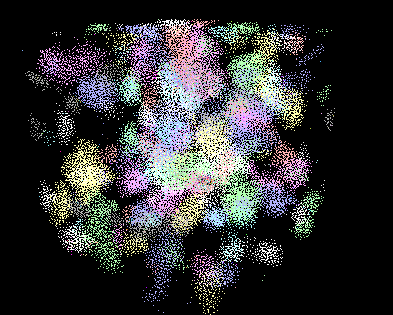
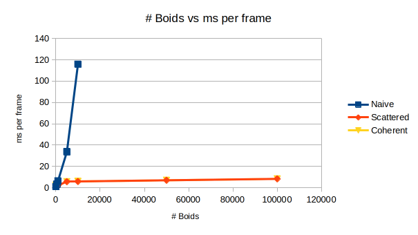
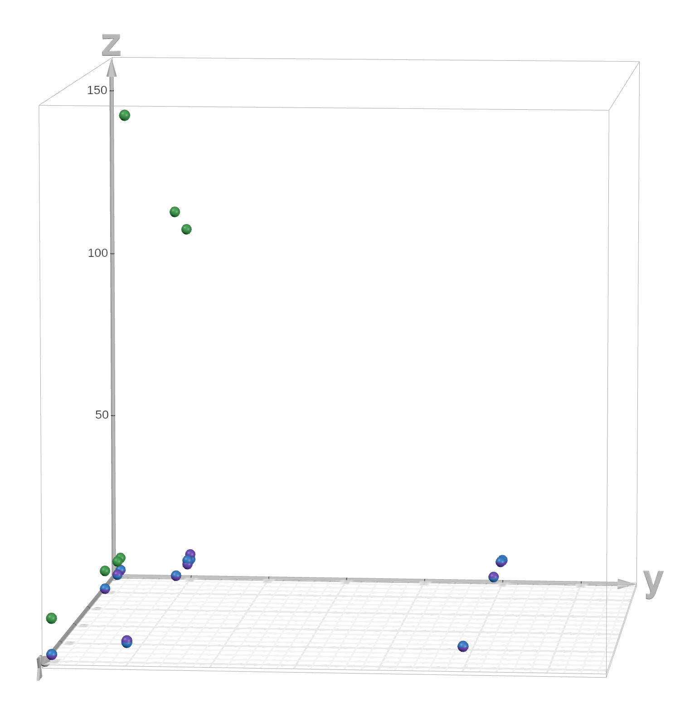

**University of Pennsylvania, CIS 5650: GPU Programming and Architecture,
Project 1 - Flocking**

* Nicholas Liu
  * [Linkedin](https://www.linkedin.com/in/liunicholas6/)
* Tested on: Linux Mint 22 Wilma, AMD Ryzen 7 5800X @ 2.512GHz, 32GB RAM, GeForce GTX 1660 Ti

## Performance Analysis
I used the difference in the GLFW timer before and after the simulation method (which happens once per frame) in order to get my benchmarks.

For each sample, I the ms/frame that I report is an average over a particular 1024 frame window. I know most people have been using fps as their metric, but I think that seconds per frame is a bit easier to interpret.

Initially I ran the simulation at a fixed block size, taking the measurement either when there was a sufficiently sample variance (1e-6) or after 2 minutes had elapsed (an arbitrary timeout).

| Block Size | Boid Count | Naive    | Scattered | Coherent |
|------------|------------|----------|-----------|----------|
| 128        | 100        | 0.921746 | 2.22342   | 2.20919  |
| 128        | 500        | 3.36143  | 2.20916   | 2.20219  |
| 128        | 1000       | 6.42337  | 2.21227   | 2.21552  |
| 128        | 5000       | 33.6607  | 5.66196   | 5.64133  |
| 128        | 10000      | 115.813  | 5.82458   | 5.84376  |
| 128        | 50000      | 3932.78  | 6.98288   | 6.99746  |
| 128        | 100000     |          | 8.31689   | 8.31512  |

I was pretty suspicous of the fact that I got roughly equal results with and without the scattered grid. I considered that it might be a symptom of the boids not converging, so I got rid of the variance cutoff. Other than the variance cutoff, I used the same methodology for subsequent runs.

| Block Size | Boid Count | Naive    | Scattered | Coherent |
|------------|------------|----------|-----------|----------|
| 16         | 1000       | 6.15115  | 2.34802   | 2.4202   |
| 16         | 10000      | 165.27   | 7.58193   | 6.04912  |
| 16         | 50000      |          | 7.1409    | 7.24018  |
| 16         | 100000     |          | 9.06192   | 9.20158  |
| 64         | 1000       | 6.20377  | 2.09294   | 2.08222  |
| 64         | 10000      | 108.791  | 5.67755   | 6.86812  |
| 64         | 50000      |          | 7.84353   | 7.86099  |
| 64         | 100000     |          | 9.08896   | 9.11807  |
| 256        | 1000       | 7.9732   | 2.52793   | 2.53109  |
| 256        | 10000      | 117.246  | 6.82406   | 6.8358   |
| 256        | 50000      |          | 7.90223   | 7.89826  |
| 256        | 100000     |          | 9.13495   | 9.15964  |
| 1024       | 1000       | 13.0482  | 2.57815   | 2.5795   |
| 1024       | 10000      | 157.17   | 6.88413   | 6.415    |
| 1024       | 50000      |          | 6.84002   | 6.84928  |
| 1024       | 100000     |          | 8.2432    | 8.30933  |

x: number of boids |
y: block size |
z: ms / frame

Most of my results were as expected
- The time for the naive method increases at rate significantly worse than linear. This makes sense -- the number of memory reads done by each thread increases by a linear factor already, and the number of threads dispatched also increases by a linear factor.
- The time for both the scattered and the coherent grids increased at a sublinear rate. We would only expect the number of memory accesses per grid cell to increase roughly linearly once the number of boids is on the same order of magnitude as the number of grid cells, but for the smaller numbers that our GPU can actually compute, each lane more or less just accesses other boids within the flock.
- Changing block size generally caused some minor variation in speed, but nothing super extraordinary -- as long as things were in a reasonable enough range that SM occupancy wasn't bottlenecked it didn't matter too much

The one result that I didn't expect is that the coherent and scattered grids got roughly the same results in my benchmarks. I would expect that as the number of boids increases, the coherent grid would perform better, as it should have better cache coherency on the memory accesses in the bottlenecking function.

Strangely enough, there does seem to be a noticable difference using the built in FPS counter on the two different grids, so I suspect there must be some issue with my benchmarking methodology.

I'm not too keen on manually recording the value in the window for a large number of configurations though, so I'm leaving my data as is for now -- I'll be sure to return to figuring out what's happening at a later date (with real CUDA timers instead of the GLFW timer).

