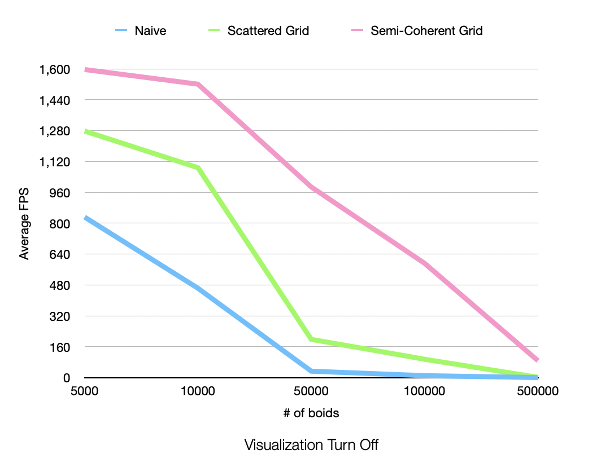
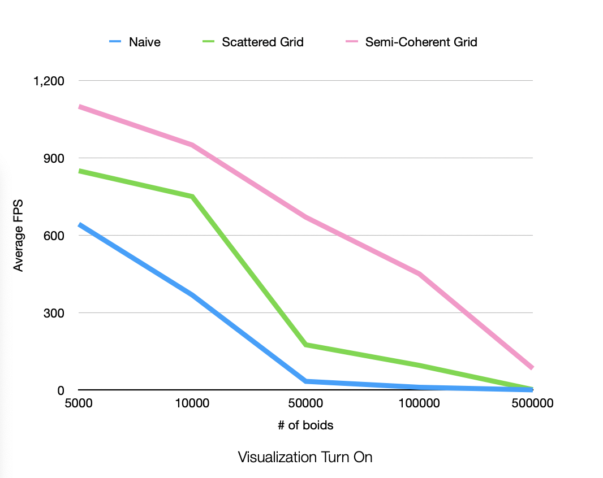
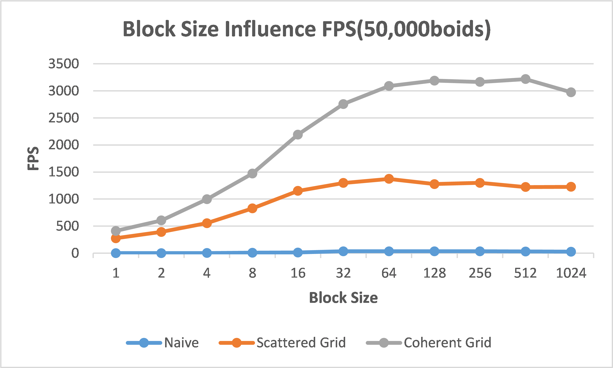

## University of Pennsylvania, CIS 5650: GPU Programming and Architecture,
### Project 1 - Flocking

* Elena Xinyue Peng
  * https://www.linkedin.com/in/elena-xinyue-peng-8b7a0a173/
* Tested on: Windows 10, Intel(R) Core(TM) i5-9400F CPU @ 2.90GH 48GB, NVIDIA GeForce GTX 1660 6144MB (Personal Desktop)

  
  
  
  

### Performance Analysis

### Questions
* For each implementation, how does changing the number of boids affect performance? Why do you think this is?

  For each implementation, the increasing number of boids will result in decreasing performance because there are simply more calculation as number of boids increases. The naive method will loop through all the boids to find its neighbors. This method is the most affected by the number of boids and it has steeper decrease as the number of boids increases. For the two grid methods, they save a lot of calculation by preproccessing the space into grid. They both have a smoothier decrease between 5000 and 10000 boids. I think the memory read overhead for 5000 and 10000 can still cover for all the neighbor-finding iteration. As the number of boid increases, this benefit start to vanish and still result in steep decrease in performance.

* For each implementation, how does changing the block count and block size affect performance? Why do you think this is?

  For all 3 implementations, changning the block size only affect performance a little bit, looking at the chart. However, there is a slightly noticeable decrease when the block size drop to 32. I think this is when we are under-utilizing the GPU resources and more adding overhead of launching more thread per block. 
  
* For the coherent uniform grid: did you experience any performance improvements with the more coherent uniform grid? Was this the outcome you expected? Why or why not?

  In general, the coherent uniform grid perform better than the scattered uniform grid method if you look at the chart. With or without visualization, the coherent uniform grid method has higher FPS than the scattered uniform grid under 128 block size. This is expected becasue even though we spend some performance to rearrange the position and velocity array, reading in a contiguous memory will be much faster than reading scattered memeory.
  
* Did changing cell width and checking 27 vs 8 neighboring cells affect performance? Why or why not? Be careful: it is insufficient (and possibly incorrect) to say that 27-cell *is slower simply because there are more cells to check!

  For my implementation, checking 27 neighboring cells does result in worse performance. I checked with 50000 boids using 128 block size. With 8 ceslls, it's hitting around 980 FPS, while 27 cells can only hit around 675 FPS. I also checked with smaller and larger number of boids and got the same conclusion. Other than the reason that there are more cells to check, I think fewer cells in conherent uniform grid method also have the advantage that closer the neighboring cell to the current boid, their memory location are actually closer, so it will cost less time to fetch those data than gathering data for outer grid cells which will locate in further memory location. Checking fewer cells not only results in less iteration but also takes less time to read memory. 
