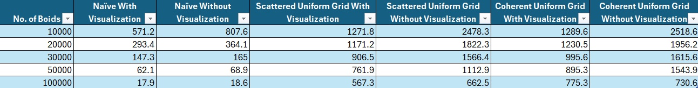
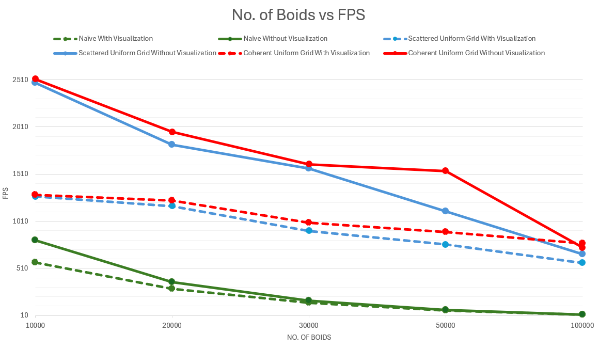
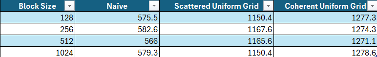
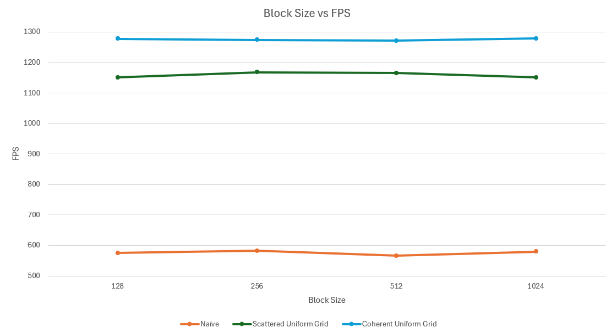

Project 0 Getting Started
====================

**University of Pennsylvania, CIS 5650: GPU Programming and Architecture, Project 0**

* ADITHYA RAJEEV
  * [LinkedIn](https://www.linkedin.com/in/adithyar262/)
* Tested on: Windows 11, i7 13th Gen @ 2.40GHz 16GB, GeForce RTX 4050 8GB (Personal)

# Boid Simulation

# Performance Analysis

## 1. FPS vs No. of Boids

## 2. FPS vs Block Size 

# Questions

## 1. For each implementation, how does changing the number of boids affect performance? Why do you think this is?
The increase in the number of boids leads to a decrease in frames per second (FPS). The inverse relationship between the number of boids and FPS is a natural consequence of the increased computational load and resource requirements as the simulation scales up. This effect is observed across both naive and optimized implementations, although optimized versions may scale better with increasing boid counts.

## 2. For each implementation, how does changing the block count and block size affect performance? Why do you think this is?
Changing the block size and number of blocks does not significantly affect the FPS (Frames Per Second) in the boids simulation. Changing the block size and number of blocks is more about optimizing how the work is distributed on the GPU rather than changing the fundamental amount or speed of parallel operations being performed. As a result, these changes typically don't lead to significant variations in FPS for the boids simulation.

## 3. For the coherent uniform grid: did you experience any performance improvements with the more coherent uniform grid? Was this the outcome you expected? Why or why not?
The coherent uniform grid implementation demonstrated a significant performance improvement over the scattered grid approach. In the coherent grid method, we eliminate the need for an additional matrix to redirect to the position and velocity array indices for boids. This removal of indirection means one less memory lookup operation (or warp) to complete for each data access. By directly accessing the boid data, we reduce the overall number of memory operations, leading to faster execution times. The coherent grid approach also organizes boid data in a way that results in more contiguous and sequential memory accesses when retrieving position and velocity information.
The combination of reduced indirection and more coherent memory access patterns results in more efficient use of the GPU's memory subsystem. This leads to reduced latency, increased throughput, and ultimately, the observed performance improvement in the coherent uniform grid implementation.

## 4. Did changing cell width and checking 27 vs 8 neighboring cells affect performance? Why or why not? Be careful: it is insufficient (and possibly incorrect) to say that 27-cell is slower simply because there are more cells to check!
Changing the number of neighboring cells checked to 27 (3x3x3 grid) improves performance in the boid simulation. This quantization of the search space leads to checking smaller volumes around each boid, often resulting in fewer overall boid comparisons. The more compact search area enhances spatial locality and cache usage, leading to more efficient memory access patterns. Despite checking more cells, the total volume searched is smaller, reducing computational overhead. This demonstrates that a finer-grained approach to neighbor searching can yield significant performance benefits by decreasing workload and enhancing memory efficiency.
    
    
    
